# 算法

## 概念

满足需求的各种思路和方法就是算法。

同样的数据，同样的目的，不同的算法，不同的**方法和思路**，**效率**就会不同。

选择好的数据结构与算法，可以大大提高程序效率。

## 特性

1. 独立性

   - 算法是**独立存在**的一种解决问题的**方法和思想**。
   - 对于算法而言，实现的语言并不重要，重要的是思想。
   - 算法可以有不同的语言描述实现版本（如C描述、C++描述、Python描述等）。

2. 五大特性

   ① 有输入
   ② 有输出
   ③ 有穷性
   ④ 确定性
   ⑤ 可行性

   这五个特性是算法的基本特征，它们共同定义了什么是算法：

   - **有输入**：算法可以有零个或多个输入。
   - **有输出**：算法必须有一个或多个输出，这是算法执行的结果。
   - **有穷性**：算法必须在执行有限个步骤之后终止，不能无限循环。
   - **确定性**：算法的每一步骤都必须有确切的定义，不能有二义性。
   - **可行性**：算法中的每一步都必须是可行的，即可以通过已经实现的基本运算来执行。

## 算法的时间效率衡量

假定计算机执行算法每一个**基本操作**的时间是固定的一个**时间单位**，那么有多少个基本操作就代表会花费多少时间单位，由此可以忽略机器环境的影响而客观的反应算法的时间效率。

**代码执行总时间(T) = 操作步骤数量 × 操作步骤执行时间**

这是一个用于分析算法时间效率的简化模型，它将总时间分解为两个关键因素：

- **操作步骤数量**：算法执行过程中基本操作的总次数。
- **操作步骤执行时间**：执行单个基本操作所需的时间。

假定计算机执行算法每一个基本操作的时间是固定的一个时间单位
操作步骤总数 = 基本操作 * 子整体 * 大整体

T = (大整体 * 子整体 * 基本操作) * 操作步骤执行时间。

## 时间复杂度

### 概念

在算法的世界里，**时间复杂度**并不是指程序跑完需要多少秒，而是用来描述**算法运行时间随数据规模增长而变化的趋势**。

简单来说，它衡量的不是“绝对时间”，而是“操作次数”的增长速度。

- 问题规模：`n`。

- 时间复杂度：`T`。
- 主要条件：随着问题规模变化而变化的条件。
- 次要条件：不随着问题规模变化而变化的条件。

### 表示

采用大O标记法。

**`T(n) = O(f(n))`**

规律只包含主要条件，次要条件全部忽略。

### 计算规则

- 基本操作
  时间复杂度为O(1)。
- 顺序结构
  时间复杂度按加法进行计算。
- 循环结构
  时间复杂度按乘法进行计算。
- 分支结构
  时间复杂度取最大值。
- 判断一个算法的效率时，往往只需要关注操作数量的最**高次项**，其它次要项和常数项可以忽略。
- 在没有特殊说明时，我们所分析的算法的时间复杂度都是指**最坏时间复杂度**。

### 分类

算法完成工作最少需要多少基本操作，即**最优时间复杂度**。
算法完成工作最多需要多少基本操作，即**最坏时间复杂度**。
算法完成工作平均需要多少基本操作，即**平均时间复杂度**。

这三种时间复杂度从不同角度描述了算法的执行效率：

- **最优时间复杂度**：描述了算法在最理想情况下的性能表现，没有参考价值。
- **最坏时间复杂度**：提供了算法性能的上限**保证**，是分析和比较算法时最常用的指标。
- **平均时间复杂度**：反映了算法在所有可能输入情况下的期望性能，但计算通常较为复杂，没有参考价值。


### 常见的时间复杂度

| 执行次数函数举例 | 阶      | 非正式术语 |
| ---------------- | ------- | ---------- |
| 12               | O(1)    | 常数阶     |
| 2n+3             | O(n)    | 线性阶     |
| 3n²+2n+1         | O(n²)   | 平方阶     |
| 5log₂n+20        | O(logn) | 对数阶     |
| 6n³+2n²+3n+4     | O(n³)   | 立方阶     |

一般没有4次方。超过4次方，算法大概有问题。

所消耗的时间从小到大:

> O(1) < O(log n) < O(n) < O(n log n) < O(n²) < O(n³)

时间复杂度越低，效率越高。

## 空间复杂度

1. 核心定义

   - **空间复杂度**：是对一个算法在运行过程中**临时占用存储空间大小**的度量。

   - **表示方法**：类似于时间复杂度，空间复杂度 S(n)定义为该算法所耗费的存储空间，同样使用**大 O标记法**。

2. 常见复杂度排序

   图片列出了常见的空间复杂度，并按从小到大的顺序排列：

   >O(1) < O(log n) < O(n) < O(n²) < O(n³)

   可以简单理解为`维度`。

# 排序算法

## 概念

- 所谓排序，使一串记录，按照其中的某个或某些关键字的大小，递增或递减的排列起来的操作。
- 排序算法，就是如何使得记录按照要求排列的方法。
- 排序算法在很多领域非常重要
    在大量数据的处理方面：一个优秀的算法可以节省大量的资源。
    在各个领域中考虑到数据的各种限制和规范，要得到一个符合实际的优秀算法，得经过大量的推理和分析。

## 稳定性

如果排序过后，相同元素的**相对位置**不变，那这种排序算法就叫稳定算法。

不稳定的排序算法：选择排序、快速排序、希尔排序、堆排序。

稳定的排序算法：冒泡排序、插入排序、归并排序和基数排序。

## 冒泡排序

冒泡排序：重复地走访过要排序的元素列，依次比较**两个相邻**的元素，如果顺序（如从大到小、首字母从从Z到A）错误就把他们**交换**过来。走访元素的工作是重复地进行直到没有相邻元素需要交换，也就是说该元素列已经排序完成。

这个算法的名字由来是因为越小的元素会经由交换慢慢“浮”到数列的顶端（升序或降序排列），就如同碳酸饮料中二氧化碳的气泡最终会上浮到顶端一样，故名“冒泡排序”。

要点：

> 1. 比较总轮数：列表长度 - 1。
> 2. 每轮比较总次数：列表长度 - 1 - 轮数（索引，从0开始）。
> 3. 比较的对象：内循环中的index位置和 index + 1位置的元素比较。

**代码实现：O(n²)**

```python
a = [5, 3, 4, 7, 2, 87, 85, 72, 101]

def bubble_sort(ls: list):
    for i in range(len(ls) - 1): # 总轮数
        for j in range(len(ls) -1 - i): # 每轮比较次数
            if ls[j] > ls[j + 1]: # 相邻元素比较，如果前面的数大于后面的数
                ls[j], ls[j + 1] = ls[j + 1], ls[j] # 前面的数后移
                """
                这里还可以想想，两个数交换位置有哪些算法
                """

    return ls # 也可以不使用return，因为列表是可变对象。函数可以直接操作全局变量导致列表改变。

b = bubble_sort(a)
print(b)

"""
[2, 3, 4, 5, 7, 72, 85, 87, 101]
"""
```

**代码优化**

```python
def bubble_better(ls: list):
    print(f'总次数：{len(ls) - 1}')
    for i in range(len(ls) - 1): # 总轮数
        count = 0 # 定义变量记录每轮比较次数

        for j in range(len(ls) -1 - i): # 每轮比较次数
            if ls[j] > ls[j + 1]: # 相邻元素比较，如果前面的数大于后面的数
                count += 1 # 发生了一次交换
                ls[j], ls[j + 1] = ls[j + 1], ls[j] # 前面的数后移

        print(f'第{i + 1}轮发生交换的次数：{count}')

        if count == 0: # 当count为0时，代表已经完成了排序，可以提前退出
            break
	"""
	外循环 - 1：减少比较轮数，提高效率
	内循环 - 1：防止索引越界报错
	内循环 - i：减少每轮比较次数，提高效率
	"""

a = [5, 3, 4, 7, 2, 87, 85, 72, 101]
bubble_better(a)
print(a)

"""
总次数：8
第1轮发生交换的次数：5
第2轮发生交换的次数：2
第3轮发生交换的次数：1
第4轮发生交换的次数：1
第5轮发生交换的次数：0
[2, 3, 4, 5, 7, 72, 85, 87, 101]
"""
```

## 选择排序

第一次从待排序的数据元素中选出**最小（或最大）**的一个元素，存放在序列的**起始位置**，然后再从剩余的未排序元素中寻找到最小（大）元素，然后放到**已排序的序列**的**末尾**。以此类推，直到全部待排序的数据元素的个数为零。

> 1. 比较总次数：列表长度 - 1。
> 2. 每轮比较总次数：列表长度 - 1 - i（起点：i + 1，终点：列表长度）。
> 3. 比较对象：当前元素与记录的最小元素。

**代码实现**

```python
a = [5, 3, 4, 7, 2, 87, 85, 72, 101]

def select_sort(ls: list):
    for i in range(len(ls) - 1):
        min_index = i # 假设当前最小值的索引是i
        for j in range(i + 1, len(ls)):
            if ls[i] > ls[j]: # 如果记录的最小值比j的值大
                min_index = j # 则把最小值记录为j

        ls[i], ls[min_index] = ls[min_index], ls[i] # 交换位置

select_sort(a)
print(a)

"""
[2, 3, 4, 5, 7, 72, 85, 87, 101]
"""
```

## 插入排序

- 插入排序的基本操作就是将一个数据插入到已经排好序的有序数据中，从而得到一个新的、个数加一的有序数据，算法适用于少量数据的排序。
- 插入排序的组成。
- 插入算法把要排序的数组分成**两部**分：第一部分是**有序**的数字（这里可以默认数组第一个数字为有序的第一部分），第二部分为**无序**的数字（这里除了第一个数字以外剩余的数字可以认为是无序的第二部分）。

> 要点：
>
> 1. 比较总轮数：列表长度 - 2。
> 2. 每轮比较次数：i - 1 ~ 0。
> 3. 比较对象：当前跟踪的无序列表的元素与 有序列表中的元素。

**代码实现**

```python
a = [5, 3, 4, 7, 2, 87, 85, 72, 101]

def insert_sort(ls: list):
    for i in range(1, len(ls)): # 遍历无序列表
        for j in range(i, 0, -1): # 遍历有序列表，0是因为有j - 1
            if ls[j] >= ls[j - 1]: # 如果无序列表这个数比有序列表末尾的数大
                break # 进行下一层循环
            ls[j], ls[j - 1] = ls[j - 1], ls[j] # 不然就交换位置

insert_sort(a)
print(a)
```

## 快速排序

**基本思想**：通过一趟排序将要排序的数据分割成独立的两部分，其中一部分的所有数据都比另外一部分的所有数据都要小，然后再按此方法对这两部分数据分别进行快速排序，整个排序过程可以递归进行，以此达到整个数据变成有序序列。

快速排序算法通过多次比较和交换来实现排序，其排序流程如下：

(1) 首先设定一个**分界值**，通过该分界值将数组分成**左右两部分**。

(2) 将大于或等于分界值的数据集中到数组**右边**，小于分界值的数据集中到数组的**左边**。此时，**左边部分**中各元素都小于或等于分界值，而**右边部分**中各元素都大于或等于分界值。

(3) 然后，**左边和右边的数据可以独立排序**。对于左侧的数组数据，又可以取一个分界值，将该部分数据分成左右两部分，同样在左边放置较小值，右边放置较大值。右侧的数组数据也做类似处理。

(4) 重复上述过程，可以看出，这是一个**递归定义**。通过递归将左侧部分排好序后，再递归排好右侧部分的顺序。当左、右两个部分各数据**排序完成**后，整个数组的排序也就完成了。

时间复杂度：O(n²)    O(n log n)

```python
"""
快速排序：
    1. 找到分界值
    2. 把比分界值小的值排左边
    3. 把比分界值大的值排右边
"""

a = [5, 3, 4, 7, 2, 87, 85, 72, 101, 10]

def fast_sort(ls: list, start: int, end: int):
    """
    快速排序，使用递归思想

    Parameters
    ----------
    ls : list
        排序的列表
    start : int
        起始值
    end : int
        结束值
    """
    # 当开始值比结束值大的时候，整个的排序完成，结束函数
    if start >= end:
        return

    # 在排序时，左右两边同时遍历，需要用变量来承接
    left = start # 记录左边的起始值
    right = end # 记录右边的起始值
    mid = ls[start] # 记录分界值

    # 要遍历直到全部排完，使用while循环排序
    while left < right:

        # 判断分界值左边的数是否比其小
        # 如果取了等号，表示分界值无法取到，需要重新赋值
        while ls[left] < mid and left < right:
            left += 1 # 如果确实小，则不操作，left指标后移

        # 判断分界值右边的数是否比其大
        while ls[right] > mid and left < right:
            right -= 1 # 如果确实大，则不操作，right指标后移

        # 结束两个while循环后，表明在左边找到了比mid大的数，在右边找到了比mid小的数
        ls[left], ls[right] = ls[right], ls[left] # 两个数交换位置

    # 结束大的while循环，表示第一次快速排序完成
    # 分界值随着交换，因此不需要赋值
    
    # 使用递归思想对左右两边的部分再次排序
    # 不用传列表切片，可以直接通过索引操作需要的部分
    fast_sort(ls, start, right - 1) # 左边的部分
    fast_sort(ls, left + 1, end) # 右边的部分

if __name__ == "__main__":
    fast_sort(a, 0, len(a) - 1)
    print(a)
    
"""
[2, 3, 4, 5, 7, 10, 72, 85, 87, 101]
"""
```

# 查找算法

## 二分查找

二分查找又称折半查找，它是一种效率较高的查找方法。

原理：将数组分为三部分，依次是中值前，中值，中值后。将要查找的值与**中值进行比较**，若小于中值则在中值前面找，若大于中值则在中值后面找，等于中值时直接返回。

前提：列表**有序**。

**递归版**

```python
a = [i for i in range(1, 18, 2)]

def binary_search_recursion(item, ls):
    n = len(ls) # 获取列表长度
    if not n:
        return False
    
    mid = n // 2
    
    if ls[mid] == item:
        return True
    elif ls[mid] > item:
        return binary_search_recursion(item, ls[:mid])
    elif ls[mid] < item:
        return binary_search_recursion(item, ls[mid + 1:])

print(binary_search_recursion(28, a))
```

**非递归版**

```python
a = [i for i in range(1, 18, 2)]

def binary_search(item, ls: list):
    start = 0
    end = len(ls)
    while start<= end:
        mid = (start + end) // 2
        if mid == item:
            return True
        elif mid < item:
            start = mid + 1
        elif mid > item:
            end = mid - 1

    return False

print(binary_search(1, a))
```


# 数据结构

## 介绍

存储数据有许多方式，比如字符串、整数、浮点数等。

同样的数据，**不同的组织方式**就是数据结构。

列表方式：`['老王'，18，'男']`。

字典方式：`{'name': '老王', 'age': 18, 'gender': '男'}`。

## 与算法的关系

数据结构只是**静态**的描述了数据元素之间的**关系**，是存储和组织数据的方式。
高效的程序需要在**数据结构的基础上**设计和选择算法。

算法是为了解决实际问题而设计的，数据结构是算法需要处理问题的载体。

>最常用的数据运算有五种：
>插入、删除、修改、查找、排序。

`数据结构 + 算法 = 程序`。

## 数据的存储

内存是以**字节**为基本存储单位的，每个基本存储空间都有自己的地址（注意：一个内存地址代表一个字节（8bit）的存储空间）。

整形(int)：4个字节
字符(char)：1个字节．单个字符“a”占1个字节，字符串“abc”占3个字节。

## 线性结构

1. 概念

   数据中的各个节点具有线性关系。

2. 特点

   - 线性结构是非空集。
   - 线性结构所有节点都最多只有一个直接前驱节点和一个直接后继节点。

3. 举例

   栈、队列。

4. 分类

   - 顺序表

     1. 概念

        将元素按顺序存放在一块**连续**的存储区里，元素间的顺序关系由它们的存储顺序自然表示。

     2. 图解

        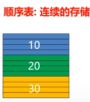

     3. 分类

        - 一体式
   
          数据存储在连续的空间，数据区和信息区在一起。扩容时只能整体搬迁。
   
        - 分离式
   
          数据区和信息区分开。扩容时信息区指向新的数据区。

     4. 存储结构

        - 数据区
        - 信息区：元素存储区的**容量**（capacity）和当前表中已有的**元素个数**（length或者size）。
   
     5. 扩充
   
        扩充的两种策略：
   
        ① 每次扩充增加**固定数目**的存储位置，如每次扩充增加10个元素位置，这种策略可称为线性增长。
   
        > 特点：节省空间，但是扩充操作频繁，操作次数多。
   
        ② 每次扩充**容量加倍**，如每次扩充增加一倍存储空间。
   
        > 特点：减少了扩充操作的执行次数，但可能会浪费空间资源，以空间换时间，推荐的方式。
   
     6. 增加元素
   
        - 表尾端加入元素——O(1)
   
        - 非保序的元素——O(1)
   
          插入新元素插在老元素前面然后这个老元素到尾端。
   
        - 保序的元素插入——O(n)
   
     7. 删除元素
   
        - 删除表尾元素——O(1)
        - 非保序的元素删除——O(1)
        - 保序的元素删除——O(n)
   
   - 链表
   
     1. 概念
   
        将元素存放在通过链接构造起来的一系列存储块中，存储区是非连续的。
   
     2. 图解
   
        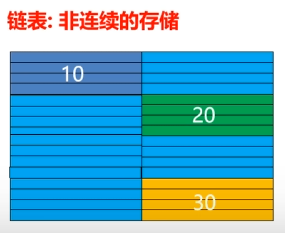
   
     3. 结构
     
        - 单链表
     
          每个节点包含两个域：元素域和链接域。
     
          
     
          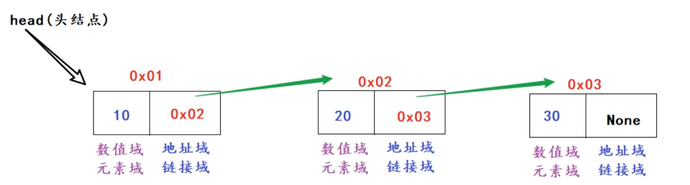
     
          :one: 表元素域item用来存放具体的数据。
     
          :two: 链接域next用来存放下一个节点的位置。
     
          :three: 链接指向连接表中的下一个节点；最后一个链接域指向空值None。
          
          :four: 变量head指向链表的头节点（首节点）位置，从head出发能找到表中的任意节点。
          
          ---
          
        - 双向链表
     
          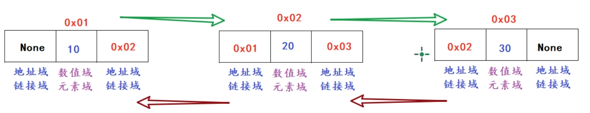
     
          ---
     
        - 单向循环链表
     
          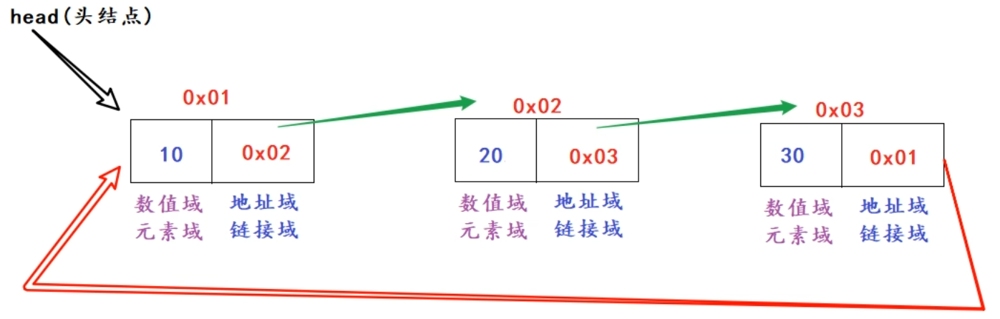
     
          ---
     
        - 双向循环链表
     
          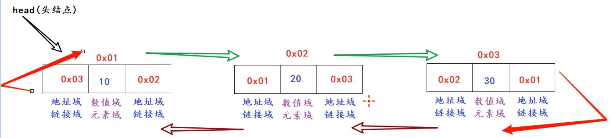
     
     4. 代码实现
     
        ```python
        """
        自定义代码模拟链表，思路分析：
        
        自定义SingleNode类，表示 节点类。
            属性：
                item：数值域(元素域)
                next：地址域(链接域)
        
        自定义SingleLinkedList类，表示：链表
            属性：
                head：表示头节点，指向第1个节点。
            行为：
                is_empty(self)：链表是否为空
                length(self)：链表长度
                travel(self, )：遍历整个链表
                add(self, item)：链表头部添加元素
                append(self, item)：链表尾部添加元素
                insert(self, pos, item)：指定位置添加元素
                remove(self, item)：删除节点
                search(self, item)：查找节点是否存在
        """
        
        # 节点
        class SingleNode:
            def __init__(self, item) -> None:
                """
                定义节点
                """
                self.item = item
                self.next: SingleNode | None = None # 地址由代码生成，用户只能给元素
        
        # 链表
        class SingleLinkedList:
            def __init__(self, head: SingleNode | None=None) -> None:
                """
                创建链表
                """
                self.head = head # 链表头节点
        
            def is_empty(self) -> bool:
                """
                链表是否为空
                """
                return self.head is None
        
            def length(self) -> int:
                """
                链表长度
                """
                # 判断头节点
                if not self.head:
                    return 0
        
                count = 0 # 计数
                cursor = self.head # 指针
        
                while cursor is not None:
                    count += 1
                    cursor = cursor.next # 指针到下一个
        
                return count
        
            def travel(self) -> list[SingleNode]:
                """
                遍历整个链表
                """
                linked_list = []
                cursor = self.head
        
                while cursor is not None:
                    linked_list.append(cursor)
                    cursor = cursor.next # 指针到下一个
        
                return linked_list
        
            def add(self, item):
                """
                链表头部添加元素
                """
                cursor = self.head # 获取当前的头节点
        
                self.head = SingleNode(item) # 改变当前头节点
                self.head.next = cursor # 让现在的头节点指向之前的头节点
        
                """
                第二种思路：
                node = SingleNode(item)
                node.next = self.head
                self.head = node
                """
        
            def append(self, item):
                """
                链表尾部添加元素
                """
                node = SingleNode(item)
        
                # 判断是否为空
                if self.is_empty():
                    self.head = node
        
                else:
                    # 直接修改最后一个节点的next属性
                    self.travel()[-1].next = node
        
                """
                也可以判断指针的next属性是否为None。
                如果为None，就代表当前指针指到了最后一个节点。
                """
        
        
            def insert(self, pos: int, item):
                """
                指定位置添加元素
                """
                linked_list = self.travel() # 获取所有节点
                node = SingleNode(item) # 获取要添加的节点
        
                # 修改节点next属性
                if pos == 0 or pos > 0: # 添加到头部
                    self.head = node
                    self.head.next = linked_list[0] # 现在的头节点指向原头节点
                    """
                    我不选择使用add方法的原因是使用add是又会创建一个SingleNode对象，浪费内存
                    """
                elif pos >= len(linked_list):
                    linked_list[-1].next = node
                else:
                    node.next = linked_list[pos - 1].next
                    linked_list[pos - 1].next = node
        
                """
                不使用列表的方法
                node = SingleNode(item)
                cursor = self.head
        
                if ll.is_empty() or pos <= 0:
                    node.next = cursor
                    self.head = node
                    return
        
                count = 0
                while count < pos - 1:
                    当cursor达到目标节点的前两个节点时，将cursor移动至目标节点的前一个节点并停止循环
                    count += 1
                    cursor = cursor.next 
                cursor.next = node
                node.next = cursor
                """
        
            def remove(self, item):
                """
                删除节点
                """
                if self.is_empty():
                    print('链表中没有节点。')
                    return
        
                linked_list = self.travel()
        
                for index, node in enumerate(linked_list):
                    if node.item == item:
                        if index == 0:
                            assert self.head # 因为前面判断了，所以这里可以直接断言
                            self.head = self.head.next
                        else:
                            linked_list[index - 1].next = node.next
                        break
                else:
                    print(f'链表中没有{item}节点。')
        
            def search(self, item) -> bool:
                """
                查找节点是否存在
                """
                for node in self.travel():
                    if node.item == item:
                        return True
                else:
                    return False
        
        if __name__ == "__main__":
            # 创建节点
            node1 = SingleNode('张三')
        
            # 测试链表
            ll = SingleLinkedList(node1)
        
            # 头部添加节点
            ll.add('李四')
        
            # 尾部添加节点
            ll.append('王五')
            ll.append('刘备')
        
            # 在第一个位置添加节点
            ll.insert(1, '赵六')
        
            # 在第0个位置添加节点
            ll.insert(0, '钱七')
        
            # 删除张三的节点
            ll.remove('张三')
        
            # 删除第一个节点（钱七）
            ll.remove('钱七')
        
            # 删除不存在的节点
            ll.remove('乔峰')
        
            # 寻找张三的节点
            print(f'节点张三是否存在于链表中：{ll.search('张三')}')
        
            # 是否为空
            print(f'当前列表是否为空：{ll.is_empty()}')
        
            # 链表长度
            print(f'当前链表的长度是：{ll.length()}')
        
            # 链表遍历
            count = 0
            for node in ll.travel():
                count += 1
                print(f'第{count}个节点的数值域是：{node.item}')
        ```
     

## 非线性结构

1. 概念

   数据结构中的各个节点之间具有多个对应关系。

2. 特点

   - 非空集。
   - 一个节点可能有多个直接前驱节点和多个直接后继节点。

3. 举例

   树、图。

### 树

1. 介绍

   树（英语：tree）就是一种非线性结构

   它是用来模拟具有树状结构性质的数据集合。它是由n（n>=1）个有限节点组成一个具有层次关系的集合。把它叫做“树”是因为它看起来像一棵倒挂的树，也就是说它是根朝上，而叶朝下的。它具有以下的特点：

   - 每个节点有零个或多个子节点。
   - 没有父节点的节点称为根节点。
   - 每一个非根节点有且只有一个父节点。
   - 没有子节点的节点叫做叶子节点。
   - 除了根节点外，每个子节点可以分为多个不相交的子树。

2. 术语

   - **节点的度**：一个节点含有的**子节点的个数**称为该节点的度。
   - **树的度**：一棵树中，所有节点中的最大的度称为树的度。
   - **叶节点或终端节点**：度为零的节点。
   - **父亲节点或父节点**：若一个节点含有子节点，则这个节点称为其子节点的父节点。
   - **孩子节点或子节点**：一个节点含有的子树的根节点称为该节点的子节点。
   - **兄弟节点**：具有相同父节点的节点互称为兄弟节点。
   - **节点的层次**：从**根开始定义**起，根为第1层，根的子节点为第2层，以此类推。
   - **树的高度或深度**：**树中节点的最大层次**。
   - **堂兄弟节点**：父节点在同一层的节点互为堂兄弟。
   - **节点的祖先**：从根到该节点所经分支上的所有节点。
   - **子孙**：以某节点为根的子树中任一节点都称为该节点的子孙。
   - **森林**：由m（m>=0）棵互不相交的树的集合称为森林。

3. 分类

   - **无序树**：树中任意节点的子节点之间**没有顺序关系**，这种树称为无序树，也称为自由树。

     > - **二叉树**：每个节点最多含有两个子树的树称为二叉树。

   - **有序树**：树中任意节点的子节点之间**有顺序关系**，这种树称为有序树。

     >- **霍夫曼树（用于信息编码）**：带权路径最短的二叉树称为哈夫曼树或最优二叉树。
     >
     >- **B树**：一种对读写操作进行优化的自平衡的二叉查找树，能够保持数据有序，拥有多于两个的子树。

### 二叉树

1. 种类

   - 完全二叉树

     对于一颗二叉树，假设其深度为d（d>1）。除了第d层外，其它各层的节点数目均已达**最大值**，且第d层所有节点**从左向右**连续地紧密排列，这样的二叉树被称为完全二叉树。

     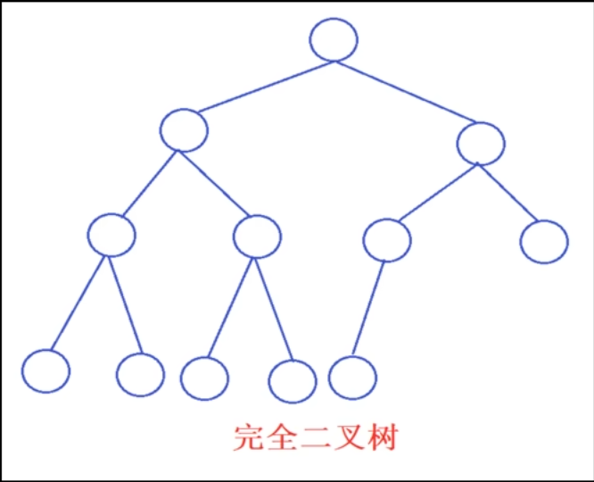

   - 满二叉树

     所有叶节点都在最底层的完全二叉树。

     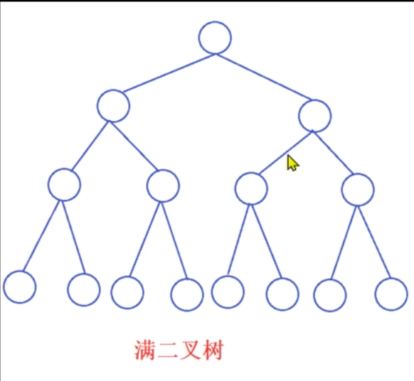

   - 非完全二叉树

     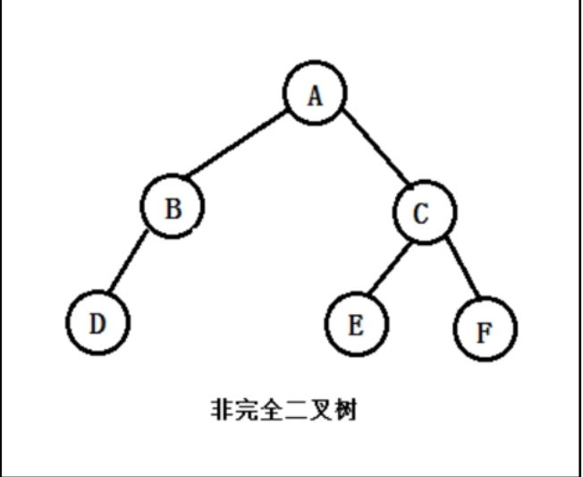

   - 平衡二叉树

     当且仅当任何节点的两棵子树的高度差不大于1的二叉树，可防止树退化为链表。

     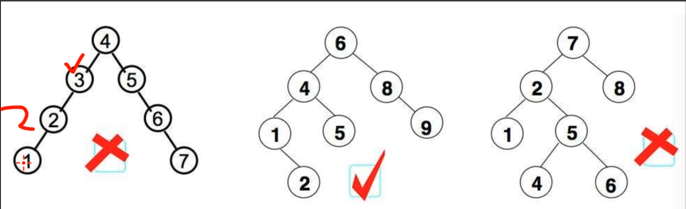

   - 排序二叉树（Binary Search Tree）

     1. 若左子树不空，则左子树上所有节点的值均小于它的根节点的值。
     2. 若右子树不空，则右子树上所有节点的值均大于它的根节点的值。
     3. 左、右子树也分别为二叉排序树。

     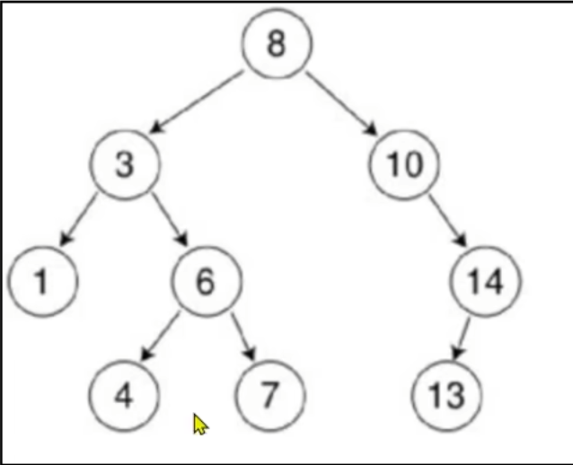

2. 存储

   - **顺序存储**：将二叉树存储在固定的数组中，虽然在遍历速度上有一定的优势，但因所占空间比较大，是非主流二叉树存储方式。
   - **链式存储**：二叉树通常以链式存储。查找方便且节省空间。

3. 应用场景

   - xml，html等，编写的解析器的时候，不可避免用到树。
   - 路由协议就是使用了树的算法。
   - mysql数据库索引。
   - 文件系统的目录结构。
   - 很多经典的AI算法都是树搜索，此外机器学习中的decision tree也是树结构。

4. 性质

   性质1：在二叉树的第 $i$ 层上至多有 $2^{i-1}$ 个结点（$i>0$）  。

   > 例：第3层最多结点个数 $2^{(3-1)} = 4$。

   性质2：深度为 $k$ 的二叉树至多有 $2^k - 1$ 个结点（$k>0$）  。

   > 例：深度 $3$ 的二叉树最多结点数 $2^3 - 1 = 7$。

   性质3：对于任意一棵二叉树，如果其叶结点数为 $N_0$，而度数为 $2$ 的结点总数为 $N_2$，则 $N_0 = N_2 + 1$。

   性质4：最多有 $n$ 个结点的完全二叉树的深度必为 $\log_2(n+1)$（实际应为 $\lfloor \log_2(n+1) \rfloor$ 或 $\lceil \log_2(n+1) \rceil$，此处按原文保留）。

   性质5：对完全二叉树，若从上至下、从左至右编号，则编号为 $i$ 的结点，其左孩子编号必为 $2i$，其右孩子编号必为 $2i+1$，其父节点的编号必为 $\lfloor i/2 \rfloor$（$i=1$ 时为根，除外）。

5. 遍历方法

   - 广度优先

     从左至右、从上至下依次拿取。

**模拟二叉树**

```python
"""
自定义代码完成二叉树
"""

# 创建节点类
class Node:
    def __init__(self, item) -> None:
        """
        创建节点

        Parameters
        ----------
        item : _type_
            元素域
        """
        self.item = item
        self.lchild: Node | None = None
        self.rchild: Node | None = None


# 创建二叉树类
class BinaryTree:
    def __init__(self, root: Node | None=None) -> None:
        """
        创建二叉树类

        Parameters
        ----------
        root : Node | None, optional
            根节点, 默认为None
        """
        self.root = root

    def add(self, item):
        """
        # 添加节点，采用广度优先的思想

        初始操作
        ------
        初始化队列、将根节点入队、准备加入到二叉树的新结点

        重复执行
        ---
        1. 获得并弹出队头元素
        2. 若当前结点的左右子结点不为空，则将其左右子节点入队列
        3. 若当前结点的左右子节点为空，则将新结点挂到为空的左子结点、或者右子节点

        Parameters
        ------
        item
            元素域
        """
        new_node = Node(item) # 将item封装为节点

        # 判断根节点是否为空
        if not self.root:
            self.root = new_node
            return
        
        # 使用广度优先遍历算法，找到空缺的节点位置
        queue = [self.root] # 创建队列并将第一个元素设置为根节点
        while True:
            # 弹出队列的第一个节点
            node = queue.pop(0)

            # 判断左子树
            if not node.lchild:
                node.lchild = new_node
                return
            else:
                queue.append(node.lchild)

            # 判断右子树
            if not node.rchild:
                node.rchild = new_node
                return
            else:
                queue.append(node.rchild)


    def breadth_travel(self):
        """
        广度优先遍历
        """
        # 判断根节点
        if not self.root:
            print(None)
            return
        
        queue = [self.root] # 创建队列并将第一个元素设置为根节点
        while queue:
            # 弹出队列的第一个节点
            node = queue.pop(0)
            print(node.item, end=' ')

            # 判断左节点
            if node.lchild:
                queue.append(node.lchild)

            # 判断右节点
            if node.rchild:
                queue.append(node.rchild)


    def pre_order(self, root: Node | None):
        """
        深度优先遍历（根左右），前序
        """
        if root:
            print(root.item, end=' ')
            self.pre_order(root.lchild)
            self.pre_order(root.rchild)

    def in_order(self, root: Node | None):
        """
        深度优先遍历（左根右），中序
        """
        if root:
            self.in_order(root.lchild)
            print(root.item, end=' ')
            self.in_order(root.rchild)

    def post_order(self, root: Node | None):
        """
        深度优先遍历（左右根），后序
        """
        if root:
            self.post_order(root.lchild)
            self.post_order(root.rchild)
            print(root.item, end=' ')


# 定义测试函数
def demon1_init():
    """
    节点和二叉树初始化测试
    """
    node = Node('张三')
    print(node.item)

    by = BinaryTree(node)
    assert by.root
    print(by.root.item)
    print(by.root.lchild)
    print(by.root.rchild)

def demon2_queue():
    """
    模拟队列
    """
    queue_list = ['A', 'B', 'C']

    print(queue_list.pop(0)) # 模拟A出队列，后面自动补齐
    print(queue_list.pop(0))
    print(queue_list.pop(0))

    print(queue_list)

if __name__ == "__main__":
    # demon1_init()
    # demon2_queue()

    by = BinaryTree()

    # 添加节点
    by.add('0')
    by.add('1')
    by.add('2')
    by.add('3')
    by.add('4')
    by.add('5')
    by.add('6')
    by.add('7')
    by.add('8')
    by.add('9')

    # 广度优先遍历
    by.breadth_travel()
    print('\n')

    # 前序
    by.pre_order(by.root)
    print('\n')

    # 中序
    by.in_order(by.root)
    print('\n')

    # 后序
    by.post_order(by.root)
    print('\n')

"""
0 1 2 3 4 5 6 7 8 9 

0 1 3 7 8 4 9 2 5 6 

7 3 8 1 9 4 0 5 2 6 

7 8 3 9 4 1 5 6 2 0 

"""
```


# 递归

1. 方法自己调用自己

2. 案例

   - 计算阶乘

   - 斐波那契数列

   - 文件夹拷贝与删除

   - 服务器数据整理

     > 以后缀名命名文件夹，把所有的后缀名相同的文件移到该后缀名文件夹且路径一致。

3. 要点

   - 必须要有出口。
   - 次数不能过多。
   - 必须有规律。

**入门**

```python
# 死递归演示
def show():
    print('我是天才')
    show()

if __name__ == "__main__":
    show()

"""
[Previous line repeated 996 more times]
RecursionError: maximum recursion depth exceeded
"""
# 栈内存溢出，一般是996

# 改正
count = 0
def show():
    global count
    count += 1
    if count >= 100: # 如果是大于1000，也会报错
        return
    print('我是天才')
    show()

if __name__ == "__main__":
    show()
```

**求阶乘**

```python
"""
求阶乘：
    n! = n * (n - 1) * ... * 2 * 1 = n * (n - 1)!
"""

def factorial(n: int) -> int:
    # 出口
    if n == 0 or n == 1:
        return 1
    elif n < 0: # 防止输错数字导致报错
        return 0

    # 规律
    return n * factorial(n - 1)

if __name__ == "__main__":
    print(factorial(5))
```
