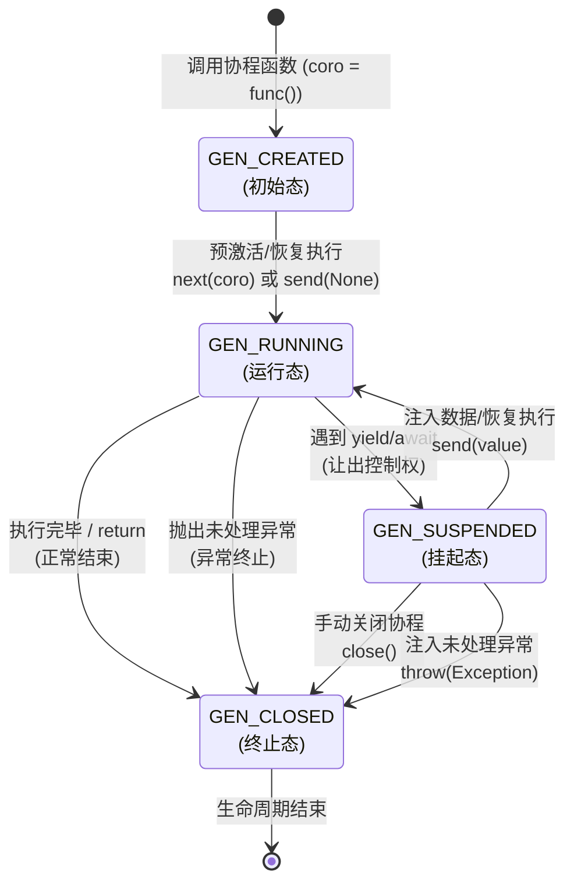
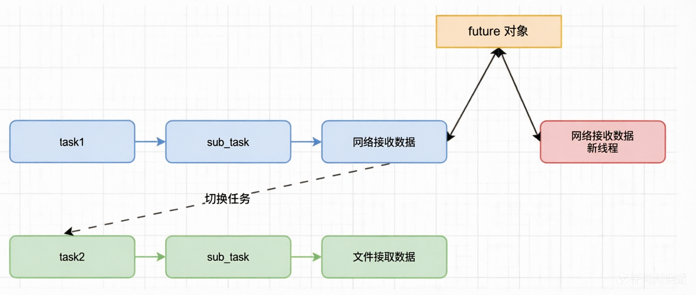

# 介绍

在现代 Python 开发中，随着应用对高并发、高性能的需求不断增加，传统同步编程方式在处理大量 I/O 操作时逐渐显得力不从心。异步编程通过极大提升程序的并发能力和资源利用率，成为了Web开发、微服务、实时通讯、数据抓取等领域的核心技术。

在开始学习 Python 的异步编程之前，先来看看传统同步编程在处理I/O 密集型任务时，存在哪些问题。I/O 密集型任务的特点是：程序在执行过程中，需要频繁等待输入/输出操作完成。例如：

- 等待网络请求返回数据
- 等待磁盘读写完成
- 等待数据库查询结果

在这些等待期间，程序会阻塞，CPU 处于空闲，无法继续做其他事情，从而大大降低了整体效率。

# 场景模拟

```python
import time

def task01():
    time.sleep(5) # 模拟一个 5 秒的耗时操作
    return 10

def task02():
    time.sleep(3) # 模拟一个 3 秒的耗时操作
    return 20

def main():
    result = task01()
    print(f"任务 1 的执行结果：{result}")
    result = task02()
    print(f'任务 2 的执行结果：{result}')

if __name__ == "__main__":
    start = time.time()
    main()
    end = time.time()
    print(f"总耗时：{end - start}s")
```

在同步编程过程中，一旦遇到 I/O 阻塞，整个程序就会停下来。导致：

- CPU 资源被浪费
- 整体执行效率低下
- 单位时间内完成的任务量少

# 异步工作介绍

## 工作流程

它的工作流程大致是这样的：

- 首先，创建一个事件循环（Event Loop）
- 然后，将需要执行的任务注册到事件循环中
- 最后，启动事件循环，开始调度和执行各个任务

需要注意的是，为了让事件循环正确地识别和调度任务，我们需要遵循以下两个规则：

- 任务函数定义时，需要使用 `async def` 定义，表示这是一个异步函数，是需要交给事件循环管理的
- 在任务函数内部，当遇到需要等待其他异步操作的地方，需要使用 `await`。这就告诉事件循环：此处可以挂起当前任务，等异步操作完成后再恢复执行。这样可以避免程序在等待期间白白占用资源，从而提升整体效率。

通过这套机制，我们可以让程序在遇到 I/O 等待时不会空耗资源，从而大幅提升整体的执行效率。

## 事件循环

在 Python 异步编程中，**事件循环**是整个异步机制的核心调度器，它负责管理、调度和执行所有异步任务。可以把它想象成一个“任务调度员”或“中央控制台”，它持续运行，不断检查哪些任务可以执行、哪些任务正在等待 I/O、哪些任务已经完成。

它的主要作用包括：

- 注册与调度任务：将用 `async def` 定义的协程函数包装成“任务”，并加入待执行队列。
- 监听 I/O 事件：当某个任务执行到 `await` 语句时，事件循环会“挂起”该任务，转而去执行其他就绪的任务，而不是傻等。
- 恢复执行：当被等待的 I/O 操作（如网络请求、文件读写）完成后，事件循环会自动恢复之前挂起的任务，继续执行后续代码。
- 避免资源浪费：通过这种“协作式多任务”机制，CPU 不会在等待 I/O 时空闲，从而大幅提升程序的整体吞吐量和响应速度。

在实际开发中，通常不需要手动创建或操作事件循环对象，Python 提供了高层级接口 `asyncio.run()`，它会自动创建、启动并关闭事件循环。

```python
import asyncio

async def fetch_data():
    print("开始请求数据...")
    await asyncio.sleep(2)  # 模拟网络请求
    print("数据请求完成！")

asyncio.run(fetch_data())
```

在这个例子中，`asyncio.run()` 就是“事件循环”，它负责启动 `fetch_data` 这个协程，并在 `await asyncio.sleep(2)` 时切换到其他任务（如果有的话），等 2 秒后再回来继续执行。

## 协作式多任务

在 Python 的 `asyncio` 事件循环中，**没有任何机制可以“强行打断”一个正在执行的协程**。这被称为**协作式多任务（Cooperative Multitasking）**，而不是操作系统级别的“抢占式多任务”。

### 耗时操作**有** `await`

当事件循环挂起任务 A，去执行任务 B 时，任务 B 会一直执行，直到它遇到自己的 `await` 语句（比如等待网络请求、休眠 `await asyncio.sleep()` 等）。

- 行为

  任务 B 遇到 `await` 后，主动把控制权交还给事件循环。

- 结果

  事件循环此时才会去检查任务 A 的 I/O 是否完成，如果完成了，就恢复执行任务 A。

### 耗时操作**没有** `await`

如果任务 B 里面写了一段非常耗时的 CPU 密集计算（比如一个巨大的 `for` 循环），并且**没有任何 `await`**：

- 行为

  任务 B 会一直霸占 CPU 往下执行，事件循环完全失去控制权。

- 结果

  1. 任务 A 即使 I/O 早就完成了，也**必须乖乖排队等着**。
  2. 事件循环**无法打断**任务 B，只能等任务 B 把那个耗时的 `for` 循环彻底跑完，或者遇到下一个 `await`。
  3. 在这期间，整个程序（包括其他所有任务）都会卡死（即所谓的“阻塞了事件循环”）。

### 核心总结

- 事件恢复的时机

  永远是在**当前正在运行的代码主动交出控制权**（遇到 `await`）之后。

- 是否打断

  **绝不打断**。Python 的协程是“自觉”的，如果某个协程“不自觉”（没有 `await` 却做了耗时操作），它就会变成“毒瘤”，卡死整个事件循环。

这也是为什么在 `asyncio` 编程中有一条铁律：**绝对不要在协程中执行耗时的 CPU 密集计算（如复杂加密、大文件解压、死循环等）**。如果非要执行，必须使用 `loop.run_in_executor()` 把它扔到线程池或进程池里去，以免阻塞事件循环。

# `async`

在 Python 中，`async` 是一个用于定义**协程函数（Coroutine Function）**的关键字。它的核心作用是告诉 Python 解释器，这个函数是一个特殊的、可以被异步调用的函数，而不是一个普通的同步函数。

## 定义协程函数

在 `def` 关键字前加上 `async` 时，定义的就不再是一个普通函数，而是一个**协程函数**。

- 普通函数

  调用时会立即执行函数体内的所有代码，直到执行完毕或遇到 `return`。

- 协程函数

  调用时**不会立即执行**函数体，而是返回一个**协程对象（Coroutine Object）**。这个对象就像一个“任务说明书”，告诉事件循环（Event Loop）这个任务可以如何被挂起和恢复。

```python
async def my_coroutine():
    return "Hello"

# 调用协程函数，并不会执行函数体
coro_obj = my_coroutine() 
print(coro_obj) 
# 输出: <coroutine object my_coroutine at 0x...>
# 可以看到，返回的是一个协程对象，而不是 "Hello"
```

## 允许使用 `await`

`async` 定义的函数内部，才可以使用 `await` 关键字。这是实现异步非阻塞的核心。

- `await` 的作用

  `await` 后面通常跟着一个“可等待对象”（Awaitable），比如另一个协程。当代码执行到 `await some_coroutine()` 时，它会做两件事：

  1. 挂起（Suspend）

     告诉事件循环：“我现在需要等待 `some_coroutine` 的结果，在它完成之前，我先不干了。你可以先去执行别的任务。”

  2. 让出控制权

     事件循环会暂停当前协程的执行，转而去运行其他已经准备好的协程，从而实现并发。

```python
import asyncio

async def task():
    print("任务开始")
    # 模拟一个耗时的 I/O 操作，比如网络请求
    # await 会挂起 task，让事件循环去处理其他事
    await asyncio.sleep(2) 
    print("任务结束")
    return "完成"

async def main():
    print("主函数开始")
    # 创建任务，但不会立即等待它
    my_task = asyncio.create_task(task())
    
    # 在 task 等待的 2 秒里，main 函数可以继续执行
    print("主函数在等待时可以继续干活")
    
    # 等待 my_task 的结果
    result = await my_task
    print(f"收到结果: {result}")

# 运行主协程
asyncio.run(main())
```

**输出：**

```
主函数开始
任务开始
主函数在等待时可以继续干活
任务结束
收到结果: 完成
```

可以看到，`主函数` 并没有因为 `task` 在等待而卡住，这就是 `await` 实现的非阻塞效果。

## 执行机制

`async` 函数本身不会自动并发，它需要一个“调度中心”来管理，这个调度中心就是**事件循环（Event Loop）**。

>**事件循环**
>
>是异步编程的核心。它负责注册、调度和执行所有的协程任务。使用 `asyncio.run(main())` 时，Python 就会自动创建一个事件循环，运行 `main` 协程，并管理其中所有的 `await` 操作。

## 总结

| 特性           | 普通函数 (`def`)         | 协程函数 (`async def`)               |
| -------------- | ------------------------ | ------------------------------------ |
| **调用结果**   | 立即执行，返回函数结果   | 返回一个协程对象，不立即执行         |
| **内部关键字** | 不能使用 `await`         | 可以使用 `await` 来挂起执行          |
| **执行方式**   | 由调用者直接执行         | 由事件循环（Event Loop）调度和执行   |
| **适用场景**   | CPU 密集型任务、简单逻辑 | I/O 密集型任务（网络请求、文件读写） |

简单来说，`async` 就像给一个函数贴上了“**我可以被暂停和恢复**”的标签，让它能够融入异步编程的生态，通过 `await` 关键字实现高效的并发，特别适合处理大量耗时的 I/O 操作。

# 协程对象

## 介绍

协程对象（Coroutine Object）本质上是一个**“尚未执行的异步任务”**。
它代表了一段计算或 I/O 操作的逻辑，这段逻辑可以暂停（挂起）和恢复。可以把它理解为一张“菜谱”或“任务说明书”，它本身并不是做好的菜（结果），而是描述了做菜的过程。

## 来源

协程对象由协程函数（Coroutine Function）调用而来。
在 Python 中，使用 `async def` 关键字定义的函数就是协程函数。当像调用普通函数一样调用它时，它不会立即执行，而是返回一个**协程对象**。

```python
async def my_coroutine():
    return "Hello"

# 调用协程函数，返回协程对象
coro = my_coroutine()  
print(type(coro))  # <class 'coroutine'>
```

## 作用

协程对象的核心作用是**作为异步编程的调度单元**。

它实现了 `__await__()` 方法，属于“可等待对象（Awaitable）”。它必须被提交给**事件循环（Event Loop）**才能被驱动执行。在事件循环中，当协程遇到 `await` 时，会主动让出控制权，让事件循环去执行其他任务，从而实现高效的非阻塞并发。

## 使用场景

- **需要并发处理 I/O 密集型任务时**：如网络请求、文件读写、数据库查询等。
- **在异步函数内部**：当需要等待另一个协程的结果时，使用 `await coro_obj`。
- **作为程序的顶层入口时**：使用 `asyncio.run(coro_obj)` 来启动整个异步程序。
- **需要将其作为独立并发任务时**：使用 `asyncio.create_task(coro_obj)` 将其包装为 Task 对象。

## 属性和方法

协程对象拥有一些用于内省（检查状态）和控制执行的内置属性与方法。

### 常用属性

| 属性名称     | 作用说明                                                     |
| ------------ | ------------------------------------------------------------ |
| `cr_frame`   | 返回协程当前的执行栈帧（Stack Frame），包含局部变量和执行状态信息。 |
| `cr_running` | 返回一个布尔值，表示该协程当前是否正在执行中。               |
| `cr_code`    | 返回协程对象的底层代码对象（Code Object）。                  |
| `cr_await`   | 返回当前协程正在等待（`await`）的可等待对象，若未在等待则返回 `None`。 |

### 常用方法

| 方法名称                        | 作用说明                                                     |
| ------------------------------- | ------------------------------------------------------------ |
| `__await__()`                   | 返回一个迭代器，用于将协程接入事件循环进行调度（由 `await` 关键字在底层触发）。 |
| `send(value)`                   | 向协程发送一个值并恢复其执行。通常发送 `None` 来启动协程，或驱动底层的生成器。 |
| `throw(type, value, traceback)` | 在协程挂起的位置抛出一个指定的异常，可用于异常处理或强制终止协程。 |
| `close()`                       | 在协程挂起的位置抛出 `GeneratorExit` 异常，用于安全地关闭并清理协程资源。 |

## 生命周期



# `await`

在 Python 异步编程中，`await` 是实现非阻塞并发的核心关键字。

## 语法约束

`await` 关键字具有严格的作用域限制，它**只能**出现在由 `async def` 定义的协程函数内部。如果在普通的 `def` 函数中使用 `await`，Python 解释器会直接抛出 `SyntaxError` 语法错误。

## 可等待对象（Awaitable）

`await` 后面必须紧跟一个“可等待对象”。常见的可等待对象包括：

- 其他协程函数返回的协程对象；

- `asyncio` 库提供的异步函数（如 `asyncio.sleep()`）；

- `Task` 对象或 `Future` 对象。

  如果 `await` 后面跟的是普通函数或非可等待对象，会抛出 `TypeError` 错误。

## 执行机制

当代码执行到 `await` 时，会发生以下过程：

- **暂停当前协程**：当前协程的执行会被挂起，不再继续向下执行代码。
- **让出 CPU 资源**：当前协程会将控制权主动交还给底层的“事件循环（Event Loop）”。
- **并发调度**：在等待 I/O 操作（如网络请求、文件读写）完成的期间，事件循环可以去执行其他处于就绪状态的协程任务，从而实现高效的非阻塞并发。

> - 如果 `await` 后面是一个**协程函数**的话，事件循环一般不会立即切换其他任务执行，而是继续执行该协程函数。
> - 如果 `await` 后面是一个**`future` 对象**的话，事件循环会挂起当前任务，转到其他任务去执行。

## 状态恢复

当 `await` 后面的可等待对象执行完毕（例如 I/O 操作完成）后，事件循环会重新唤醒之前挂起的协程，恢复其执行状态，并将可等待对象的返回值传递给 `await` 表达式，程序继续向下执行后续代码。

# `future` 对象

在 Python 中，提到 `Future` 对象，通常是指 `asyncio` 模块中的 `Future` 类。它是一个相对底层的可等待对象（Awaitable），代表了一个**异步操作的最终结果**。它就像一个“占位符”或“收据”，在任务执行期间没有值，当任务完成、被取消或发生异常时，结果会被设置到其中。

## 创建对象格式

在现代 Python 异步编程中，官方推荐通过当前正在运行的事件循环来创建 `Future` 对象，而不是直接实例化：

```python
loop = asyncio.get_running_loop()       # 获取当前正在运行的事件循环
future = loop.create_future()           # 通过事件循环创建一个 Future 对象
```

## 参数详解

`loop.create_future()` 方法本身不需要传入业务参数，但了解 `Future` 对象的核心状态参数至关重要：

| 参数/状态名称 | 作用说明                                 | 常见可选值/状态                                              |
| ------------- | ---------------------------------------- | ------------------------------------------------------------ |
| `result`      | 异步操作成功完成时，存储的最终返回值     | 任意 Python 对象（通过 `set_result()` 设置）                 |
| `exception`   | 异步操作失败时，存储的异常对象           | 异常实例（通过 `set_exception()` 设置）                      |
| `_state`      | 内部状态标识，用于追踪 Future 的生命周期 | `PENDING`（等待中）<br />`FINISHED`（已完成）<br />`CANCELLED`（已取消） |

## 常用属性

`Future` 对象主要依赖内部属性来管理状态，开发者通常通过方法来访问它们：

| 属性名称     | 作用说明                                                     |
| ------------ | ------------------------------------------------------------ |
| `_state`     | 记录当前 Future 的状态（`PENDING`, `FINISHED`, `CANCELLED`） |
| `_result`    | 存储任务成功执行后的返回值                                   |
| `_exception` | 存储任务执行过程中抛出的异常                                 |
| `_callbacks` | 存储任务完成后需要触发的回调函数列表                         |
| `_loop`      | 记录该 Future 绑定的事件循环对象                             |

## 常用方法

| 方法名称                   | 作用说明                                                     |
| -------------------------- | ------------------------------------------------------------ |
| `done()`                   | 检查 Future 是否已经完成（包括成功完成、抛出异常或被取消）   |
| `result()`                 | 获取 Future 的结果。若未完成会抛出 `InvalidStateError`，若被取消会抛出 `CancelledError` |
| `set_result(result)`       | 手动将 Future 标记为完成，并设置其返回值                     |
| `set_exception(exception)` | 手动将 Future 标记为完成，并设置其抛出的异常                 |
| `cancel()`                 | 尝试取消 Future 的执行                                       |
| `cancelled()`              | 检查 Future 是否已被取消                                     |
| `add_done_callback(fn)`    | 注册一个回调函数，当 Future 完成（或取消）时自动触发         |
| `exception()`              | 获取 Future 中设置的异常，若未设置则返回 `None`              |

**补充说明：**

1. Task 与 Future 的关系

   在实际开发中，我们很少直接手动创建和管理 `Future`。通常使用 `asyncio.create_task()` 将协程包装成 `Task` 对象。

   `Task` 是 `Future` 的子类，它会自动管理协程的执行状态，并在协程返回结果或抛出异常时自动调用 `set_result()` 或 `set_exception()`。

2. 并发模块的 Future

   Python 的 `concurrent.futures` 模块（用于线程池和进程池）中也有一个 `Future` 类。它用于多线程/多进程环境，不支持 `await` 语法，使用时需注意区分。

## 作用路径



假设：我们需要 Python 事件循环来管理两个任务。执行过程如下：

1. 当事件循环执行到 task1 -> sub_task -> 网络接收数据时，需要等待，为了不阻塞事件循环，会创建一个新的线程，并把该任务扔到该线程中去执行。
2. 创建一个 future 对象，让事件循环和新创建的线程对象持有。当新线程接收到数据后，通过 future 对象将数据传递到 task1 任务对象中。当事件循环检测到 future 对象有返回结果，继续调度 task1 任务执行。
3. 由于 task1 任务已经被挂起，事件循环就可以切换到任务2去执行，避免在任务1上等待。

# `task` 对象

在 Python 异步编程中，`Task` 对象是用于在事件循环中封装和并发调度协程的核心类。它是 `Future` 的子类，专门用于包装协程，使其能够独立于创建它的协程运行。

## 创建对象格式

官方强烈建议不要直接实例化 `Task` 类，而是通过工厂函数来创建对象：

```python
task = asyncio.create_task(
    coro=my_coroutine(),      # 必选：要包装并调度的协程对象
    name="MyTask",            # 可选：为任务指定一个名称，便于调试和日志追踪
    context=None              # 可选：指定自定义的上下文变量（Python 3.11+ 支持）
)
```

## 参数详解

| 参数名称  | 作用说明                                                     | 常见可选值                                                   |
| --------- | ------------------------------------------------------------ | ------------------------------------------------------------ |
| `coro`    | 要包装的协程对象，Task 会自动将其加入事件循环进行调度        | 由 `async def` 定义的协程函数调用后返回的对象                |
| `name`    | 任务的名称标识，用于在调试或打印任务时进行区分               | 任意字符串（默认为 `None`，系统会自动分配名称）              |
| `context` | 允许指定自定义的 `contextvars.Context`，<br />实现任务内的局部状态存储 | `contextvars.Context` 对象（默认为 `None`，<br />会复制当前上下文） |

## 常用属性

| 属性名称 | 作用说明                                                     |
| -------- | ------------------------------------------------------------ |
| `_state` | 记录 Task 当前的生命周期状态（`PENDING`、`RUNNING`、`FINISHED`、`CANCELLED`） |
| `_coro`  | 存储由该 Task 包装的底层协程对象                             |
| `_loop`  | 记录该 Task 所绑定的事件循环对象                             |

## 常用方法

| 方法名称                | 作用说明                                                     |
| ----------------------- | ------------------------------------------------------------ |
| `done()`                | 检查 Task 是否已完成（正常返回、抛出异常或被取消均算作完成） |
| `result()`              | 获取 Task 封装的协程的执行结果。若未完成或已取消，会抛出相应异常 |
| `exception()`           | 获取 Task 中抛出的异常。若未发生异常则返回 `None`，若已取消则抛出 `CancelledError` |
| `cancel()`              | 请求取消该 Task，会在下一轮事件循环中向协程抛出 `CancelledError` 异常 |
| `cancelled()`           | 检查该 Task 是否已经被成功取消                               |
| `add_done_callback(fn)` | 注册一个回调函数，当 Task 完成时自动触发，并将 Task 对象作为参数传入 |
| `get_name()`            | 获取当前 Task 的名称                                         |
| `set_name(value)`       | 动态修改当前 Task 的名称                                     |
| `get_coro()`            | 返回由该 Task 包装的底层协程对象                             |
| `get_stack()`           | 返回此 Task 对象的栈框架列表，用于调试挂起或异常的协程       |

## 补充说明

1. 与协程的区别

   直接 `await` 一个协程是**串行**的，必须等它执行完；而将协程包装成 `Task` 后，它会立刻被提交给事件循环**并发**执行。

2. 与 Future 的区别

   `Future` 通常代表一个底层的异步操作结果，而 `Task` 是 `Future` 的子类，专门负责驱动协程的执行。协程执行完毕后，`Task` 会自动调用底层的 `set_result()` 或 `set_exception()` 来更新自身状态。

3. 内存安全

   事件循环只保留对 `Task` 对象的弱引用。如果你创建了 `Task` 但没有保存它的引用（例如没有赋值给变量或放入集合中），它可能会被垃圾回收机制意外销毁。

# 总结

异步编程是一种在**单线程中实现并发执行**的技术，它通过“事件循环”来调度任务，遇到会等待的操作时（比如网络请求或文件读写），就把控制权交给其他任务，自己等结果再回来继续处理。这样就避免了“等着发呆”的情况，大大提升了运行效率。与多线程不同，异步不靠开启多个线程，而是通过任务切换来充分利用时间资源。

*通俗来说：异步编程就是让单线程也能干多件事，不等白等，高效非阻塞。*

当程序主要瓶颈是文件读写、网络请求、数据库操作等 IO 操作时，异步编程可以在等待 IO 响应期间处理其他任务，最大化资源利用率。相比开多线程，异步在性能和资源占用上更轻量。简言之，Python 异步编程在IO密集型任务上最优，避免线程阻塞等待。

写代码时需要具备“异步思维”——凡是会等待的操作，都应该考虑是否使用 `await`、是否用异步库实现。每写一个任务，都应自问：这个地方是不是可以不阻塞？简言之，关注**是否等待**，主动识别可异步处理的环节。