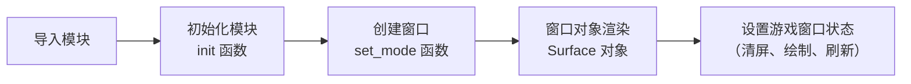

# 基本流程

1. 导入模块
2. 初始化 `pygame`——`init()` 函数
3. 创建 `pygame` 窗口——`set_mode` 函数
4. 窗口图像渲染——`surface` 对象
5. 设置游戏窗口状态（清屏、绘制、刷新）



# 流程详解

## 导包

```python
import pygame
from pygame.locals import * # 不建议这么做
```

`pygame.locals` 存储了绝大部分顶级变量和常量。

- `pygame.QUIT` 程序退出事件
- `pygame.KEYDOWN` 键盘按下事件

## 初始化

```python
result = pygame.init()
```

1. 作用

   在底层初始化所有导入 `pygame` 的子模块，并为要使用的硬件设备做准备工作。

2. 返回值

   一个二元元组。第一个表示成功导入的子模块数，第二个表示导入失败的个数。

   ```python
   print(f"导入成功{result[0]}个。")
   print(f"导入失败{result[1]}个。")
   ```

## 创建窗口

使用 `pygame.display.set_mode` 函数。

1. 创建格式

   ```python
   screen = pygame.display.set_mode(
       size=(0, 0),       # 指定窗口的宽度和高度（像素），以元组形式传入
       flags=0,           # 控制窗口显示类型的标志位（如全屏、可调整大小等），可用 | 组合
       depth=0,           # 指定像素的颜色深度（位数），通常设为 0 让系统自动选择最佳值
       display=0,         # 在多显示器环境下，指定窗口输出的显示器索引
       vsync=0            # 是否开启垂直同步（设为 1 可避免画面撕裂，但受硬件驱动限制）
   )					 # 返回一个 Surface 对象
   ```

2. 参数说明

   | 参数      | 作用说明                     | 可选值与补充说明                                             |
   | --------- | ---------------------------- | ------------------------------------------------------------ |
   | `size`    | 设置主窗口的宽度和高度       | 一个元组 `(width, height)`，例如 `(800, 600)`。              |
   | `flags`   | 控制窗口的行为与显示样式     | `pygame.FULLSCREEN`（全屏模式）<br />`pygame.RESIZABLE`（窗口可拖动调整大小）<br />`pygame.NOFRAME`（无边框窗口）<br />`pygame.DOUBLEBUF`（双缓冲，减少闪烁）<br />`pygame.HWSURFACE`（硬件加速，常与全屏配合）<br />`pygame.OPENGL`（创建 OpenGL 渲染窗口）<br />`pygame.SCALED`（适配高分辨率显示器）<br />`pygame.SHOWN`（默认可见模式）<br />`pygame.HIDDEN`（隐藏模式）。多个标志位可用 \`<br />其中，`DOUBLEBUF` 和 `HWSURFACE` 最常用。 |
   | `depth`   | 指定每个像素的颜色位数       | 通常为 `0`（自动选择系统最佳值），<br />也可手动指定 `8`、`16`、`32` 等。 |
   | `display` | 指定多显示器环境下的输出设备 | 整数索引<br />`0` 表示主显示器<br />`1` 表示第二个显示器等   |
   | `vsync`   | 控制是否开启垂直同步         | `0`（关闭）<br /> `1`（开启，可减少画面撕裂，但可能影响帧率） |

> 也可以使用位或运算符组合成复合模式类型。
>
> ```python
> SIZE = WIDTH, HEIGHT = 640, 396
> pygame.display.set_mode(SIZE, HWSURFACE | DOUBLEBUF, 32)
> ```

## 窗口对象渲染

`pygame.display.set_mode` 函数会返回一个 `Surface` 对象（即主窗口的画布）。`Surface` 对象之间的相互绘制就类似于将画好的画纸进行叠加放置，放在最上面的画纸会覆盖限免所有的画纸。

1. `fill(color, rect=None)`

   用纯色填充 Surface 的全部或部分区域。`color` 为 RGB 元组（如 `(0,0,0)` 黑色），常用于每帧清除屏幕背景。

2. `blit(source, dest, area=None, special_flags=0) -> Rect` 

   将一个 Surface（如加载的图片、渲染的文本）绘制到当前主窗口 Surface 上。

   - `source` 为源图像（必须是 `Surfacre` 对象）。
   - `dest` 为目标坐标 $(X, Y)$ 。
   - `area` 限定所要绘制的 `Surface` 对象的绘制范围，一个四元元组。
   - `special_flags` 指定混合模式。
   - 返回值 `Rect` 是一个四元元组，表示目标 `Surface` 对象实际的绘制矩形区域。

>**`Pygame` 的坐标系**
>
>`Pygame` 的窗口就是一个二维坐标系。
>
>1. 原点 (0, 0)：位于窗口的**左上角**。
>2. X 轴：从左到右，数值**递增**。
>3. Y 轴：从上到下，数值**递增**。
>
>图片的锚点在左上角。

## 设置游戏窗口状态

### 窗口介绍

使用 `Pygame` 制作小游戏一般都以一个窗口呈现，该过程类似于一个画板，在画板上放置已画好的画纸，而在这些画纸上渲染的可以是一张图片、一段文本、一个图形等，当存在有**多张画纸**时，会出现**层叠效应**。

而当需要 `Pygame` 窗口**一直**呈现在界面中时，就需要对每一张画纸进行重叠部分的不间断的擦除与绘制，在 Python 中，这需要借助一个 `while` 循环实现，只要条件为真，它就持续运行，直到条件为假或者直接终止程序，使其退出运行。

### 游戏状态

`Pygame` 是一个专门用来设计游戏的模块，在设计游戏时，需要知道游戏状态只是一种形象的叫法，它其实是程序中使用到的**所有变量的一组值**。

在很多游戏中，游戏状态包括了玩家的死亡与存活状态，以及游戏的开始、暂停、结束状态等。游戏根据不同的游戏状态执行不同的操作，从而绘制不同的画面，进而执行不同的事件监听代码，如此循环往复，使得 `Pygame` 窗体能够一直呈现在屏幕上。


# 最小框架

使用这个框架，能帮我们快速看到程序运行效果图，提高开发效率。

>**框架流程图**
>
>```mermaid
>graph LR
>    Start([开始]) --> Import[引入pygame和sys与其他库]
>    Import --> Init[初始化init及相关设置]
>    Init --> Draw[绘制刷新页面]
>    Draw --> Event[获取事件并逐类响应]
>    Event --> Check{是否退出}
>
>    Check -- N --> Draw
>    Check -- Y --> End([结束])
>
>    %% 样式设置，模拟原图颜色
>    style Start fill:#4CAF50,stroke:#333,color:white
>    style End fill:#F44336,stroke:#333,color:white
>    style Check fill:#2196F3,stroke:#333,color:white
>    style Import fill:#D7CCC8,stroke:#333
>    style Init fill:#D7CCC8,stroke:#333
>    style Draw fill:#D7CCC8,stroke:#333
>    style Event fill:#D7CCC8,stroke:#333
>```

```python
# 导入必须的包
import sys
import pygame
from pygame import locals as lc

# 定义游戏中的常量
SIZE = WIDTH, HEIGHT = 640, 480         # 窗口大小
FPS = 60                                # 帧率
TITLE = "02_最小开发框架"                # 窗口标题
BG_COLOR = (25, 102, 173)               # 背景颜色

# 初始化pygame
pygame.init()
pygame.mixer.init()

# 创建游戏窗口
screen = pygame.display.set_mode(SIZE)

# 设置窗口标题
pygame.display.set_caption(TITLE)

# 创建时间管理对象
clock = pygame.time.Clock()

# 创建字体对象
font = pygame.font.SysFont(None, 60)

# 程序主循环
running = True
while running:
    # 清屏
    screen.fill(BG_COLOR) # 先准备一块画布

    # 绘制
    for event in pygame.event.get(): # 获取事件
        if event.type == lc.QUIT: # 判断点击窗口右上角的叉
            pygame.quit() # 退出游戏，还原设备
            sys.exit() # 退出程序

    # 刷新
    pygame.display.update()

    # 设置帧数
    clock.tick(FPS)
```

# 模块常用函数

## `display` 模块

| 函数                           | 说明                                    |
| ------------------------------ | --------------------------------------- |
| `pygame.display.set_mode()`    | 初始化显示窗口                          |
| `pygame.display.flip()`        | 将完整待显示的 Surface 对象更新到屏幕上 |
| `pygame.display.update()`      | 更新部分屏幕区域显示                    |
| `pygame.display.get_surface()` | 获取当前显示的窗口 Surface 对象         |
| `pygame.display.set_icon()`    | 设置窗口图标                            |
| `pygame.display.set_caption()` | 设置窗口标题                            |
| `pygame.display.list_modes()`  | 获取可用全屏模式分辨率的列表            |
| `pygame.display.mode_ok()`     | 返回显示模式的最佳颜色深度              |
| `pygame.display.iconify()`     | 最小化显示 Surface 对象                 |

## `Surface` 对象

1. 获取方法

   | 函数                  | 说明                                           |
   | --------------------- | ---------------------------------------------- |
   | `get_alpha()`         | 获取整个图像的透明度                           |
   | `get_locked()`        | 检测该 Surface 对象当前是否为锁定状态          |
   | `get_locks()`         | 返回该 Surface 对象的锁定                      |
   | `get_at()`            | 获取一个像素的颜色值                           |
   | `get_at_mapped()`     | 获取一个像素映射的颜色索引号                   |
   | `get_palette()`       | 获取 Surface 对象 8 位索引的调色板             |
   | `get_palette_at()`    | 返回给定索引在调色板中的颜色值                 |
   | `get_clip()`          | 获取该 Surface 对象的当前剪切区域              |
   | `get_parent()`        | 获取子 Surface 对象的父对象                    |
   | `get_abs_parent()`    | 获取子 Surface 对象的顶层父对象                |
   | `get_offset()`        | 获取子 Surface 对象在父对象中的偏移位置        |
   | `get_abs_offset()`    | 获取子 Surface 对象在顶层父对象中的偏移位置    |
   | `get_size()`          | 获取 Surface 对象的尺寸                        |
   | `get_width()`         | 获取 Surface 对象的宽度                        |
   | `get_height()`        | 获取 Surface 对象的高度                        |
   | `get_rect()`          | 获取 Surface 对象的矩形区域                    |
   | `get_bitsize()`       | 获取 Surface 对象像素格式的位深度              |
   | `get_bytesize()`      | 获取 Surface 对象每个像素使用的字节数          |
   | `get_flags()`         | 获取 Surface 对象的附加标志                    |
   | `get_pitch()`         | 获取 Surface 对象每行占用的字节数              |
   | `get_masks()`         | 获取用于颜色与映射索引号之间转换的掩码         |
   | `get_shifts()`        | 获取当位移动时在颜色与映射索引号之间转换的掩码 |
   | `get_losses()`        | 获取最低有效位在颜色与映射索引号之间转换的掩码 |
   | `get_bounding_rect()` | 获取最小包含所有数据的 Rect 对象               |
   | `get_view()`          | 获取 Surface 对象的像素缓冲区视图              |
   | `get_buffer()`        | 获取 Surface 对象的像素缓冲区对象              |
   | `get_colorkey()`      | 获取 colorkeys                                 |

2. 设置方法

   | 方法               | 作用说明                                       |
   | ------------------ | ---------------------------------------------- |
   | `set_at()`         | 设置一个像素的颜色值                           |
   | `set_palette()`    | 设置 Surface 对象 8 位索引的调色板             |
   | `set_palette_at()` | 设置给定索引在调色板中的颜色值                 |
   | `set_clip()`       | 设置该 Surface 对象的当前剪切区域              |
   | `set_masks()`      | 设置用于颜色与映射索引号之间转换的掩码         |
   | `set_shifts()`     | 设置当位移动时在颜色与映射索引号之间转换的掩码 |
   | `set_colorkey()`   | 设置 colorkeys                                 |
   | `set_alpha()`      | 设置整个图像的透明度                           |

3. 其他方法

   | 函数              | 说明                                                |
   | ----------------- | --------------------------------------------------- |
   | `lock()`          | 锁定 Surface 对象的内存，使其可以进行像素访问       |
   | `unlock()`        | 解锁 Surface 对象的内存，使其无法进行像素访问       |
   | `mustlock()`      | 检测该 Surface 对象是否需要被锁定                   |
   | `map_rgb()`       | 将一个 RGBA 颜色转换为映射的颜色值                  |
   | `unmap_rgb()`     | 将一个映射的颜色值转换为 Color 对象                 |
   | `subsurface()`    | 根据父对象创建一个新的子 Surface 对象               |
   | `convert()`       | 修改图像（Surface 对象）的像素格式                  |
   | `convert_alpha()` | 修改图像（Surface 对象）的像素格式，包含 alpha 通道 |
   | `copy()`          | 创建一个 Surface 对象的拷贝                         |
   | `scroll()`        | 移动 Surface 对象                                   |