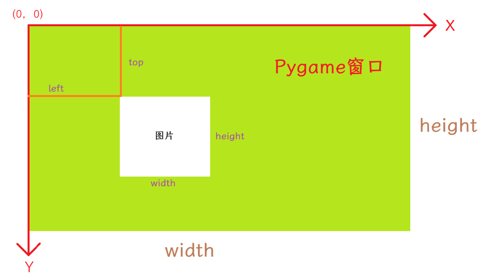

# 像素

`pygame` 窗口中使用的颜色单位默认是像素，

## 颜色系统

`pygame` 使用的是 RGBA 系统。

- R：红色值。
- G：绿色值。
- B：蓝色值。
- A：透明度。

## 颜色常量

`pygame.color.THECOLORS` 

```python
from pygame.color import THECOLORS

print("红色：", THECOLORS['red'])
print("绿色：", THECOLORS['green'])
print(THECOLORS.keys())
```

这个常量是一个字典，通过键获取对应的 RGBA 颜色数值，665个。

## `Color` 对象

`pygame.Color` 是 `pygame` 库中用于表示和操作颜色的核心对象。它通常使用 RGBA 模式（红、绿、蓝、透明度）来表示颜色，每个分量的取值范围一般为 0 到 255。

### 创建对象的格式

```python
import pygame

# 方式1：通过红、绿、蓝三个整数分量创建（透明度默认为255，即不透明）
color1 = pygame.Color(255, 0, 0)  # 红色分量, 绿色分量, 蓝色分量

# 方式2：通过红、绿、蓝、透明度四个整数分量创建
color2 = pygame.Color(255, 0, 0, 128)  # 红色分量, 绿色分量, 蓝色分量, 透明度分量

# 方式3：通过预定义的颜色名称字符串创建
color3 = pygame.Color("red")  # 颜色名称字符串（如 "grey", "gold" 等）

# 方式4：通过 HTML 颜色格式字符串创建
color4 = pygame.Color("#FF0000")  # HTML十六进制颜色字符串（可选带透明度，如 "#FF0000FF"）

# 方式5：通过十六进制数字字符串创建
color5 = pygame.Color("0xFF0000")  # 十六进制数字字符串（可选带透明度，如 "0xFF0000FF"）

# 方式6：通过包含3个或4个整数的元组创建
color6 = pygame.Color((255, 0, 0, 255))  # RGB或RGBA元组
```

### 参数作用与可选值

| 参数     | 作用                  | 可选值/取值范围                                             |
| -------- | --------------------- | ----------------------------------------------------------- |
| r        | 红色分量值            | 整数，范围 0 ~ 255                                          |
| g        | 绿色分量值            | 整数，范围 0 ~ 255                                          |
| b        | 蓝色分量值            | 整数，范围 0 ~ 255                                          |
| a        | 透明度（Alpha）分量值 | 整数，范围 0 ~ 255（0为完全透明，255为不透明，默认255）     |
| name     | 预定义的颜色名称      | 字符串，如 "red", "green", "grey", "gold", "violet" 等      |
| rgbvalue | 颜色格式字符串        | HTML格式（如 "#rrggbbaa"）或十六进制格式（如 "0xrrggbbaa"） |

### 常用属性

| 属性   | 描述                                                         |
| ------ | ------------------------------------------------------------ |
| `r`    | 获取或设置颜色的红色分量值（0-255）                          |
| `g`    | 获取或设置颜色的绿色分量值（0-255）                          |
| `b`    | 获取或设置颜色的蓝色分量值（0-255）                          |
| `a`    | 获取或设置颜色的透明度 Alpha 值（0-255）                     |
| `hex`  | 获取或设置颜色的十六进制字符串表示（格式为 "#rrggbbaa"）     |
| `hsva` | 获取或设置颜色的 HSVA 表示形式（色调、饱和度、亮度、透明度） |
| `hsla` | 获取或设置颜色的 HSLA 表示形式                               |
| `cmy`  | 获取或设置颜色的 CMY 表示形式（青色、品红色、黄色）          |

### 常用方法

| 方法                    | 描述                                                         |
| ----------------------- | ------------------------------------------------------------ |
| `normalize()`           | 将颜色的 RGBA 各通道值归一化到 0 ~ 1 之间，并返回一个元组。  |
| `correct_gamma(gamma)`  | 对颜色应用特定的伽马值调整，并返回一个新的颜色对象。         |
| `lerp(color, float)`    | 返回当前颜色与给定颜色之间的线性插值颜色（float取值0~1）。   |
| `premul_alpha()`        | 返回一个新的颜色对象，其 R、G、B 值为原值乘以 Alpha 值（预乘透明度）。 |
| `set_length(len)`       | 设置颜色对象的长度（成员数量，可设为1, 2, 3或4）。           |
| `from_hsva(h, s, v, a)` | 类方法，通过 HSVA 值创建并返回一个新的 Color 对象。          |
| `from_hsla(h, s, l, a)` | 类方法，通过 HSLA 值创建并返回一个新的 Color 对象。          |
| `from_cmy(c, m, y)`     | 类方法，通过 CMY 值创建并返回一个新的 Color 对象。           |

# 透明度

在 `pygame` 游戏窗口中，支持三种透明度：

- 像素值透明度（pixel alphas）
- 颜色值透明度（colorkeys）
- 图像透明度（surface alphas）

## 像素透明度

1. 介绍

    通过给 `Color` 对象添加第四个透明度参数的方式来实现，该值叫做 alpha 值，这类透明度叫“像素透明度”。

    在一个 `Surface` 对象上添加一个像素点时，新的颜色值替代了原来的颜色值。但是，如果使用一个带有 alpha 值得颜色，就相当于给原来得颜色添加了一个带有颜色的色调。
    
2. 透明图片

    通常情况，在 `pygame` 窗口加载一张透明的图片时，执行效率很慢。可使用 `convert_alpha` 函数更快地绘制透明图片。

    ```python
    pixel_Sur = pygame.image.load(IMG_PATH).convert_alpha()
    ```
    
    - 不能把非透明的图像转变为透明的。
    - 使用 `pygame.display.set_mode` 返回的 `Surface` 对象不能使用 `convert_alpha` 方法。

> **图片的转化**
>
> - **`convert()`**
>
>   将图像转换为与当前显示表面（screen）相同的像素格式。**关键点是：在转换过程中，它会直接丢弃（剥离）图像原有的 Alpha 透明度通道**。
>
> - **`convert_alpha()`**
>
>   将图像转换为适合 Pygame 渲染的格式，但**会完整保留原有的 Alpha 透明度通道**，并对透明混合进行专门优化。
>
> 1. **永远不要在主循环内加载图片**，应在游戏初始化阶段一次性加载。
> 2. 如果图片**没有**透明通道（如 JPG 背景），加载后立刻调用 **`.convert()`**。
> 3. 如果图片**带有**透明通道（如 PNG 精灵、图标），加载后立刻调用 **`.convert_alpha()`**。

## 颜色值透明度

1. 概念

   指设置图像中的某个颜色值为透明。为了在绘制 `Surface` 对象时，将图像中所有与指定颜色值相同的颜色绘制为透明。

2. 方法

   `pygame.Surface.set_colorkey(Color)` 

   传入一个 `Color` 对象，指定透明颜色值。

   > 多个透明一起设置，后面的会顶掉前面的。

## 图像透明度

1. 概念

   调整整个图像的透明度。

2. 取值范围

   0 ~ 255。

   - 0：完全透明。
   - 255：完全不透明。
   - 128：半透明。

3. API

   `pygame.Surface.set_alpha(value)` 

> 可以与颜色值透明度混用。

# 窗口坐标

## 坐标系

以笛卡尔坐标系标识窗口中的点。

- 左上角为原点 $(0, 0)$ 
- $X$ 轴为水平向右
- $Y$ 轴为竖直向下

## `Rect` 对象

`pygame.rect.Rect` 

用于精确描述 `Pygame` 窗口中所有可见元素的位置，又被称为矩形区域管理对象，由 `left`、`top`、`width`、`height` 四个值创建。



白色矩形区域标识一个 `Rect` 对象的范围。

- `(left, top)` 坐标点标识这个对象所确定的 `Surface` 对象在 `Pygame` 窗口中所处的起始位置，即左上角顶点坐标。
- `width` 标识矩形区域宽度。
- `height` 标识矩形区域的高度。

# 帧速率

## 前置知识

### 视觉暂留现象

如果看见的画面的切换速率高于 `20张/s` 时，就会认为是连贯的，即动画。

### 帧率

Frame Per Second，FPS，单位是 $\mathrm{HZ}$，每秒绘制多少次刷新。

- 一般电视的画面是 24FPS。
- 游戏在 30FPS 基本流畅。

## 控制

> `pygame.time`，管理子时间的模块。

`pygame.time.Clock` 对象

| 方法                          | 描述                                                         |
| ----------------------------- | ------------------------------------------------------------ |
| `tick(framerate=0)`           | 最核心方法。<br />每帧调用一次，计算自上次调用以来经过的毫秒数。<br />若传入帧率（如 60），程序会自动休眠以限制最大帧率。<br />该方法占用 CPU 较少，但时间精度稍低。 |
| `tick_busy_loop(framerate=0)` | 功能与 `tick()` 相同，但使用繁忙循环（busy loop）来等待。<br />时间测量更精确，但会占用大量 CPU 资源，一般不推荐使用。 |
| `get_time()`                  | 返回前两次调用 `tick()` 之间经过的毫秒数<br />（包含 `tick()` 为了限制帧率而产生的休眠时间）。 |
| `get_rawtime()`               | 返回前两次调用 `tick()` 之间的实际毫秒数<br />（不包含 `tick()` 为了限制帧率而产生的休眠时间）。 |
| `get_fps()`                   | 计算并返回当前游戏的帧率（FPS）。<br />它是根据最近十次调用 `tick()` 的平均时间计算得出的。 |

# 向量

`pygame.math.Vector2` 对象，表示二维向量。它支持浮点数运算，封装了强大的数学功能，在游戏开发中常被用来精确表示物体的位置、速度、加速度和方向等属性。

## 创建对象的格式

```python
import pygame

# 方式1：使用两个数值（x, y）直接初始化
v1 = pygame.math.Vector2(3, 4)  # x轴分量, y轴分量

# 方式2：使用包含两个数值的元组或列表初始化
v2 = pygame.math.Vector2((5, 6))  # 包含x和y分量的元组或列表

# 方式3：不传参数，默认初始化为零向量 (0, 0)
v3 = pygame.math.Vector2()  # 无参数，默认值为(0, 0)

# 方式4：复制另一个 Vector2 实例
v4 = pygame.math.Vector2(v1)  # 另一个 Vector2 对象
```

## 参数作用与可选值

| 参数       | 作用                                           | 可选值/取值范围       |
| ---------- | ---------------------------------------------- | --------------------- |
| `x`        | 向量在 x 轴方向上的映射值（分量）              | 整数或浮点数（float） |
| `y`        | 向量在 y 轴方向上的映射值（分量）              | 整数或浮点数（float） |
| `iterable` | 包含两个数值的序列（如元组、列表或另一个向量） | 长度为2的序列         |

## 常用属性

`Vector2` 对象支持通过属性或索引操作符来访问和修改分量，同时也包含一些内置的容差属性。

| 属性      | 描述                                                        |
| --------- | ----------------------------------------------------------- |
| `x`       | 获取或设置向量的 x 分量（float 类型）                       |
| `y`       | 获取或设置向量的 y 分量（float 类型）                       |
| `epsilon` | 向量比较或计算的容差值（默认 1e-6），用于处理浮点数计算误差 |

## 常用方法

### 基础运算与几何属性：

| 方法                     | 描述                                                         |
| ------------------------ | ------------------------------------------------------------ |
| `copy()`                 | 返回该向量的一个副本。                                       |
| `update(x, y)`           | 原地更新向量对象的 x 和 y 值。                               |
| `length()`               | 返回向量距离原点 (0, 0) 的长度（模）。                       |
| `length_squared()`       | 返回向量长度的平方（比 `length()` 计算更快，省去了开方运算）。 |
| `normalize()`            | 返回一个方向不变但长度被缩放为 1 的新向量（归一化/单位向量）。 |
| `normalize_ip()`         | 原地修改向量，使其长度变为 1（`ip` 代表 `in-place`）。       |
| `is_normalized()`        | 判断当前向量的长度是否为 1。                                 |
| `scale_to_length(float)` | 原地缩放向量，使其长度变为指定的浮点数值。                   |

### 高级向量运算与空间变换：

| 方法                           | 描述                                                         |
| ------------------------------ | ------------------------------------------------------------ |
| `dot(Vector2)`                 | 返回当前向量与指定向量的点积（标量）。                       |
| `cross(Vector2)`               | 返回当前向量与指定向量的二维叉积（标量）。                   |
| `distance_to(Vector2)`         | 返回当前向量到指定向量（点）的欧几里得距离。                 |
| `lerp(Vector2, float)`         | 返回两个向量之间的线性插值（float 范围 0~1，0为原向量，1为目标向量）。 |
| `rotate(angle)`                | 按指定角度逆时针旋转向量，并返回新向量<br />（Pygame 坐标系 y 轴向下，视觉上为顺时针）。 |
| `rotate_ip(angle)`             | 原地按指定角度旋转向量。                                     |
| `angle_to(Vector2)`            | 返回当前向量旋转到指定向量所需的角度。                       |
| `move_towards(Vector2, float)` | 使当前向量朝着指定向量的位置移动指定的长度。                 |
| `reflect(Vector2)`             | 以给定的向量作为法线，计算反射后的向量。                     |

# 原装 `math` 模块

Python 自带的 `math` 模块是一个提供对底层 C 语言数学库函数访问的标准库。它主要提供对浮点数（`float`）的数学运算支持，不包含复数运算（复数运算由 `cmath` 模块提供）。

## 导入与使用格式

`math` 是一个模块（Module），而不是一个类，因此**不能直接创建对象**。需要先将其导入，然后直接调用其提供的常量和函数。

```python
import math  # 导入整个 math 模块

# 使用模块中的常量
pi_value = math.pi  # 获取圆周率 π 的值
e_value = math.e    # 获取自然常数 e 的值

# 使用模块中的函数
sqrt_val = math.sqrt(16)  # 计算 16 的平方根
sin_val = math.sin(math.pi / 2)  # 计算 π/2 的正弦值
```

## 常用常量

`math` 模块提供了一些精确的数学常量，以下是它们的作用和取值：

| 常量        | 作用                  | 可选值/取值              |
| ----------- | --------------------- | ------------------------ |
| `math.pi`   | 圆周率 π              | 约等于 3.141592653589793 |
| `math.e`    | 自然常数 e            | 约等于 2.718281828459045 |
| `math.tau`  | 圆周率 τ (即 2π)      | 约等于 6.283185307179586 |
| `math.inf`  | 正无穷大              | 浮点数正无穷大           |
| `-math.inf` | 负无穷大              | 浮点数负无穷大           |
| `math.nan`  | 非数字 (Not a Number) | 表示一个无效的浮点数值   |

## 基础运算与幂对数

`math` 模块提供了极其丰富的数学函数，为了便于阅读，这里将其分为两个表格展示：

| 函数                  | 描述                                                     |
| --------------------- | -------------------------------------------------------- |
| `math.sqrt(x)`        | 返回 x 的平方根（x 必须大于等于 0）                      |
| `math.ceil(x)`        | 向上取整，返回大于或等于 x 的最小整数                    |
| `math.floor(x)`       | 向下取整，返回小于或等于 x 的最大整数                    |
| `math.trunc(x)`       | 截断取整，返回 x 的整数部分（直接丢弃小数）              |
| `math.fabs(x)`        | 返回 x 的绝对值（返回值为浮点数）                        |
| `math.pow(x, y)`      | 返回 x 的 y 次方（返回值为浮点数）                       |
| `math.exp(x)`         | 返回 e 的 x 次方                                         |
| `math.log(x[, base])` | 返回 x 的对数。若省略 base，默认返回自然对数（底数为 e） |
| `math.log10(x)`       | 返回 x 的以 10 为底的对数                                |
| `math.log2(x)`        | 返回 x 的以 2 为底的对数                                 |

## 三角函数与特殊函数

> Python 中的三角函数默认使用弧度。

| 函数                  | 描述                                                         |
| --------------------- | ------------------------------------------------------------ |
| `math.sin(x)`         | 返回 x 的正弦值（x 必须以弧度为单位）                        |
| `math.cos(x)`         | 返回 x 的余弦值（x 必须以弧度为单位）                        |
| `math.tan(x)`         | 返回 x 的正切值（x 必须以弧度为单位）                        |
| `math.asin(x)`        | 返回 x 的反正弦值（返回值为弧度）                            |
| `math.acos(x)`        | 返回 x 的反余弦值（返回值为弧度）                            |
| `math.atan(x)`        | 返回 x 的反正切值（返回值为弧度）                            |
| `math.degrees(x)`     | 将弧度 x 转换为角度                                          |
| `math.radians(x)`     | 将角度 x 转换为弧度                                          |
| `math.gcd(*integers)` | 返回多个整数的最大公约数                                     |
| `math.lcm(*integers)` | 返回多个整数的最小公倍数                                     |
| `math.isclose(a, b)`  | 判断两个浮点数 a 和 b 是否在容差范围内接近（解决浮点数精度问题） |

# `PixelArray` 对象

`pygame.PixelArray` 

使开发者能以类似操作数组的防止来直接操作指定 `Surface` 对象上的任意一个像素点或批量像素点的颜色值。

## 创建对象的格式

`pygame.PixelArray` 的创建方式非常直接，只需传入一个 Surface 对象即可。

```python
import pygame

# 假设 surface 是一个已经创建的 pygame.Surface 对象
# surface: 需要被直接访问像素数据的 Surface 对象
pixel_array = pygame.PixelArray(surface) # 返回的是 Surface 所对应的 PixelArray 对象
```

## 参数作用与可选值

| 参数      | 作用                                                    | 可选值/取值范围                  |
| --------- | ------------------------------------------------------- | -------------------------------- |
| `Surface` | 被 `PixelArray` 包装并用于直接访问像素的 `Surface` 对象 | 任何有效的 `pygame.Surface` 实例 |

## 常用属性

`PixelArray` 提供了多个属性用于获取数组的维度和底层 Surface 信息。

| 属性       | 描述                                          |
| ---------- | --------------------------------------------- |
| `surface`  | 获取该 `PixelArray` 所绑定的 `Surface` 对象。 |
| `itemsize` | 返回像素数组中单个元素的字节大小。            |
| `ndim`     | 返回数组的维度数量（通常为 2）。              |
| `shape`    | 返回数组的大小（即宽度和高度）。              |
| `strides`  | 返回每个数组维度的字节偏移量。                |

## 常用方法

`PixelArray` 支持切片操作以及多种像素处理功能。

| 方法                                                  | 描述                                                         |
| ----------------------------------------------------- | ------------------------------------------------------------ |
| `make_surface()`                                      | 根据当前的 `PixelArray` 创建并返回一个新的 `Surface` 对象。  |
| `replace(color, repcolor, distance=0, weights=(...))` | 将 `PixelArray` 中匹配的颜色替换为另一种颜色（原地操作）。   |
| `extract(color, distance=0, weights=(...))`           | 提取指定颜色，匹配像素变为白色，不匹配变为黑色，返回新的 `PixelArray`。 |
| `compare(other)`                                      | 将当前的 `PixelArray` 与另一个 `PixelArray` 进行比较。       |
| `transpose()`                                         | 交换数组的 X 和 Y 轴（即转置操作）。                         |
| `close()`                                             | 关闭 `PixelArray` 并释放 Surface 的锁定状态。                |

## 注意

1. 索引顺序

   `PixelArray` 支持二维切片，其索引顺序为 `[x, y]`（即 `[列, 行]`）。

   > 这点和 `numpy` 有hen'da

2. 颜色赋值与读取

   可以使用整数、`pygame.Color` 对象或 `(r, g, b[, a])` 元组来赋值像素，但在读取像素值时，它只会返回一个整数。

   若需比较颜色，必须使用 `Surface.map_rgb()` 方法先将颜色转换为映射值。

3. **锁定与解锁**

   创建 `PixelArray` 对象时，底层的 Surface 会被锁定（此时无法对该 Surface 使用 `blit()` 方法）。使用完毕后，必须调用 `close()` 方法或使用 `del` 语句删除该对象以解锁 Surface，否则会引发 `pygame.error: Surfaces must not be locked during blit` 错误。最佳实践是使用 `with pygame.PixelArray(surface) as pixel_array:` 的上下文管理器风格。

> **`Surface` 对象的访问**
>
> 对任何 `Surface` 对象的访问都需要先上锁，再解锁。一般的函数自动完成了这个过程。如果手动上锁，最后一定要解锁。

