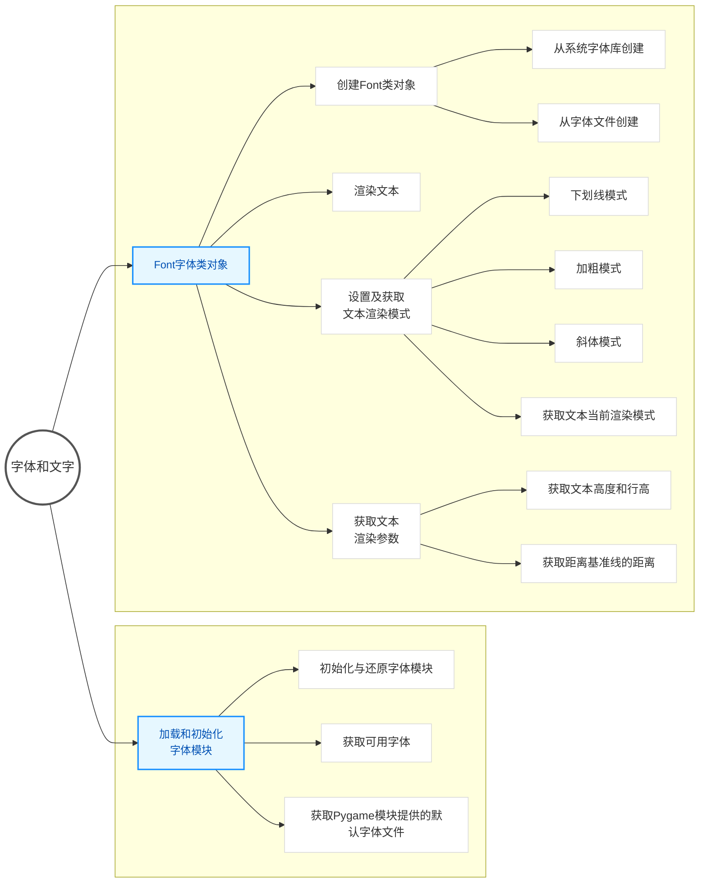
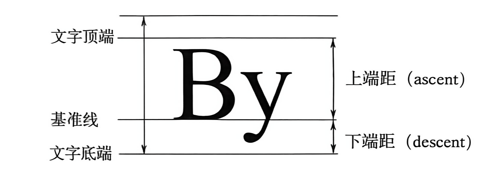

# 知识框架



# 介绍

## 介绍

`pygame.font` 模块能够在一个新的 `Surface` 对象上表示 TrueType 字体，并能接收所有 UCS-2 字符（‘u0001’ 到 ‘uFFFF’）

> **TrueType 字体**
>
> 电脑轮廓字体的类型标准，扩展名为 `.ttf`，它能够为开发者提供关于字体显示、不同字体大小的像素级显示等的高级控制。

依赖 SDL_ttf，在使用之前，需要先测试该模块是否可用，并对其进行初始化。

```python
# 在终端中打开 python 交互窗口
import pygame.font
```

## 常用函数

`pygame.font` 模块是 Pygame 中用于渲染文本的核心模块。它提供了一系列函数来加载字体、创建字体对象以及查询系统字体信息。

以下是该模块中一些最常用的函数：

| 函数                               | 作用                                                         |
| ---------------------------------- | ------------------------------------------------------------ |
| `pygame.font.init()`               | 初始化字体模块，通常在 `pygame.init()` 中自动调用。          |
| `pygame.font.quit()`               | 关闭字体模块。                                               |
| `pygame.font.get_fonts()`          | 返回一个列表，包含所有可用字体的名称（小写且无空格）。       |
| `pygame.font.match_font(name)`     | 根据字体名称查找并返回系统字体文件的完整路径。               |
| `pygame.font.Font(filename, size)` | 从指定的字体文件创建一个 `Font` 对象，用于渲染文本。         |
| `pygame.font.SysFont(name, size)`  | 从系统字体中创建一个 `Font` 对象，如果找不到则使用默认字体。 |
| `pygame.font.get_default_font()`   | 返回系统默认字体文件的文件名。                               |
| `pygame.font.get_init()`           | 检查字体模块是否已经初始化，返回布尔值。                     |
| `pygame.font.Font`                 | 一个类，用于从字体文件创建可渲染的字体对象。                 |
| `pygame.font.SysFont`              | 一个函数，用于从系统字体中创建一个 `Font` 对象。             |

# 初始化

## 初始化

```python
# 初始化字体模块
pygame.font.init()

# 还原字体模块
pygame.font.quit() # 即使没有初始化，也能使用，是线程安全的
```

## 获取可用字体

```python
pygame.font.get_fonts()
```

获取当前系统中所有可使用的字体，返回字体类型的列表。所有字体类型名都被设置为小写，空格和标点符号会被删除。

```python
pygame.font.get_default_font()
```

获取 `Pygame` 模块中的默认字体文件。

# `Font` 字体类对象

## 介绍

在 `Pygame` 窗口中，文本是基于 `Surface` 对象来绘制的，而文本的 `Surface` 对象需要通过 `pygame.font.Font` 对象在一个新的 `Surface` 对象中渲染文本生成，

其中，文本的渲染可以设置为仿真的粗体或者为斜体特征，但建议使用一个本身就带有粗体和斜体字形的字体文件。

## 创建对象的格式

### 从字体文件创建

```python
import pygame

# 方式1：从指定的字体文件路径加载字体
# filename: 字体文件的完整路径（如 .ttf, .otf 文件）
# size: 字体大小（磅值），一旦创建后不可更改
font1 = pygame.font.Font("C:/Windows/Fonts/simhei.ttf", 50)

# 方式2：使用 Pygame 自带的默认字体
# name: 传入 None 以加载内置的默认字体（freesansbold）
# size: 字体大小
font2 = pygame.font.Font(None, 36)

# 方式3：通过一个已打开的文件对象加载字体
# file_object: 以二进制读取模式打开的字体文件对象
# size: 字体大小
font3 = pygame.font.Font(open("my_font.ttf", "rb"), 32)
```

### 从系统字体库创建

`pygame.font.SysFont` 是 Pygame 中用于直接从系统字体库中加载并创建 `Font` 对象的便捷函数。它不需要指定字体文件的路径，只需**提供字体名称**即可。如果系统中找不到指定的字体，`Pygame` 会自动回退使用其内置的默认字体（freesansbold）。

```python
# 从系统字体库中创建一个 Font 对象
# name: 要加载的字体名称（可以是字符串、列表或逗号分隔的字符串）
# size: 字体大小（单位：磅）
# bold: 是否启用粗体样式（默认为 False）
# italic: 是否启用斜体样式（默认为 False）
font = pygame.font.SysFont("Arial", 36, bold=False, italic=False)
```

#### 参数作用与可选值

| 参数     | 作用                         | 可选值/取值范围                                              |
| -------- | ---------------------------- | ------------------------------------------------------------ |
| `name`   | 指定要从系统中加载的字体名称 | 字符串（如 "Arial", "SimHei"）<br />字体名称列表（如 ["方正粗黑宋简体", "microsoftsansserif"]）<br />逗号分隔的字符串。<br />若传入 `None` 或找不到指定字体，则使用 Pygame 默认字体 |
| `size`   | 设置字体的大小               | 正整数（单位：磅/point）                                     |
| `bold`   | 控制字体是否加粗             | 布尔值<br />`True` 为加粗，<br />`False` 为不加粗，默认为 `False` |
| `italic` | 控制字体是否为斜体           | 布尔值<br />`True` 为斜体<br />`False` 为非斜体，默认为 `False` |

#### 简单的代码示例

```python
import pygame

pygame.init()
screen = pygame.display.set_mode((400, 300))

# 1. 加载系统自带的 Arial 字体，大小 36，加粗
font_en = pygame.font.SysFont("Arial", 36, bold=True)

# 2. 加载中文字体（如黑体），大小 24
# 注意：显示中文必须使用系统中支持中文的字体，否则会出现乱码
font_cn = pygame.font.SysFont("SimHei", 24)

# 3. 渲染文本并绘制到屏幕上
text_surface_en = font_en.render("Hello Pygame!", True, (255, 255, 255))
text_surface_cn = font_cn.render("你好，Pygame！", True, (255, 255, 255))

screen.blit(text_surface_en, (50, 100))
screen.blit(text_surface_cn, (50, 150))

pygame.display.flip()
```

## 参数作用与可选值

| 参数          | 作用                         | 可选值/取值范围                                              |
| ------------- | ---------------------------- | ------------------------------------------------------------ |
| `filename`    | 字体文件的完整路径字符串     | 有效的字体文件路径（如 `xxx.ttf`）<br />若传入 `None` 则使用默认字体 |
| `file_object` | 包含字体数据的已打开文件对象 | 以二进制读取模式打开的文件对象                               |
| `size`        | 设置字体的大小               | 正整数（单位：磅/point），默认值为 12                        |

## 常用属性

| 属性            | 描述                                         |
| --------------- | -------------------------------------------- |
| `bold`          | 获取或设置字体是否应以粗体呈现（布尔值）     |
| `italic`        | 获取或设置字体是否应以假斜体呈现（布尔值）   |
| `underline`     | 获取或设置是否应使用下划线呈现字体（布尔值） |
| `strikethrough` | 获取或设置是否应使用删除线呈现字体（布尔值） |

## 常用方法

`pygame.font.Font` 提供了丰富的方法来渲染文本、获取字体度量信息以及控制样式。

### 获取状态方法

这类方法用于查询字体当前的样式状态或度量信息。

| 方法                  | 描述                                                   |
| --------------------- | ------------------------------------------------------ |
| `get_bold()`          | 检查文本是否将以粗体显示（返回布尔值）。               |
| `get_italic()`        | 检查文本是否呈现为斜体（返回布尔值）。                 |
| `get_underline()`     | 检查文本是否绘制了下划线（返回布尔值）。               |
| `get_strikethrough()` | 检查文本是否包含删除线（返回布尔值）。                 |
| `get_height()`        | 返回字体的总高度（像素）。指每个字符的平均规格。       |
| `get_linesize()`      | 返回字体文本的行高（行间距，像素）。指单行文本的高度。 |
| `get_ascent()`        | 返回从字体基准线到字体顶部的距离。                     |
| `get_descent()`       | 返回从字体基准线到字体底部的距离。                     |

**字体基准线、上端距、下端距**



### 设置状态方法

这类方法用于修改字体的显示样式（如粗体、斜体等）。

| 方法                      | 描述                           |
| ------------------------- | ------------------------------ |
| `set_bold(bool)`          | 启用或禁用虚拟粗体字渲染。     |
| `set_italic(bool)`        | 启用或禁用虚拟斜体字渲染。     |
| `set_underline(bool)`     | 控制是否为文本内容绘制下划线。 |
| `set_strikethrough(bool)` | 控制是否为文本内容绘制删除线。 |

### 其他核心方法

这类方法用于执行实际的文本渲染、尺寸计算以及获取字符的详细信息。

| 方法                                              | 描述                                                         |
| ------------------------------------------------- | ------------------------------------------------------------ |
| `render(text, antialias, color, background=None)` | 将文本渲染到一个新的 `Surface` 对象上。<br />`text` 为文本内容；<br />`antialias` 为是否开启抗锯齿（布尔值）；<br />`color` 为字体颜色；<br />`background` 为可选的背景颜色。 |
| `size(text)`                                      | 计算并返回渲染指定文本所需的像素尺寸<br />返回值为 `(width, height)` 元组。 |
| `metrics(text)`                                   | 获取字符串中每个字符的详细度量信息<br />返回包含 `(minx, maxx, miny, maxy, advance)` 元组的列表。 |

## 文本渲染方法

`pygame.font.Font.render`

`Pygame` 不能直接在一个现有的 `Surface` 对象上绘制文本，需要使用该函数创建一个渲染了文本的 `Surface` 对象，然后再把这个对象绘制到目标 `Surface` 对象上。

- 仅支持一行文本的渲染。

  > 回车符（\r）、换行符（\n）、制表符（\t）等字符会被渲染为一个空的矩形。

- 没有 `background` 参数，对应区域内表示的文本都将设置为透明。

- 渲染文本为空时，会返回一个空白的 `Surface` 对象，仅有一个像素点的宽度，高度和字体高度一样。

- 字体渲染不是线程安全的行为，在任何时候只有一个线程能渲染文本。

> **抗锯齿**
>
> 是一种图形技术。通过给文本和图像的边缘添加一些模糊效果，使其看上去不那么块状化，但绘制会多花些时间。