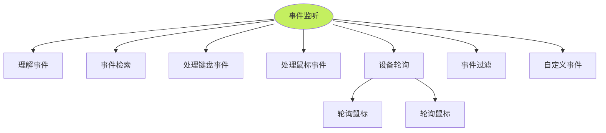

# 知识架构



# 理解事件

事件的种类有很多，而且一个 `Pygame` 程序中可能有多个事件，`Pygame` 会把一系列事件存放在一个队列中，然后逐个进行处理。

常规的队列是由 `Pygame.event.EventType` 对象组成的，一个 `EventType` 事件对象由一个事件类型标识符和一组成员数据组成。

**事件及成员属性列表**

| 事件类型          | 产生途径                        | 成员属性          |
| ----------------- | ------------------------------- | ----------------- |
| `QUIT`            | 用户按下关闭按钮                | none              |
| `ACTIVEEVENT`     | Pygame 被激活或者隐藏           | gain, state       |
| `KEYDOWN`         | 键盘被按下                      | unicode, key, mod |
| `KEYUP`           | 键盘被放开                      | key, mod          |
| `MOUSEMOTION`     | 鼠标移动                        | pos, rel, buttons |
| `MOUSEBUTTONDOWN` | 鼠标按下                        | pos, button       |
| `MOUSEBUTTONUP`   | 鼠标放开                        | pos, button       |
| `JOYAXISMOTION`   | 游戏手柄 (Joystick or pad) 移动 | joy, axis, value  |
| `JOYBALLMOTION`   | 游戏球 (Joy ball) 移动          | joy, axis, value  |
| `JOYHATMOTION`    | 游戏手柄 (Joystick) 移动        | joy, axis, value  |
| `JOYBUTTONDOWN`   | 游戏手柄按下                    | joy, button       |
| `JOYBUTTONUP`     | 游戏手柄放开                    | joy, button       |
| `VIDEORESIZE`     | Pygame 窗口缩放                 | size, w, h        |
| `VIDEOEXPOSE`     | Pygame 窗口部分公开 (expose)    | none              |
| `USEREVENT`       | 触发一个用户事件                | code              |

## 事件类型标识符（Event Type）

- 意思 

  它代表了**“发生了什么事”**。它是事件的唯一身份标签，告诉程序这个事件属于哪一类。

- 作用 

  程序在处理事件时，首先会检查这个标识符，以决定是否需要处理该事件，以及应该跳转到哪段代码去执行。

- 常见例子 

  - `pygame.QUIT`：代表用户点击了窗口关闭按钮。
  - `pygame.KEYDOWN`：代表键盘上的某个键被按下了。
  - `pygame.MOUSEBUTTONDOWN`：代表鼠标按键被按下了。

- 代码体现：在代码中，它通常通过 `event.type` 来获取。

## 成员数据（Member Data）

- 意思 

  它代表了**“这件事的具体细节”**。当事件发生时，Pygame 会自动捕获并附带一系列相关的信息。

- 作用 

  让程序知道事件发生的具体状态。比如，虽然都是“按键按下”，但成员数据会告诉程序具体是哪个键被按下了；虽然都是“鼠标点击”，但成员数据会告诉程序点击的具体坐标在哪里。

- 常见例子 

  - 在 `KEYDOWN`（键盘按下）事件中，`event.key` 是成员数据，它记录了具体按下的键（如 `K_SPACE` 空格键）。
  - 在 `MOUSEBUTTONDOWN`（鼠标按下）事件中，`event.pos` 是成员数据，它记录了点击时的 `(x, y)` 坐标。
  - 在 `VIDEORESIZE`（窗口大小调整）事件中，`event.size`、`event.w`、`event.h` 都是成员数据，记录了调整后窗口的宽和高。

- 代码体现

  在代码中，可以通过 `event.属性名`（如 `event.key`）或 `event.dict` 来获取这些细节。

## 代码演示

```python
for event in pygame.event.get():
    # 【事件类型标识符】：判断这封信是不是“键盘按下”事件
    if event.type == pygame.KEYDOWN: 
        
        # 【成员数据】：获取具体按下了哪个键
        if event.key == pygame.K_ESCAPE:
            print("用户按下了 ESC 键，准备退出游戏！")
            
    # 【事件类型标识符】：判断这封信是不是“鼠标按下”事件
    elif event.type == pygame.MOUSEBUTTONDOWN:
        
        # 【成员数据】：获取鼠标点击的具体坐标 (x, y)
        print(f"鼠标在坐标 {event.pos} 处被点击了")
```

# 事件常用方法

`pygame.event` 是 Pygame 中用于处理用户输入（如键盘、鼠标）和系统事件（如窗口关闭）的核心模块。它通过事件队列机制，将用户的操作和系统的通知包装成一个个事件对象，供游戏程序有序地获取和处理。

## 常用属性

`pygame.event` 模块本身没有直接对外暴露的常用数据属性，其核心功能主要通过以下方法来实现。

## 常用方法

根据功能划分，`pygame.event` 模块的常用方法可以分为获取事件、设置事件状态以及其他核心处理功能。

### 获取事件

这类方法用于从事件队列中读取、检测或查询事件。

| 方法                         | 描述                                                         |
| ---------------------------- | ------------------------------------------------------------ |
| `pygame.event.get()`         | 从事件队列中获取所有未处理的事件列表，并将其从队列中删除。   |
| `pygame.event.poll()`        | 从队列中返回并删除一个事件；如果队列为空，则返回一个 `NOEVENT` 事件。 |
| `pygame.event.wait()`        | 阻塞程序直至事件发生，然后从队列中返回并删除该事件。         |
| `pygame.event.peek()`        | 检测某类型的事件是否存在于队列中（返回布尔值）。             |
| `pygame.event.get_blocked()` | 检测某一类型的事件是否被禁止进入事件队列（返回布尔值）。     |
| `pygame.event.get_grab()`    | 检测当前程序是否独占了输入设备（返回布尔值）。               |

### 设置事件状态

这类方法用于控制哪些事件可以进入队列，或设置输入设备的独占状态。

| 方法                         | 描述                                                         |
| ---------------------------- | ------------------------------------------------------------ |
| `pygame.event.set_allowed()` | 控制允许哪些类型的事件进入事件队列。                         |
| `pygame.event.set_blocked()` | 控制禁止哪些类型的事件进入事件队列（传入 `None` 则允许所有事件）。 |
| `pygame.event.set_grab()`    | 控制程序是否独占输入设备（如锁定鼠标和键盘，阻止其他应用获取）。 |

### 其他核心方法

这类方法用于手动处理队列、创建事件、清空队列等底层操作。

| 方法                        | 描述                                                         |
| --------------------------- | ------------------------------------------------------------ |
| `pygame.event.pump()`       | 让 Pygame 内部自动处理事件队列，确保程序与操作系统保持同步<br />（若未调用其他 get/wait 方法，每帧需调用一次）。 |
| `pygame.event.clear()`      | 从事件队列中删除所有事件，或清除指定类型的特定事件。         |
| `pygame.event.post()`       | 手动放置一个新的事件对象到事件队列中。                       |
| `pygame.event.Event()`      | 创建一个用户自定义的新事件对象。                             |
| `pygame.event.event_name()` | 通过事件类型的 ID 获取该事件的字符串名字。                   |

# 事件检索

## `get`

```python
pygame.event.get(type | typelist | None) -> Eventlist
```

从事件队列中获取一个事件，并从队列中删除该事件。如果指定一个或多个 `type` 参数，则只获取并删除指定类型的事件。

## 获取单个事件

从事件队列中获取一个事件可以使用 `poll()` 函数或者 `wait()` 函数。其中，`poll()` 函数会根据当前情形返回一个真实的事件，当队列为空时，它将立刻返回类型为 `pygame.NOEVENT` 的事件；而 `wait()` 函数是等到发生一个事件才继续下去，当队列为空时，它将继续等待并处于睡眠状态。

```python
pygame.event.poll() -> EventType instance
pygame.event.wait() -> EventType instance
```

- 绝大多数游戏开发（如贪吃蛇、飞机大战）

  请务必使用 **`poll()`** 或者更常用的 **`get()`**（它一次性获取所有事件列表），因为它们不会阻塞主循环，能保证画面流畅刷新。

- 特殊场景

  只有希望游戏**完全停下来等待玩家操作**（例如：“按任意键开始”界面，或者弹出一个模态对话框）时，才考虑使用 `wait()`。

# 处理键盘事件

## 常用按键的常量

| 按键常量            | 说明                      | 按键常量           | 说明                  |
| ------------------- | ------------------------- | ------------------ | --------------------- |
| `K_BACKSPACE`       | 退格键 (Backspace)        | `K_TAB`            | 制表键 (Tab)          |
| `K_SPACE`           | 空格键 (Space)            | `K_RETURN`         | 回车键 (Enter)        |
| `K_0, ..., K_9`     | 0, …, 9                   | `K_a, ..., K_z`    | a, …, z               |
| `K_KP0, ..., K_KP9` | 0 (小键盘), …, 9 (小键盘) | `K_F1, ..., K_F15` | F1, …, F15            |
| `K_DELETE`          | 删除键 (delete)           | `KMOD_ALT`         | 同时按下 Alt 键       |
| `K_UP`              | 向上箭头 (up arrow)       | `K_DOWN`           | 向下箭头 (down arrow) |
| `K_RIGHT`           | 向右箭头 (right arrow)    | `K_LEFT`           | 向左箭头 (left arrow) |

`Pygame` 的键盘事件具有两个成员属性：

- `key` 

  按键按下或放开的键值，是一个 ASCII 码值整型数字，比如 `K_b` 等。

- `mod` 

  包含组合键信息，例如 `mod&KMOD_CTRL` 为真，表示用户同时按下了 `Ctrl` 键。

## `mod` 详解

在 Pygame 中，`mod` 属性是键盘事件（`KEYDOWN` 和 `KEYUP`）中非常重要的一个成员数据。它的全称是 **Modifier（修饰键）**，专门用来记录在触发某个按键事件时，用户是否**同时按下了修饰键**（如 Shift、Ctrl、Alt 等）。

### 修饰键

修饰键通常不单独产生字符，而是配合其他按键一起使用，用来改变按键的行为。例如：

- 按下 `A` 键，输入小写字母 `a`。
- 按下 `Shift + A`，输入大写字母 `A`。这里的 `Shift` 就是修饰键。
- 按下 `Ctrl + C`，触发复制功能。这里的 `Ctrl` 也是修饰键。

### 位掩码机制

`mod` 属性是一个**位掩码（Bitmask）**，可以把它理解为一个包含多个开关的“状态板”。当按键事件发生时，Pygame 会把当前所有被按下的修饰键的状态，通过**按位或运算（Bitwise-OR）**组合成一个整数，并赋值给 `event.mod`。

因为它是位掩码，所以它**可以同时记录多个修饰键的状态**（比如同时按下了 Shift 和 Ctrl）。

### 常用的修饰键常量

Pygame 在 `pygame.locals` 中定义了一系列常量来表示这些修饰键：

| 常量名称                      | 含义                               |
| ----------------------------- | ---------------------------------- |
| `KMOD_NONE`                   | 没有任何修饰键被按下               |
| `KMOD_LSHIFT` / `KMOD_RSHIFT` | 左 / 右 Shift 键                   |
| `KMOD_SHIFT`                  | 左 Shift 或 右 Shift（或两者都按） |
| `KMOD_LCTRL` / `KMOD_RCTRL`   | 左 / 右 Ctrl 键                    |
| `KMOD_CTRL`                   | 左 Ctrl 或 右 Ctrl（或两者都按）   |
| `KMOD_LALT` / `KMOD_RALT`     | 左 / 右 Alt 键                     |
| `KMOD_ALT`                    | 左 Alt 或 右 Alt（或两者都按）     |
| `KMOD_CAPS`                   | Caps Lock（大写锁定）              |
| `KMOD_NUM`                    | Num Lock（数字锁定）               |

### 判断 `mod` 

因为 `mod` 是位掩码，所以在判断时**必须使用按位与运算（`&`）**，而不是简单的等于号（`==`）。

> 只有判断是否没有任何修饰键时，可以使用 `== KMOD_NONE`。

### 代码示例

```python
for event in pygame.event.get():
    if event.type == pygame.KEYDOWN:
        
        # 1. 判断是否【没有】按下任何修饰键
        if event.mod == pygame.KMOD_NONE:
            print("只按下了普通键，没有按修饰键")
            
        # 2. 判断是否按下了 Shift 键（不区分左右）
        # 使用 & 按位与运算，如果结果不为0，说明该位为1，即Shift被按下了
        if event.mod & pygame.KMOD_SHIFT:
            print("Shift键被按下了！")
            
        # 3. 判断是否同时按下了 Ctrl + S （保存快捷键）
        if event.key == pygame.K_s and event.mod & pygame.KMOD_CTRL:
            print("触发了 Ctrl+S 保存操作！")
            
        # 4. 判断是否按下了左 Alt 键
        if event.mod & pygame.KMOD_LALT:
            print("左Alt键被按下了！")
```

## `key` 模块

`pygame.key` 是 Pygame 中用于处理键盘输入的核心模块。它提供了查询键盘状态、检测修饰键（如 Shift、Ctrl）以及控制按键重复等功能。

### 常用属性

`pygame.key` 模块本身没有直接对外暴露的常用数据属性，其核心功能主要通过以下方法来实现。

### 常用方法

根据功能划分，`pygame.key` 模块的常用方法可以分为获取状态、设置状态以及其他核心处理功能。

#### 获取状态方法（get）

这类方法用于查询当前键盘的状态或获取按键的相关信息。

| 方法                        | 描述                                                         |
| --------------------------- | ------------------------------------------------------------ |
| `pygame.key.get_focused()`  | 检查当前的显示窗口是否正在接收系统的键盘输入（返回布尔值）。 |
| `pygame.key.get_pressed()`  | 获取键盘上**所有**按键的当前状态，返回一个布尔值序列（按下为 `True`）。 |
| `pygame.key.get_mods()`     | 获取当前被按下的**所有**修饰键（如 Shift、Ctrl、Alt）的位掩码状态。 |
| `pygame.key.get_repeat()`   | 获取当前按住的键的重复输入参数（返回延迟时间和间隔时间）。   |
| `pygame.key.name(key)`      | 获取指定按键标识符（整数 ID）对应的名称字符串。              |
| `pygame.key.key_code(name)` | 根据按键名称字符串获取对应的按键标识符（整数 ID）。          |

#### 设置状态方法（set）

这类方法用于修改键盘的某些行为或临时模拟按键状态。

| 方法                                     | 描述                                                         |
| ---------------------------------------- | ------------------------------------------------------------ |
| `pygame.key.set_mods(mods)`              | 临时设置某些修饰键为被按下的状态。                           |
| `pygame.key.set_repeat(delay, interval)` | 控制按住某个键时重复触发 `KEYDOWN` 事件的延迟时间和间隔时间。 |

#### 其他核心方法

这类方法用于控制文本输入等高级功能。

| 方法                            | 描述                                            |
| ------------------------------- | ----------------------------------------------- |
| `pygame.key.start_text_input()` | 开始处理 Unicode 文本输入事件（常用于输入框）。 |
| `pygame.key.stop_text_input()`  | 停止处理 Unicode 文本输入事件。                 |

# 处理鼠标事件

