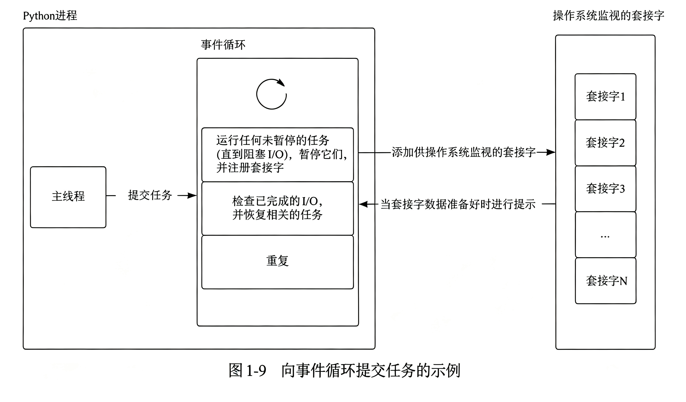

# 异步的介绍

## 定义与本质

异步编程（Asynchronous Programming）是一种非阻塞的并发编程模型。其本质是通过“协作式多任务”机制，允许程序在等待耗时操作（如网络请求、文件读写、数据库查询等 I/O 操作）完成时，主动让出 CPU 控制权去执行其他任务。当耗时操作完成后，程序再恢复执行。这种机制使得单线程也能高效地处理大量并发任务，彻底避免了传统同步编程中因等待 I/O 而导致的资源浪费。

把一个特定的长时间的任务与主程序分离开，让其可以在后台运行。系统可以自由地执行不依赖于该任务的其他工作，而不是阻止其他所有应用程序代码等待该长时间任务的完成。一旦长时间运行的任务完成，系统会受到它已完成的通知，以便对结果进行处理。

## 目的

在传统的同步编程模型中，代码按顺序执行。每当遇到耗时的 I/O 操作时，整个程序会被阻塞（卡住），无法继续执行后续代码。若程序中有多个耗时操作，它们只能串行运行，导致效率极低。

异步编程的引入主要为了解决以下痛点：

1. 高效利用 CPU 资源

   在 I/O 等待期间，CPU 不再闲置，而是立即切换去执行其他就绪任务，充分利用系统资源。

2. 提升程序并发能力

   无需为每个任务创建独立的线程或进程，单线程即可同时处理成千上万个并发连接，大幅降低系统开销。

3. 改善用户体验

   在 Web 服务或图形界面中，异步编程能确保后台耗时操作不会阻塞主线程，保证界面或接口的实时响应。

## 核心作用

1. I/O 密集型任务加速

   特别适用于网络爬虫、Web 服务器、微服务网关等需要频繁进行 I/O 操作的场景，能显著缩短总执行时间。

2. 高并发服务支撑

   配合 FastAPI 等现代异步框架，单机即可承载海量并发请求，提升系统吞吐量。

3. 简化并发代码结构

   通过 `async/await` 语法，将复杂的异步回调逻辑转化为类似同步代码的线性结构，提高代码的可读性与可维护性。

## 使用流程

Python 通过标准库 `asyncio` 提供了完整的异步编程基础设施。

### 核心语法关键字

1. `async def`

   用于定义协程函数（Coroutine）。协程是一种可以暂停和恢复的特殊函数。

2. `await`

   只能在协程内部使用，用于“等待”一个耗时的异步操作完成。遇到 `await` 时，当前协程会暂停并将控制权交还给事件循环。

3. `asyncio.run()`：程序的异步入口，用于启动事件循环并运行最外层的协程。

### 基础代码模板

```python
import asyncio

# 1. 使用 async def 定义协程
async def say_hello():
    print("你好！")
    # 2. 使用 await 等待异步操作（模拟等待1秒）
    # 注意：严禁使用 time.sleep()，它会阻塞整个事件循环
    await asyncio.sleep(1)
    print("世界！")

# 3. 使用 asyncio.run() 启动协程
asyncio.run(say_hello())
```

### 实现并发执行

若直接 `await` 多个协程，它们依然是串行执行的。要实现真正的并发，需使用任务调度工具：

- `asyncio.gather()`

  批量并发执行多个协程，并等待所有任务完成。

  ```python
  async def main():
      # 将三个任务并发执行，总耗时约等于最慢的那个任务
      results = await asyncio.gather(
          fetch_data(1, 2),
          fetch_data(2, 1),
          fetch_data(3, 3)
      )
  ```

- `asyncio.create_task()`

  创建后台任务，任务会立即被调度执行，且不阻塞后续代码。

## 注意事项

1. 严禁阻塞事件循环

   在协程中绝对不能使用 `time.sleep()`、`requests.get()` 或普通的文件读写等同步阻塞代码，否则整个异步并发将失效。必须使用对应的异步库（如 `aiohttp` 替代 `requests`，`aiofiles` 替代普通文件操作）。

2. 必须使用 `await` 触发执行

   调用协程函数若不加 `await`，只会返回一个协程对象而不会真正执行代码。

3. 适用场景限制

   异步编程专为 I/O 密集型任务设计。对于 CPU 密集型任务（如复杂数学计算、图像处理），异步无法加速，反而可能因调度开销降低性能，此时应使用多进程（`multiprocessing`）。

# 密集型任务

## 定义

在计算机程序设计中，根据任务执行时主要消耗的系统资源类型，通常将任务划分为 I/O 密集型（I/O-bound）与 CPU 密集型（CPU-bound）两大类。

1. I/O 密集型任务

   指程序在执行过程中，大部分时间处于等待输入/输出（Input/Output）操作完成的状态。这类任务的瓶颈在于外部设备（如硬盘、网络、数据库）的响应速度，而非处理器的计算能力。CPU 在等待期间通常处于空闲状态。

2. CPU 密集型任务

   指程序在执行过程中，大部分时间都在进行复杂的逻辑运算、数据处理或数学计算。这类任务的瓶颈在于处理器的计算速度与核心数量，CPU 始终处于高负载运转状态，极少发生 I/O 等待。

## 典型特征

准确识别任务类型是选择正确并发或并行策略的前提。

1. I/O 密集型任务特征与场景

   - 特征

     执行耗时主要取决于外部设备的延迟，CPU 占用率通常较低。

   - 常见场景

     网络请求（如爬虫、API 调用）、文件读写、数据库查询与更新、用户交互等待、消息队列处理等。

2. CPU 密集型任务特征与场景

   - 特征

     执行耗时主要取决于算法复杂度与 CPU 主频，CPU 占用率通常接近 100%。

   - 常见场景

     复杂数学运算（如矩阵乘法、加密解密）、图像处理与视频编解码、机器学习模型训练、大规模数据排序与搜索、代码编译等。

## 技术方案

针对不同的任务类型，Python 提供了截然不同的并发与并行解决方案。

### I/O 密集型

利用“并发”（Concurrency）。

由于 CPU 在等待 I/O 时是空闲的，应让程序在等待期间切换去执行其他任务，从而最大化利用 CPU 的空闲时间片。

1. 异步编程（`asyncio`）

   使用 `async/await` 语法配合异步库（如 `aiohttp`、`asyncpg`）。这是目前处理高并发 I/O 任务最高效、资源消耗最低的方案，单线程即可处理数万并发连接。

2. 多线程（`threading`）

   Python 的多线程在 I/O 等待时会释放全局解释器锁（GIL），允许其他线程运行。适用于不支持异步的旧版 I/O 库。

### CPU 密集型

利用“并行”（Parallelism）。由于 CPU 始终满载，必须通过增加计算单元（多核 CPU）来真正缩短执行时间。

- 多进程（`multiprocessing`）

  创建多个独立的 Python 进程，每个进程拥有独立的内存空间和 GIL，能够真正利用多核 CPU 进行并行计算。这是解决 Python CPU 密集型任务瓶颈的唯一标准方案。

## 方案选择对比

| 任务类型       | 瓶颈所在         | 核心思路            | 推荐 Python 方案                | 关键注意事项                                                 |
| -------------- | ---------------- | ------------------- | ------------------------------- | ------------------------------------------------------------ |
| **I/O 密集型** | 外部设备响应速度 | 并发（Concurrency） | `asyncio`（首选）或 `threading` | 严禁在异步代码中使用同步阻塞函数（如 `time.sleep`、`requests.get`） |
| **CPU 密集型** | 处理器计算能力   | 并行（Parallelism） | `multiprocessing`               | 进程创建与通信开销较大，需确保单个任务计算量足够大以抵消开销 |

## 混合任务的处理

在实际工程中，许多任务是混合型（Mixed Workload）的。例如，一个 Web 服务既需要处理大量的数据库查询（I/O），又需要对上传的图片进行压缩（CPU）。

通常以 I/O 密集型为主架构（如使用 FastAPI + `asyncio`），当遇到 CPU 密集型子任务时，通过 `run_in_executor` 将其提交到线程池或进程池中执行，避免阻塞主事件循环。

# 进程与线程

## 核心定义

1. 进程（Process）

   进程是操作系统进行**资源分配和调度的基本单位**。它是程序在计算机中的一次运行活动，代表了一个正在执行的程序实例。

2. 线程（Thread）

   线程是进程内部的一个执行单元，是操作系统进行 **CPU 调度和执行的基本单位**。它是比进程更小的能独立运行的基本单位。

3. 主线程

    线程与创建它的进程相关联。一个进程总是至少有一个与之关联的线程，叫主线程。

4. 工作线程

    一个进程还可以创建其他线程，通常叫做工作线程或后台线程。

5. 主线程和工作线程的级别理解

    | 维度         | 结论                       | 原因                                                         |
    | :----------- | :------------------------- | :----------------------------------------------------------- |
    | **启动顺序** | 不是平级，主线程是创建者   | 子线程的 `start()` 方法由主线程调用执行。                    |
    | **调度地位** | 是平级，都是进程的普通线程 | 操作系统内核不记录“谁创建了谁”，只调度所有就绪的线程。       |
    | **内存共享** | 是平级，共享堆内存         | 主线程和子线程共享同一个进程的虚拟地址空间（全局变量、堆对象）。 |
    | **退出影响** | 不是平级，主线程有特殊职责 | 进程退出时，**只等待非守护线程**，不等待守护线程；<br />而主线程正是执行这一等待逻辑的线程。 |

    - 在**逻辑启动关系**上，子线程在主线程“之下”（由它发起）；
    - 在**操作系统调度**上，子线程与主线程“平级”（都是进程的直接子执行单元，共享相同的进程资源）。

> **主线程的结束**
>
> 当主线程运行完脚本的最后一行，它会立即进入 CPython 解释器的退出例程（`Py_FinalizeEx`），在这个阶段主线程会主动执行以下任务：
>
> 1. 调用 `atexit` 钩子
>
>    执行所有通过 `atexit.register()` 注册的函数（这些函数是在主线程上下文中顺序执行的）。
>
> 2. 等待非守护线程
>
>    这是最耗时的一步。主线程会调用底层线程库的等待函数（如 `pthread_join` 或 `WaitForMultipleObjects`），**阻塞自己**，直到所有非守护子线程的 `run()` 方法返回并彻底终止。
>
> 3. 回收内存和资源
>
>    在所有子线程退出后，主线程恢复执行，销毁全局对象、关闭文件描述符，最后向操作系统发出 `exit` 系统调用。
>
> 因此，在主线程的代码执行完毕之后、进程退出之前的这段时间里，主线程**始终存活**，只是它不再执行你编写的业务逻辑，而是在执行运行时系统级的清理逻辑。
>
> ```python
> """
> 在 Python 中，默认创建的线程都是非守护线程（即 daemon=False）。
> Python 解释器的退出机制规定：
> 只有当所有非守护线程都执行完毕后，程序才会彻底退出。
> 因此，即使主线程的代码已经执行完毕，且没有对子线程调用 join() 方法，
> 只要子线程还在运行，主线程（以及整个 Python 进程）就会一直处于等待状态，
> 直到子线程执行结束。
> """
> 
> import atexit  # 允许程序员定义多个退出函数，在程序正常终止时执行。
> import threading
> import time
> 
> 
> def on_exit():
>     print(
>         f"atexit 钩子运行在: {threading.current_thread().name}"
>     )  # 输出 MainThread
> 
> 
> def task():
>     print("子线程开始执行")
>     time.sleep(5)
>     print("子线程结束")
> 
> 
> if __name__ == "__main__":
>     print("主线程开始")
>     atexit.register(on_exit)
> 
>     t = threading.Thread(target=task)
>     t.start()
> 
>     print("主线程代码执行完毕，进入挂起状态")
> ```


## 核心作用

| 概念     | 核心作用           | 详细说明                                                     |
| -------- | ------------------ | ------------------------------------------------------------ |
| **进程** | **资源隔离与保护** | 每个进程拥有独立的内存空间（代码段、数据段、堆栈等）。<br />**进程之间的资源是相互隔离的**，一个进程的崩溃通常不会直接影响其他进程，从而保证了系统的稳定性。 |
| **线程** | **高效执行与通信** | 线程是 CPU 调度的最小单位。<br />**同一个进程内的多个线程共享该进程的内存空间和资源**，这使得线程间的通信和数据交换非常高效，<br />无需复杂的进程间通信机制。 |

## 核心区别

| 对比维度     | 进程                                               | 线程                                                       |
| ------------ | -------------------------------------------------- | ---------------------------------------------------------- |
| **资源拥有** | 拥有独立的内存空间和系统资源                       | 不拥有系统资源，但可访问其所属进程的全部资源               |
| **调度单位** | 资源分配的基本单位                                 | CPU 调度和执行的基本单位                                   |
| **创建开销** | 创建和销毁开销大（需分配独立内存）                 | 创建和切换开销小（共享所属进程的内存）                     |
| **通信方式** | 需通过进程间通信机制（如管道、消息队列、共享内存） | 可直接读写同一进程的数据段（如全局变量），但需处理同步问题 |
| **稳定性**   | 一个进程崩溃通常不影响其他进程                     | 一个线程崩溃可能导致整个进程崩溃                           |

## 应用场景

1. 多进程应用

   适用于需要高稳定性和资源隔离的场景。例如，Chrome 浏览器为每个标签页分配独立进程，防止单个网页崩溃导致整个浏览器关闭；Python 的 `multiprocessing` 模块用于绕过全局解释器锁（GIL）实现真正的并行计算。

2. 多线程应用

   适用于需要高并发、快速响应且任务间需频繁共享数据的场景。例如，Web 服务器为每个客户端请求分配一个线程进行处理；图形界面程序中，主线程负责 UI 渲染，后台线程负责数据处理，防止界面卡顿。

## 编程实现方式

### 多进程

```python
import multiprocessing

def worker():
    """子进程执行的任务"""
    print("子进程正在运行")

if __name__ == "__main__":
    # 创建并启动一个子进程
    p = multiprocessing.Process(target=worker)
    p.start()
    p.join()  # 等待子进程结束
```

### 多线程

```python
import threading

def worker():
    """子线程执行的任务"""
    print("子线程正在运行")

# 创建并启动一个子线程
t = threading.Thread(target=worker)
t.start()
t.join()  # 等待子线程结束
```

## 注意事项

1. 线程安全问题

   由于多线程共享内存空间，当多个线程同时修改同一变量时，极易引发数据竞争（Race Condition）。必须使用锁（Lock）、信号量（Semaphore）等同步机制来保证数据的一致性。

2. GIL 限制

   在 CPython 解释器中，全局解释器锁（GIL）限制了同一时刻只有一个线程在执行 Python 字节码。因此，Python 的多线程无法充分利用多核 CPU 实现计算密集型任务的并行，此时应优先选择多进程。

3. 资源消耗

   虽然线程比进程轻量，但创建过多线程仍会消耗大量内存和 CPU 切换开销。在高并发场景下，应使用线程池（Thread Pool）或协程（Coroutine）来管理任务，避免无限制地创建线程。

# 全局解释器锁（GIL）

## 核心定义

全局解释器锁（Global Interpreter Lock，简称 GIL）是 CPython 解释器中的一种互斥锁机制。该机制确保在同一个进程内，任何时刻只有一个线程能够执行 Python 字节码。

## 核心作用

| 作用分类           | 详细说明                                                     | 典型场景                             |
| ------------------ | ------------------------------------------------------------ | ------------------------------------ |
| **内存管理保护**   | 简化 CPython 的内存管理机制（引用计数），<br />防止多线程同时修改对象引用计数导致的数据不一致或内存泄漏。 | 所有 Python 对象的创建、销毁与访问。 |
| **C 扩展集成**     | 简化 C 语言扩展库的集成，因为大多数 C 库并非线程安全，<br />GIL 避免了在 C 代码中实现复杂的锁机制。 | 调用 NumPy、Pandas 等底层 C 库时。   |
| **单线程性能优化** | 在单核 CPU 时代，GIL 减少了线程切换和锁竞争的开销，<br />提升了单线程程序的执行效率。 | 简单的脚本执行或单线程应用。         |

## 对多线程的影响

1. CPU 密集型任务

   对于需要大量计算的任务（如数学运算、图像处理），GIL 会成为性能瓶颈。由于同一时刻只有一个线程能执行字节码，多线程无法利用多核 CPU 实现真正的并行计算，甚至可能因线程切换开销导致性能低于单线程。

2. I/O 密集型任务

   对于需要等待外部输入输出的任务（如网络请求、文件读写），GIL 的影响较小。当线程执行 I/O 操作时，会自动释放 GIL，允许其他线程获取锁并执行，从而实现宏观上的并发处理。

## 应对 GIL 限制的常用方案

### 使用多进程替代多线程

通过 `multiprocessing` 模块创建多个进程，每个进程拥有独立的 Python 解释器和内存空间，从而绕过 GIL 限制，实现真正的并行计算。

```python
import multiprocessing

def cpu_bound_task():
    """CPU密集型任务示例"""
    result = 0
    for i in range(10000000):
        result += i

if __name__ == "__main__":
    processes = []
    for _ in range(4):
        p = multiprocessing.Process(target=cpu_bound_task)
        processes.append(p)
        p.start()
    for p in processes:
        p.join()
```

### 使用异步编程

通过 `asyncio` 模块实现单线程内的并发，特别适用于 I/O 密集型任务。异步编程通过事件循环和非阻塞 I/O 避免了多线程的开销。

```python
import asyncio

async def io_bound_task():
    """I/O密集型任务示例"""
    await asyncio.sleep(1)  # 模拟网络请求或文件读取

async def main():
    tasks = [io_bound_task() for _ in range(10)]
    await asyncio.gather(*tasks)

asyncio.run(main())
```

### 使用 C 扩展释放 GIL

在 C/C++ 编写的扩展模块中，可以通过 `Py_BEGIN_ALLOW_THREADS` 和 `Py_END_ALLOW_THREADS` 宏手动释放 GIL，允许其他线程在 C 代码执行期间运行。

## GIL 的未来发展

Python 社区已通过 PEP 703 提案，计划将 GIL 设为可选功能。在 Python 3.13 版本中，无 GIL 模式将作为实验性功能提供，允许开发者在不需要 GIL 的场景下选择关闭它，以实现真正的多线程并行。

## 关键注意事项

1. GIL 仅存在于 CPython

   其他 Python 实现（如 Jython、IronPython）没有 GIL，但 CPython 是最广泛使用的解释器。

2. I/O 操作自动释放 GIL

   文件读写、网络请求、`time.sleep()` 等操作会自动释放 GIL，无需手动处理。

3. 多进程通信开销

   使用多进程绕过 GIL 时，进程间通信（IPC）比线程间通信更复杂且开销更大，需合理选择队列、管道等通信方式。

4. 线程池与进程池

   在高并发场景下，应使用 `concurrent.futures.ThreadPoolExecutor` 或 `ProcessPoolExecutor` 来管理线程或进程，避免频繁创建和销毁带来的开销。

# 事件循环（Event Loop）核心概念笔记

## 定义

事件循环（Event Loop）是一种程序执行模型与任务调度机制。其核心是一个无限循环，负责不断地检查是否有任务（事件）需要处理。如果有，就执行任务；如果没有，就进入等待状态，直到下一个任务到来。该机制是异步编程和非阻塞 I/O 的核心基础。

## 核心作用

1. 实现非阻塞 I/O

   允许程序在等待 I/O 操作（如网络请求、文件读写）时不阻塞主线程，从而充分利用计算机资源。

2. 管理异步任务

   通过事件队列（Event Queue）管理待处理的任务，协调多个异步操作的执行顺序。

3. 提升并发性能

   在高并发、高 I/O 密集型的应用中，显著减少线程切换开销，避免因线程过多导致的资源浪费。

4. 协调单线程并发

   在单线程语言（如 JavaScript）中，通过任务排队和调度，实现看似并发的执行效果。

## 执行流程

事件循环的执行流程是一个持续运转的调度机制。

创建事件循环时，会创建一个空的任务队列，然后将任务添加到队列中。

首先，事件循环启动并进入一个无限循环状态；接着，它会检查就绪队列中是否有待执行的同步任务或已恢复的协程，若有则取出并执行；当执行过程中遇到 `await` 关键字（如 I/O 操作）时，当前任务会被挂起并移入等待队列，事件循环随即切换去执行其他就绪任务；同时，事件循环会持续监听底层 I/O 多路复用器（如 `epoll`、`kqueue`），一旦某个被挂起的 I/O 操作完成，对应的任务会被重新移回就绪队列；如此周而复始，直到所有任务执行完毕或收到停止信号，事件循环才会退出。



## 使用方式

1. JavaScript 环境

   事件循环是 JavaScript 运行时环境（如浏览器、Node.js）的内置机制，开发者无需手动创建，只需编写异步代码（如 `Promise`、`async/await`、`setTimeout`），引擎会自动通过事件循环调度执行。

2. Python 环境

   通过标准库 `asyncio` 模块使用。开发者使用 `async` 定义协程函数，使用 `await` 挂起协程，并通过 `asyncio.run()` 启动事件循环来运行主协程。

3. GUI 编程

   在 Tkinter 等 GUI 框架中，通过调用 `mainloop()` 方法启动主事件循环，使窗口能够持续响应用户交互事件（如点击、键盘输入）。

## 实例

以下是一个基于 Python `asyncio` 模块的最简事件循环示例，展示了如何定义异步任务并让事件循环并发调度它们.

```python
import asyncio

# 定义一个异步任务（协程）
async def task_1():
    print("任务1开始")
    await asyncio.sleep(2)  # 模拟 I/O 操作，挂起协程，不阻塞事件循环
    print("任务1完成")

# 定义另一个异步任务
async def task_2():
    print("任务2开始")
    await asyncio.sleep(1)  # 模拟较短的 I/O 操作
    print("任务2完成")

# 定义主协程，用于聚合多个任务
async def main():
    # 使用 gather 并发运行多个协程
    await asyncio.gather(task_1(), task_2())

# 运行事件循环，执行主协程
if __name__ == "__main__":
    asyncio.run(main())
```

程序启动后，事件循环会先执行 `task_1` 和 `task_2` 的同步部分（打印“开始”）。当遇到 `await asyncio.sleep()` 时，当前协程会挂起，事件循环会立即切换到另一个就绪的协程继续执行。因此，“任务2完成”会先于“任务1完成”被打印，体现了事件循环的并发调度能力。