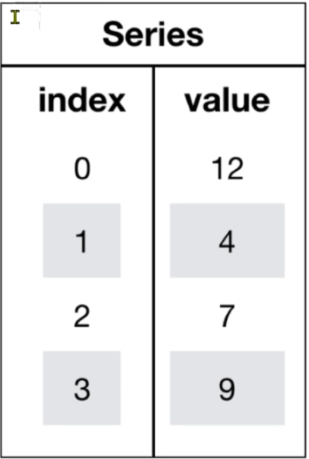
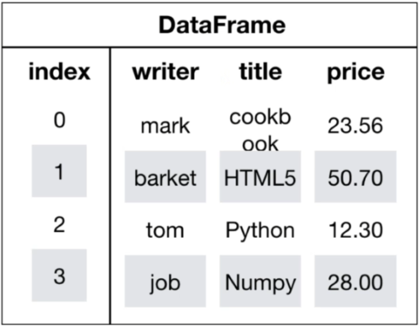

# Pandas

## 介绍

- **定位**：Pandas 是 Python 的第三方库，是商业与工程领域最流行的**结构化数据工具集**，广泛用于：
  - 数据清洗
  - 数据处理
  - 数据分析
- **技术基础与性能**：
  - 底层基于 **NumPy** 构建 → 运行速度极快（向量化操作 + C 语言优化）。
- **功能亮点**：
  -  专为缺失数据设计：提供强大且易用的缺失值处理 API（如 `dropna()`, `fillna()`, `isna()` 等）。
  -  灵活高效的分组-聚合-转换（`groupby`, `agg`, `transform`, `apply` 等），支持复杂业务逻辑。
  -  支持 DataFrame/Series 数据结构，天然适配表格型数据（行/列标签、混合类型）。

>Pandas 凭借**高性能底层 + 高级抽象接口**，成为 Python 数据科学生态中不可或缺的核心组件。
>
>数据单位：byte，kb，mb，gb，tb，pb，eb，zb，yb，nb，db。

**使用`itables`库让vs code的DataFrame渲染成表格**

```python
from itables import init_notebook_mode
init_notebook_mode(all_interactive=True)
# 也可以使用Data Wrangler插件
```

## 数据类型

| Pandas数据类型      | 说明         | 对应的Python类型                  |
| ------------------- | ------------ | --------------------------------- |
| `Object`            | 字符串类型   | `string`。                        |
| `int`               | 整数类型     | `int`。                           |
| `float`             | 浮点数类型   | `float`。                         |
| `datetime`          | 日期时间类型 | `datetime`包中的`datetime`类型。  |
| `timedelta`         | 时间差类型   | `datetime`包中的`timedelta`类型。 |
| `category`          | 分类类型     | 无原生类型，可以自定义。          |
| `bool`              | 布尔类型     | `bool (True, False)`。            |
| `nan`，`NAN`，`NaN` | 空值类型     | `None`。                          |

> **Category 类型（分类数据）**
>
> - **定义**：用于表示**分类数据**，通常适用于取值**范围固定且有限**的集合。
> - 典型示例
>   - 性别（如：男、女）。
>   - 颜色（如：红、黄、蓝）。
>   - 产品类型等。
> - 核心优势
>   1. **节省内存**：相比于普通的字符串或对象类型，占用更少的内存空间。
>   2. **性能提升**：针对分类数据的操作（如排序、分组）运行速度更快。

## Series

1. 介绍

   Pandas中最基本的数据对象，类似于一维数组。

   

   - `values`：一组数据（`numpy.ndarray` 类型）

   - `index`：相关的数据索引标签；如果没有为数据指定索引，则会自动创建一个 `0` 到 `N-1`（`N` 为数据的长度）的整数型索引。

2. 创建

   列表、`np.arange`、`np.random`

3. 基本函数

   | 函数               | 函数说明                                                     |
   | ------------------ | ------------------------------------------------------------ |
   | `pd.Series.unique` | 返回一个**NumPy数组**，其中包含了 Series 中所有**唯一**的值。它不保留任何重复项。 |


## DataFrame

1. 介绍

   DataFrame 是一个类似于二维数组或表格（如 Excel）的对象，既有行索引，又有列索引。

   - **行索引**：表明不同行，横向索引，叫 `index`，0 轴，`axis=0`。
   - **列索引**：表明不同列，纵向索引，叫 `columns`，1 轴，`axis=1`。

   

2. 创建

   - 字典 + 列表

     一个键值对等于一列的数据。

   - 列表 + 元组 | 列表

     一个元组 | 列表等于一行的数据。

3. 属性

   使用 `len(df)` 可以获得行数。

   | 属性         | 属性说明                                                     |
   | :----------- | :----------------------------------------------------------- |
   | `df.index`   | 返回索引列。                                                 |
   | `df.columns` | 返回列名。                                                   |
   | `df.values`  | 返回数据。                                                   |
   | `df.shape`   | 返回 DataFrame 的形状，$(行 \times 列)$。                    |
   | `df.size`    | 返回 DataFrame 中元素的总数量。                              |
   | `df.ndim`    | 返回 DataFrame 的维度数。 DataFrame 是二维的，因此始终返回 2。 |
   | `df.dtypes`  | 返回各列数据类型的 Series。每列对应的数据类型，如 int64, float64, object 等。 |
   | `df.empty`   | 检查 DataFrame 是否为空。如果 DataFrame 没有行或没有列则返回 True，否则返回 False。 |
   | `df.T`       | 返回 DataFrame 的转置。行列互换，原列变为行，原行变为列。    |
   | `df.axes`    | 返回 DataFrame 的轴对象列表。`[index, columns]`，包含行索引和列索引的列表。 |

4. 基本函数

   | 属性                           | 属性说明                                                     |
   | :----------------------------- | :----------------------------------------------------------- |
   | `df.transpose()`               | 返回 DataFrame 的转置。行列互换，原列变为行，原行变为列      |
   | `df.isnull()` 或 `df.isna()`   | 返回布尔值 DataFrame，标记缺失值位置。与原 DataFrame 形状相同的布尔矩阵，缺失值位置为 True |
   | `df.notnull()` 或 `df.notna()` | 返回布尔值 DataFrame，标记缺失值位置。与原 DataFrame 形状相同的布尔矩阵，非缺失值位置为 True。 |
   | `df.info()`                    | 显示 DataFrame 的摘要信息。提供数据类型、内存使用量、非空值计数等详细信息。 |
   | `df.describe()`                | 返回数值列的统计摘要。包含计数、均值、标准差、最小值、四分位数、最大值等统计信息。 |
   | `df.head(n)`                   | 返回前 n 行数据。默认返回前 5 行，用于快速查看数据结构和内容。 |
   | `df.tail(n)`                   | 返回后 n 行数据。 默认返回后 5 行，用于查看数据末尾的内容。  |

   > 操作`DataFrame`一般会返回副本而不会修改原始数据。可以使用`inplace=True`参数设置。

   - `df.reset_index(drop: bool=False, names=None)`

     1. 作用

        重置索引列。

     2. `drop`

        当为`True`时，不会把原本的索引列加入到`DataFrame`中。

     3. `names`

        修改加入到`DataFrame`的索引列的名字。

   - `df.rename(index: dict, columns: dict)`

     精准修改索引名或者列名。字典的键是原名，值是新名。

   - `df.set_index(key, drop=True)`

     1. 作用

        设置索引。

     2. `key`

        接受数组、迭代器和生成器等可迭代对象，也可以是原本的列字段。当key是列表时，pandas会根据列表中的值寻找对应的字段，找不到会**报错**。当列表里面的值有很多个，会把它们都当作索引列。

     3. `drop`

        当key是字段时且drop为`True`的时候，会删除用作索引的该列。

## 索引查找

1. `df[列名][行索引名]`

   先列后行。

   取出多列：`df[[字段1, 字段2, ...]]`，记得里面再加一个`[]`，这样才会是多个选择，一个`[]`是表示**下标运算符**。

   > - `df[[col]]` -> DataFrame对象
   >
   > - `df[col]` -> Series对象

2. `df.loc[行索引名, 列索引名]`

   这里的`行索引名`和`列索引名`均支持切片写法，即：`起始值:结束值:步长`。也可以是列表。

   > 取出想要的列：
   >
   > - `df.loc[:, [字段1, 字段2, ...]]`

3. `df.iloc[行索引, 列索引]`。

   这里的索引指数字编号，支持切片写法，也可以是列表。

## 运算

1. 直接赋值

   `df[字段名] = 表达式 | 字面量`

   - 会把这一整列进行相同的操作。
   - 会修改原始数据。
   - 也可以使用`df.字段名`，但是如果字段名有空格等，就不能。

2. 直接运算

   `df 算数运算符 数字`

   - 对所有列进行运算。
   - 也可以筛选出来单独运算。

3. 算数运算

   | 函数       | 函数说明 |
   | ---------- | -------- |
   | `df.add()` | 加法。   |
   | `df.sub()` | 减法。   |
   | ...        | ...      |

4. 逻辑运算

   - `df[条件表达式]`

     返回表达式为`True`的数据。

   - `df.query(expr: str, inplace=False, **kwargs)`

     - `expr` ：是一个字符串，包含查询条件。条件中的变量名通常是 DataFrame 的列名，支持 `f-string`。
     - `inplace`：如果为 `True`，则直接修改原 DataFrame 而不是返回一个新的。默认为 `False`。
     - `**kwargs`：传递外部变量到查询字符串中。

     > 在这里的逻辑运算中，`and`、`not`、`or`等也会被视为逻辑运算符，可能会导致出错。如果列名有这些单词，需要将整个列名使用反引号``包裹。

     如果想在查询字符串中使用 DataFrame 之外的 Python 变量，需要用 `@` 符号引用它。

     ```python
     import pandas as pd
     
     df = pd.DataFrame({
         'Name': ['Alice', 'Bob', 'Charlie', 'David'],
         'Age': [25, 30, 35, 30],
         'City': ['New York', 'London', 'Paris', 'New York'],
         'Salary': [50000, 60000, 70000, 55000]
     })
     
     min_age = 30
     target_city = 'New York'
     
     # 筛选年龄大于等于 min_age 且城市为目标城市的记录
     result = df.query('Age >= @min_age and City == @target_city')
     print(result)
     #      Name  Age      City  Salary
     # 3   David   30  New York   55000
     ```

   - `df.isin(values: Series | DataFrame | Sequence | Mapping)`

     - 当`values`是一个可迭代对象，会把df中的每一个值与可迭代对象的每一个值进行比较。即判断存不存在。
     - 当`values`是一个字典，字典的键对应df中的列名，值对应df中的值。
     - 当`values`是一个Series，会根据 Series 的**索引**来匹配 DataFrame 的行。也就是提供坐标，根据坐标查看是否存在。
     - 当`values`是一个DataFrame，会尝试根据**行索引**和**列标签**同时对齐 DataFrame。

5. 替换

   ```python
   df.replace(
       to_replace, # 需要被替换的值或模式（可以是标量、列表、字典或正则表达式）
       value, # 用来替换的新值（可以是标量、列表或字典）
       inplace: bool = False, # 是否在原DataFrame上进行修改
       regex # 是否将to_replace视为正则表达式进行模式匹配
   )
   ```

   | 参数         | 参数说明                                                     |
   | ------------ | ------------------------------------------------------------ |
   | `to_replace` | 需要被替换的值。<br />可以是**单个值**（如 `'old_value'`）、<br />一个**列表**（`['old_val1', 'old_val2']`）、<br />一个**正则表达式**（`r'^\s*$', flags=re.IGNORECASE`）、<br />一个字典（`{'old_val': 'new_val'}`）等。<br />如果提供了 `value` 参数，则此参数不能为空。 |
   | `value`      | 用来替换 `to_replace` 的新值。<br />可以是单个值（如 `'new_value'`）或一个列表。<br />如果 `to_replace` 是一个字典，则此参数会被忽略，因为字典本身已经定义了替换关系。 |
   | `inplace`    | 默认为 `False`。<br />如果设置为 `True`，则直接在原 DataFrame/Series 上执行替换操作并返回 `None`。<br />如果为 `False`（默认），则返回一个新的、已完成替换的 DataFrame/Series。 |
   | `regex`      | 默认为 `False`。<br />如果为 `True`，则 `to_replace` 将被解释为正则表达式模式。 |

## 排序

1. `df.sort_values(by, ascending: bool=True)` 

   - 根据值排序，默认升序。
   - `by`的值可以有多个，使用列表。同样的，如果排序升降不同，`ascending`的值也可以使用列表。

2. `df.sort_index()` 

   根据索引排序。

3. `df.rank()` 

   > 只是**显示排名**，并不会修改数据。
   >
   > 一般新增一列用于显示它的结果。`df[xx排名] = df[列名].rank(...)`

   | 参数           | 参数说明                                                     |
   | -------------- | ------------------------------------------------------------ |
   | `axis`         | 指定计算排名的轴。<br />`axis=0`（默认）表示按列计算排名（每一列内的值相互比较）。<br />`axis=1` 表示按行计算排名（每一行内的值相互比较）。 |
   | `method`       | 指定如何处理并列（相同值）的情况。                           |
   | `numeric_only` | 默认为 `False`。<br />如果为 `True`，则只对数值列进行排名。  |
   | `na_option`    | 指定如何处理 `NaN`（缺失值）。                               |
   | `ascending`    | 默认为 `True`。<br />为 `True`，则值越小排名越靠前（1为最小值）。<br />如果为 `False`，则值越大排名越靠前（1为最大值）。 |
   | `pct`          | 当前排名与最大排名的百分比。会覆盖掉排名。                   |

   - `method`

     | 参数值             | 核心规则                     | 示例说明                       |
     | ------------------ | ---------------------------- | ------------------------------ |
     | `'average'` (默认) | 并列的值取平均排名           | 按顺序分配的排名的平均值。     |
     | `'min'`            | 并列的值取最小排名           | 并列第一名取 1，下一个值取 3。 |
     | `'max'`            | 并列的值取最大排名           | 并列第一名取 2，下一个值取 3。 |
     | `'first'`          | 按出现顺序分配排名           | 谁先出现谁排名靠前，无并列。   |
     | `'dense'`          | 并列取相同排名，后续排名连续 | 并列第一名取 1，下一个值取 2。 |

   - `na_option`

     | 参数值          | 核心规则               | 示例说明                             |
     | --------------- | ---------------------- | ------------------------------------ |
     | `'keep'` (默认) | `NaN` 的排名仍为 `NaN` | 缺失值不参与排名，结果保持为缺失值。 |
     | `'top'`         | `NaN` 被赋予最低的排名 | 在升序中排在最前面（例如排第 1）。   |
     | `'bottom'`      | `NaN` 被赋予最高的排名 | 在升序中排在最后面。                 |

## 统计分析

| 函数                      | 函数说明                                                     |
| ------------------------- | ------------------------------------------------------------ |
| `df.count()`              | 计算非 `NaN | null` 值的数量。                               |
| `df.sum()`                | 计算数值列的总和。                                           |
| `df.prod()`               | 计算沿指定轴的元素乘积（Product）。例如，对一行或一列的所有数字进行连续相乘。 |
| `df.mean()`               | 计算数值列的平均值（均值）。                                 |
| `df.median()`             | 计算数值列的中位数。                                         |
| `df.mode()`               | 计算数值列的众数【mode】（出现频率最高的值）。               |
| `df.std()`                | 计算数值列的标准差。                                         |
| `df.var()`                | 计算数值列的样本方差（Variance）。方差衡量数据点与均值的离散程度，是标准差的平方。 |
| `df.var()`                | 计算数值列的方差。                                           |
| `df.min()`                | 计算每一列的最小值。                                         |
| `df.max()`                | 计算每一列的最大值。                                         |
| `df.idxmin()`             | 返回每一列最小值的索引标签。                                 |
| `df.idxmax()`             | 返回每一列最大值的索引标签。                                 |
| `df.quantile(q=0.5)`      | 计算指定分位数（例如 q=0.5 是中位数，q=0.25 是第一四分位数）。 |
| `df.describe()`           | 生成描述性统计信息的汇总表，包括计数、均值、标准差、最小值、四分位数和最大值。 |
| `df.corr()`               | 计算列与列之间的相关系数矩阵。                               |
| `df.cov()`                | 计算列与列之间的协方差矩阵。                                 |
| `df.abs()`                | 计算每个元素的绝对值。                                       |
| `df.cumsum()`             | 计算累加和。                                                 |
| `df.cummax()`             | 累积最大值，遇到更大的数就更新。                             |
| `df.cummin()`             | 累积最小值，遇到更小的数就更新。                             |
| `df.cumprod()`            | 计算累乘。                                                   |
| `df.nlargest(n, columns)` | 获取按指定列排序后的前 n 个最大值的行。                      |

> **cumulative /kjuːˈmjuːlətɪv/**
>
> - 累积的；累加的；渐增的。
> - 形容一个过程是逐步增加、层层叠叠积累起来的。
>
> ```python
> import pandas as pd
> 
> df = pd.DataFrame({
>     'A': [1, 2, 3],
>     'B': [4, 5, 6]
> })
> 
> print(df)
> #    A  B
> # 0  1  4
> # 1  2  5
> # 2  3  6
> 
> print(df.cummax())
> #    A  B
> # 0  1  4  # 第一行 A=1, B=4
> # 1  2  5  # 第二行 A=max(1,2)=2, B=max(4,5)=5
> # 2  3  6  # 第三行 A=max(1,2,3)=3, B=max(4,5,6)=6
> 
> print(df.cummin())
> #    A  B
> # 0  1  4  # 第一行 A=1, B=4
> # 1  1  4  # 第二行 A=min(1,2)=1, B=min(4,5)=4
> # 2  1  4  # 第三行 A=min(1,2,3)=1, B=min(4,5,6)=4
> ```

## `apply`自定义运算

`apply(func, axis=0, raw=False, result_type=None, args=(), **kwds)`

- **`func`**: 必需参数。要应用的函数。这个函数可以是自己定义的，也可以是内置函数或 lambda 函数。
- `axis` （仅DataFrame）： 指定函数应用的方向。
  - `axis=0` 或 `'index'`: 函数将应用于每一列（即**沿索引方向**，对每列执行）。**这是默认值**。
  - `axis=1` 或 `'columns'`: 函数将应用于每一行（即**沿列方向**，对每行执行）。
- `args`，`\**kwds`：传递给 `func` 的额外位置参数和关键字参数。

## 数据增删

1. 增加列

   - `df['新的列名'] = ...`

     使用列表可以给每一行赋不同的值。

   - `df.assign(**kwargs)`

     它接收一系列关键字参数，其中 `key` 是要创建的新列的名称（必须是字符串），而 `value` 是要添加到该列的值。`value` 可以是以下几种形式：

     - **标量**：一个常数，例如 `new_col=5`，这会使新列的所有行都填充为 `5`。
     - **可迭代对象**：如列表、Series 或 NumPy 数组，其长度必须与 DataFrame 的行数相同，例如 `new_col=[1, 2, 3]`。
     - **函数**：一个接受当前 DataFrame 作为输入的函数。这使得新列的值可以基于 DataFrame 中的其他列动态计算得出。例如 `new_col=lambda x: x['col1'] * x['col2']`。

2. 删除

   ```python
   df.drop(
       self,
       labels: IndexLabel | ListLike = ...,
       *,
       axis: Axis = ...,
       index: IndexLabel | ListLike = ...,
       columns: IndexLabel | ListLike = ...,
       level: Level | None = ...,
       inplace: bool = False,
       errors: IgnoreRaise = 'ignore',
   )
   ```

   | 参数      | 参数说明                                                     |
   | --------- | ------------------------------------------------------------ |
   | `labels`  | 指定要删除的行标签或列标签。<br />可以是一个单个的标签（如 `'column_name'` 或 `0`）;<br />也可以是一个由多个标签组成的列表（如 `['col1', 'col2']` 或 `[0, 2, 4]`）。 |
   | `axis`    | 指定删除操作的方向。<br />`axis=0` 表示按行删除（即删除指定的行索引）;<br />`axis=1` 表示按列删除（即删除指定的列名）。默认值为 `0`。 |
   | `index`   | 与 `labels` 功能相同，但明确指定了要删除的是行索引。不能与 `labels` 同时使用。 |
   | `columns` | 与 `labels` 功能类似，但明确指定了要删除的是列名。不能与 `labels` 同时使用。 |
   | `level`   | 当索引是多级索引（MultiIndex）时，指定要删除的层级。         |
   | `inplace` | 默认为 `False`。如果设置为 `True`，则会在原 DataFrame 上直接执行删除操作，并返回 `None`。<br />如果为 `False`（默认），则会返回一个新的、已删除指定内容的 DataFrame。这是一个非常关键的参数。 |
   | `errors`  | 控制当尝试删除不存在的标签时的行为。<br />`'raise'`（默认）会引发 KeyError 错误；<br />`'ignore'` 则会忽略错误，仅删除存在的标签。 |

   > 也可以使用`del`语句，但是这是直接从原始数据中删除。
   >
   > `del` 语句的设计是用于删除单个变量、列表中的单个元素或字典中的单个键值对。
   >
   > 对于 `Pandas.DataFrame`，`del` 只能用于删除单个列，其正确写法是 `del df['column_name']`。
   >
   > Python 解析器无法理解 `del <一个表达式>` 这种形式，它只能删除命名空间中的标识符（变量名）。

3. 去重

   ```python
   df.drop_duplicates(
       self,
       subset: Hashable | Iterable[Hashable] | None = ...,
       *,
       keep: DropKeep = ...,
       inplace: bool = ...,
       ignore_index: bool = ...,
   )
   ```

   | 参数           | 参数说明                                                     |
   | -------------- | ------------------------------------------------------------ |
   | `subset`       | 指定用来判断重复的列。<br />可以是一个列名（如 `'column_name'`）或一个列名列表（如 `['col1', 'col2']`）。<br />如果未指定（`None`），则将考虑所有列。 |
   | `keep`         | 指定保留哪个重复项。<br />`'first'`（默认）保留第一次出现的重复项；<br />`'last'` 保留最后一次出现的重复项；<br />`'all'` 或 `False` 将删除所有重复项（包括首次出现的）。 |
   | `inplace`      | 默认为 `False`。<br />如果为 `True`，则直接在原 DataFrame 上进行修改并返回 `None`。<br />如果为 `False`（默认），则返回一个新的、已去重的 DataFrame。 |
   | `ignore_index` | 默认为 `False`。<br />如果为 `True`，则结果的索引会被重置为 `RangeIndex`（从 0 开始递增），丢弃原来的索引。 |

4. `concat` 拼接

   ```python
   pd.concat(
       objs: Iterable[Series | DataFrame] | Mapping[HashableT, Series | DataFrame],
       axis: Literal[1, "columns"],
       join: str = ...,
       ignore_index: bool = ...,
       keys: Iterable[Hashable] | None = ...,
       levels=...,
       names: list[HashableT] | None = ...,
       sort: bool = ...,
   )
   ```

   | 参数           | 参数说明                                                     |
   | -------------- | ------------------------------------------------------------ |
   | `objs`         | 一个 Series 或 DataFrame 对象的序列或映射（例如列表或字典），这些对象是你想要连接在一起的。<br />使用列表等包裹。 |
   | `axis`         | 指定连接的轴。<br />`axis=0`（默认）表示沿索引（垂直方向）堆叠，增加行数。<br />`axis=1` 表示沿列（水平方向）拼接，增加列数。 |
   | `join`         | 指定如何处理其他轴上的索引。<br />`'outer'`（默认）表示使用所有索引的并集，缺失的部分用 `NaN` 填充。<br />`'inner'` 表示只使用共同的索引交集。 |
   | `ignore_index` | 默认为 `False`。<br />如果为 `True`，则不保留原有的行/列索引，而是生成一个新的、从 0 开始的整数索引。 |
   | `keys`         | 一个序列，用于创建一个**分层**索引（MultiIndex）。<br />每个传入的对象都会被标记上对应的 key。相当于坐标，会覆盖原来的索引。 |
   | `sort`         | 默认为 `False`。如果为 `True`，则会对非连接轴上的列进行排序。 |

   > - 对于`key`参数，接受`Iterable[str]`，把索引按拼接的DateFrame重置。索引会变为`tuple[str, int]`，str是key的元素，int是第几行。
   > - 列合并默认参考列名，行合并默认参考索引。

5. `merge` 拼接

   > 只能按列方向进行合并（相同的索引合并），增加列数。

   ```python
   pd.merge(
       left,                 # 左侧要合并的 DataFrame 或 Series 对象
       right,                # 右侧要合并的 DataFrame 或 Series 对象
       how='inner',          # 指定数据连接的方式（如内连接、外连接等）
       on=None,              # 指定左右两个数据对象中同名的列作为连接键
       left_on=None,         # 指定左侧数据对象中用作连接键的列
       right_on=None,        # 指定右侧数据对象中用作连接键的列
       left_index=False,     # 是否使用左侧数据对象的行索引作为连接键
       right_index=False,    # 是否使用右侧数据对象的行索引作为连接键
       sort=False,           # 是否根据连接键对合并后的结果进行字典顺序排序
       suffixes=('_x', '_y'),# 当两个数据对象存在非连接键的重名列时，自动添加的后缀
       copy=True,            # 是否始终从传入的对象中复制数据（Pandas 3.0+ 已弃用）
       indicator=False,      # 是否在输出结果中添加一列 '_merge'，显示每行数据的来源
       validate=None         # 检查合并操作是否符合指定的键唯一性类型（如一对一、一对多）
   )
   ```

   | 参数                         | 作用说明                                                  | 可选值 / 类型                                                |
   | ---------------------------- | --------------------------------------------------------- | ------------------------------------------------------------ |
   | `left` / `right`             | 参与合并的左侧和右侧数据对象                              | `DataFrame` 或 `Series`                                      |
   | `how`                        | 决定数据合并时的保留逻辑                                  | `'inner'`（交集，默认）<br />`'outer'`（并集）<br />`'left'`（左表为准）<br />`'right'`（右表为准）<br />`'cross'`（笛卡尔积）<br />`'left_anti'`（左反连接）<br />`'right_anti'`（右反连接） |
   | `on`                         | 用于连接的列名或索引级别名称                              | 列名字符串或列名列表（必须同时存在于左右对象中）             |
   | `left_on` / `right_on`       | 当左右对象连接键列名不同时，分别指定左右侧的连接键        | 列名、索引级别名称或数组                                     |
   | `left_index` / `right_index` | 是否将行索引（Index）作为连接键                           | `True` 或 `False`（默认）                                    |
   | `sort`                       | 是否按连接键对合并结果进行排序                            | `True` 或 `False`（默认）                                    |
   | `suffixes`                   | 处理重叠列名时添加的字符串后缀                            | 长度为 2 的元组，默认为 `('_x', '_y')`                       |
   | `copy`                       | 是否复制数据（注：Pandas 3.0 起已弃用，采用写时复制机制） | `True`（默认）或 `False`                                     |
   | `indicator`                  | 添加来源指示列，方便排查数据匹配情况                      | `False`（默认）<br />`True`（列名为 `_merge`）, 或自定义列名字符串 |
   | `validate`                   | 验证连接键的唯一性，确保数据一致性                        | `None`（默认）<br />`'one_to_one'`（1:1）<br />`'one_to_many'`（1:m）<br />`'many_to_one'`（m:1）<br />`'many_to_many'`（m:m） |

6. `map()` 映射

   根据某一列的数值来添加新的映射列，用于 `Series`（即 DataFrame 的某一列）的“一对一”值转换。

   - 传入字典
     字典的键（Key）是原值，字典的值（Value）是新值。

     ```python
     import pandas as pd
     
     df = pd.DataFrame({'score': [1, 1, 2, 3]})
     mapping = {1: '好学生', 2: '中等学生', 3: '普通学生'}
     
     # 使用字典进行映射
     df['level'] = df['score'].map(mapping)
     ```

   - 传入函数或 lambda 表达式（适合数值计算或复杂逻辑）

     ```python
     # 使用 lambda 表达式将分数翻倍
     df['double_score'] = df['score'].map(lambda x: x * 2)
     
     # 或者传入自定义函数
     def check_pass(x):
         return '及格' if x >= 2 else '不及格'
     
     df['status'] = df['score'].map(check_pass)
     ```

   - 传入另一个 Series（适合跨表映射）
      Series 的索引（Index）作为原值，Series 的值作为新值来进行映射。

         ```python
      # 用 mapping_series 的索引去匹配 df['score'] 的值
      mapping_series = pd.Series(['好学生', '中等学生'], index=[1, 2])
      df['level'] = df['score'].map(mapping_series)
         ```

   - 缺失值（na_action）

     在使用字典映射时，如果原数据中有字典里不存在的值，`map` 默认会把它变成 `NaN`（空值）。如果希望保留原值或忽略空值，可以使用 `na_action` 参数。

       ```python
     # 假设原数据里有个 4，但字典里没有定义 4 对应什么
     df = pd.DataFrame({'score': [1, 2, 4, None]})
     mapping = {1: '好学生', 2: '中等学生'}
     
     # 默认情况：4 和 None 都会变成 NaN
     print(df['score'].map(mapping)) 
     
     # 使用 na_action='ignore'：遇到原本就是 NaN 的值会跳过，保持原样（但字典里没定义的 4 依然会变成 NaN）
     print(df['score'].map(mapping, na_action='ignore'))
       ```

   

## 缺失值查看

1. 处理思路

   - 应用 `isnull` 判断是否有缺失数据 `NaN`。
   - 应用 `fillna` 实现缺失值的填充。
   - 应用 `dropna` 实现缺失值的删除。
   - 应用 `replace` 实现数据的替换。

2. 获取缺失值的标记方式(NaN或者其他标记方式)

   如果缺失值的标记方式是NaN

   - 判断数据中是否包含NaN:

     - `pd.isnull(df)`
     - `pd.notnull(df)`

   - 存在缺失值nan:

     1. 删除存在缺失值的: `dropna(axis='rows')`

        > 不会修改原数据, 需要接受返回值。

     2. 替换缺失值: `fillna(value, inplace=True)`

        - `value`：替换成的值。
        - `inplace`：`True`会修改原数据，`False`不替换修改原数据, 生成新的对象。

   如果缺失值没有使用NaN标记, 比如使用"?"

   - 先替换"?"为`np.nan`，然后继续处理。

| 函数                            | 函数说明                                                     |
| ------------------------------- | ------------------------------------------------------------ |
| `pd.isna(df)`或`pd.isnull(df)`  | 查看数据是否为NaN，返回布尔值表格。                          |
| `df.all()`                      | 检查数据结构中的所有元素是否都为 True（或在逻辑上等价于 True）。 |
| `df.any()`                      | 检查数据结构中的所有元素是否存在 True（或在逻辑上等价于 True）。用法与`all`一致。 |
| `df.columns[df.isnull().any()]` | 查看存在缺失值的列的字段。                                   |
| `df.isna().sum()`               | 统计每一列缺失值的个数。                                     |

> **`df.all()`函数**
>
> 主要功能：
>
> - 对于 `True`/`False` 布尔类型的 DataFrame 或 Series，`.all()` 会检查是否所有值都为 `True`。
> - 对于非布尔类型的 DataFrame 或 Series，它会先将所有值转换为布尔值（Python 规则：非零、非空、非 `None`、非 `NaN` 等视为 `True`，`0`, `''`, `None`, `NaN` 等视为 `False`），然后再进行检查。
>
> ---
>
> 常用参数：
>
> - `axis`
>
>   指定要沿着哪个轴进行操作。
>
>   - `axis=0` (默认): 沿着索引方向向下计算，对每一列执行 `all()` 操作，最终返回一个包含每列结果的 `Series`。
>   - `axis=1`: 沿着列方向向右计算，对每一行执行 `all()` 操作，最终返回一个包含每行结果的 `Series`。
>
> - `skipna`
>
>   是否跳过 `NaN` 值。默认为 `True`。
>
> ---
>
> 注意：
>
> - 因为0和空字符串也会被转为False，因此要统计空值最好是使用`isna`等函数先把非空值转化为布尔值，防止出先错误选择。

| 操作                   | 说明                                                         |
| ---------------------- | ------------------------------------------------------------ |
| `df.isna().any()`      | 查看是否有缺失值。                                           |
| `df.notna().all()`     | 查看是否有缺失值。                                           |
| `np.all(pd.notna(df))` | 查看是否有缺失值。                                           |
| `df.isna().sum()`      | 统计每一列缺失值个数，设置`axis`为`columns`以统计每一行缺失值个数。 |

> **查看缺失值的行**
>
> - `df[df.isna().any(axis='columns')]`
>   1. 使用`isna`把缺失值转化为`True`。
>   2. 使用`any`并指定统计方向为`沿列方向`，找出具有缺失值的那几行。
>   3. 使用下标运算符把那几行提取出来。
> - `df[~df.notna().all(axis='columns')]`
>   - 去了个反而已，没有反就是查找没有缺失值的行。

## **缺失**值处理

1. 删除

   ```python
   DataFrame.dropna(
       axis=0,          # 控制是删除行(0/'index')还是列(1/'columns')
       how='any',       # 控制在什么条件下删除行/列 ('any' 或 'all')
       thresh=None,     # 设置保留所需的最小非NA值数量
       subset=None,     # 指定要考虑的列或行的标签
       inplace=False,    # 是否直接修改原DataFrame而不返回新对象
       ingore_index=False # 是否重置索引
   )
   ```

   | 参数      | 参数说明                                                     |
   | --------- | ------------------------------------------------------------ |
   | `axis`    | 控制删除维度。`0` 或 `'index'` (默认) 表示删除包含缺失值的行；`1` 或 `'columns'` 表示删除包含缺失值的列。 |
   | `how`     | 控制删除的条件。`'any'` (默认) 表示只要行/列中有任何缺失值就删除；`'all'` 表示只有当行/列全部为缺失值时才删除。 |
   | `thresh`  | 设置一个阈值，保留至少有 `thresh` 个非缺失值的行/列。        |
   | `subset`  | 指定一个列名或行索引的列表，`dropna` 将只考虑这些指定的列/行来判断是否删除对应的行/列。 |
   | `inplace` | 布尔值，默认为 `False`。如果为 `True`，则直接修改原 DataFrame 而不返回新的 DataFrame；如果为 `False`，则返回一个新的已清理的 DataFrame。 |

2. 填充

   ```python
   DataFrame.fillna(
       value=None,        # 用于填充缺失值的具体值或方法
       method=None,       # 填充方法，如 'ffill' 或 'bfill'
       axis=None,         # 沿哪个轴填充 (0/'index' 或 1/'columns')
       inplace=False,     # 是否就地修改原DataFrame
       limit=None,        # 限制连续填充的NaN数量
       downcast=None      # 强制转换数据类型
   )
   ```

   | 参数       | 参数说明                                                     |
   | ---------- | ------------------------------------------------------------ |
   | `value`    | 最常用的参数。可以是一个标量（如 `0`, `"Unknown"`）、字典（`{'col1': 0, 'col2': 'missing'}`）、Series 或另一个 DataFrame，用于指定用什么值来替换缺失值。 |
   | `method`   | 指定一种填充方法，而不是一个固定值。可用选项包括：`'ffill'` (前向填充，用前面的有效值填充)、`'bfill'` (后向填充，用后面的有效值填充)。**建议使用单独的函数代替**。 |
   | `axis`     | 指定沿哪个轴进行填充。`0` 或 `'index'` (默认) 沿行方向填充；`1` 或 `'columns'` 沿列方向填充。 |
   | `inplace`  | 布尔值，默认为 `False`。若为 `True`，则直接修改原 DataFrame，不返回新对象。 |
   | `limit`    | 与 `method` 一起使用，限制连续填充的最大数量。例如 `limit=1` 表示最多只填充一个连续的 NaN。 |
   | `downcast` | 一个字典或字符串，用于在填充后强制转换数据类型（如 `{'int64': 'infer'}`）。通常较少使用。 |

   ```python
   for col in df.columns: # 遍历df的所有字段
       if np.all(pd.notnull(df[col])) == False: # 对每一列进行统计，当这一列出现空值时，结果为False
           print(col) # 把这个字段打印出来
           df[col].fillna(df[col].mean(), inplace=True) # 使用这个字段的平均值填充
   ```


## 分组

```python
DataFrame.groupby(
    by=None,
    axis=0,
    level=None,
    as_index=True,
    sort=True,
    group_keys=True,
    observed=False,
    dropna=True
)
```

| 参数名       | 默认值  | 说明                                                         |
| ------------ | ------- | ------------------------------------------------------------ |
| `by`         | `None`  | 指定分组的依据。<br />可以是列名（str）、列名列表、一个 Series、<br />一个字典（用于将 Series 映射到分组名称）<br />或一个函数（输入是轴标签，返回分组名称）。 |
| `axis`       | `0`     | 指定沿哪个轴进行分组。<br />`0` 或 `'index'`（默认）表示沿行索引方向（通常是按列的值）分组；<br />`1` 或 `'columns'` 表示沿列索引方向（很少用）分组。 |
| `level`      | `None`  | 当索引是 MultiIndex（多层索引）时，可以通过 `level` 指定按哪一层索引进行分组。<br />可以是层级编号（int）或层级名称（str）。 |
| `as_index`   | `True`  | 决定分组标签是否作为结果的索引。<br />`True`（默认）时，分组列会成为结果的索引；<br />`False` 时，分组列会作为普通列保留在结果中，类似于 SQL 中的 `GROUP BY ... WITH ROLLUP` 的效果。 |
| `sort`       | `True`  | 是否对分组键进行排序。<br />`True`（默认）时，结果会按键值排序；<br />`False` 时，结果顺序与原始数据中的首次出现顺序相同，可能会更快。 |
| `group_keys` | `True`  | 在应用 `apply` 等函数时，是否将分组键作为结果的索引前缀。<br />`True` 时，结果会有 `(分组键, 原始索引)` 这样的多层索引；<br />`False` 时，会忽略分组键，只保留原始索引。 |
| `observed`   | `False` | 仅适用于分组键是 `Categorical`（分类）数据类型时。<br />`False`（默认）时，即使某个类别在数据中没有出现，也会出现在结果中；<br />`True` 时，只返回数据中实际存在的类别。 |
| `dropna`     | `True`  | 决定是否将分组键中的缺失值（NaN）排除在分组之外。<br />`True`（默认）时，含有 NaN 的行不会出现在任何分组中；<br />`False` 时，会创建一个包含所有 NaN 值的特殊分组。 |

> **`by`参数说明**
>
> - 按单列分组，可以是字符串、数字或者列表。
> - 按多列分组，需要使用列表。

使用`get_group('组名')`可以获取到组的数据。

## 聚合

`agg()` 函数（即 `aggregate` 的缩写）是 Pandas 中用于**数据聚合**的核心工具。可以把它理解为 Excel 里的“分类汇总”或者 SQL 里的聚合函数，它的核心作用就是把一堆数据经过计算（如求和、求平均、找最大最小值等），最终浓缩成一个精简的统计结果。

```python
DataFrame.agg(func=None, axis=0, *args, **kwargs)

Series.agg(func=None, axis=0, *args, **kwargs)
```

| 参数       | 说明                                                         |
| ---------- | ------------------------------------------------------------ |
| `func`     | 指定要应用的函数。可以是字符串（如 `'sum'`）、<br />函数对象（如 `np.mean`）、<br />函数列表（如 `['sum', 'mean']`）<br />或字典（对不同列指定不同函数）。 |
| `axis`     | 指定轴向。<br />`0` 或 `'index'`（默认）表示按列聚合；<br />`1` 或 `'columns'` 表示按行聚合。 |
| `*args`    | 传递给聚合函数的位置参数。                                   |
| `**kwargs` | 传递给聚合函数的关键字参数。                                 |

- `df.agg({'列名1': '函数', '列名2': '函数', ...})`

  > 也可以是函数列表。

- `df.agge(新列名1=('原列名1', 函数)， 新列名2=('原列名2', 函数))`

  > 新列名不需要`''`，因为它是参数。
  
- `df.agg(['函数1', '函数2', ...])` 

  > 对所有的列进行聚合。

## 过滤

`filter` 函数的主要作用是根据一个条件，**筛选出满足该条件的行或列**。它通常与 `groupby` 结合使用，用于筛选出满足特定条件的**整个分组**，而不是单个元素。

```python
DataFrame.filter(
    items=None, 
    like=None, 
    regex=None, 
    axis=None
)
```

| 参数名  | 类型                                   | 描述                                                         |
| ------- | -------------------------------------- | ------------------------------------------------------------ |
| `items` | `list-like`                            | 标签列表，只保留标签在列表中的项。                           |
| `like`  | `str`                                  | 保留其标签包含指定子字符串的项。                             |
| `regex` | `str (正则表达式)`                     | 保留其标签匹配指定正则表达式的项。                           |
| `axis`  | `{0 or 'index', 1 or 'columns', None}` | 指定是筛选行索引 (`'index'`) 还是列索引 (`'columns'`)。<br />`None` (默认) 时，如果 `items` 存在，则默认为 `'columns'`；<br />否则，根据其他参数推断。 |

```python
import pandas as pd

df = pd.DataFrame({
    'A_col': [1, 2, 3],
    'B_col': [4, 5, 6],
    'A_data': [7, 8, 9]
}, index=['row1', 'row2', 'row3'])

print("原始数据框:\n", df)

# 1. 使用 items 筛选特定列
filtered_df1 = df.filter(items=['A_col', 'A_data'])
print("\n1. 筛选列 ['A_col', 'A_data']:\n", filtered_df1)

# 2. 使用 like 筛选列名包含 'A_' 的列
filtered_df2 = df.filter(like='A_')
print("\n2. 筛选列名包含 'A_':\n", filtered_df2)

# 3. 使用 regex 筛选列名以 'A' 开头的列
filtered_df3 = df.filter(regex='^A')
print("\n3. 筛选列名以 'A' 开头:\n", filtered_df3)

# 4. 使用 axis='index' 筛选行
filtered_df4 = df.filter(items=['row1', 'row3'], axis='index')
print("\n4. 筛选行 ['row1', 'row3']:\n", filtered_df4)
```

---

```python
DataFrame.groupby(...).filter(func, dropna=True)
```

它会将一个函数应用于**每个分组**（也就是使用`get_group`返回的除了分组字段的对象），只有**当函数返回 `True`** 时，才会将**整个分组**的数据**保留**在最终结果中。

如果函数返回 `False` 或 `False` 等价的值（如 `0`, `None`, 空序列等），则该分组的所有行都会被丢弃。

| 参数名   | 类型       | 默认值 | 描述                                                         |
| -------- | ---------- | ------ | ------------------------------------------------------------ |
| `func`   | `function` | -      | 接收一个 DataFrame 或 Series (代表一个分组) 作为输入，并返回 `True` 或 `False`。 |
| `dropna` | `bool`     | `True` | 如果为 `True`，则从结果中删除因过滤而变空的组。              |

## 交叉表

在 Pandas 中，交叉表（Crosstab）是一种专门用来**统计两个或多个分类变量之间频次（即出现次数）分布**的强大工具。可以把它理解为 Excel 中的“数据透视表”或者 SQL 中的 `GROUP BY` 计数统计。

它的核心作用是快速生成一个二维表格，直观地展示不同变量组合下的数据情况。

> 只能处理一维的行和列，不支持像透视表那样复杂的多级行列嵌套。

```python
pd.crosstab(
    index,           # 行索引（必选）：指定作为行分组的列或数组
    columns,         # 列索引（必选）：指定作为列分组的列或数组
    values=None,     # （可选）用于聚合的数值列，配合 aggfunc 使用
    aggfunc=None,    # （可选）聚合函数，默认为计数（count）
    margins=False,   # （可选）是否添加行/列总计，默认为 False
    margins_name='All', # （可选）总计行/列的名称
    normalize=False  # （可选）是否将结果转换为百分比/频率
)
```

| 参数名         | 说明                                                         |
| -------------- | ------------------------------------------------------------ |
| `index`        | 【必需】用作交叉表行的数组或 Series（通常是 DataFrame 的某一列）。 |
| `columns`      | 【必需】用作交叉表列的数组或 Series。                        |
| `values`       | 可选。如果提供了 `values`，则不再单纯统计频次，而是对这些值进行聚合。 |
| `aggfunc`      | 可选。配合 `values` 使用，指定聚合函数（如 `'sum'`, `'mean'` 等）。默认是统计频次（即 `'count'`）。 |
| `margins`      | 布尔值，默认为 `False`。如果为 `True`，会在表格的最后添加“总计”行和“总计”列。 |
| `margins_name` | `margins`行和列的名称。                                      |
| `normalize`    | 布尔值或字符串，默认为 `False`。如果为 `True` 或指定 `'index'`/`'columns'`，会将结果转换为百分比（占比）。 |

## 透视表

Pandas 中的透视表（Pivot Table）是数据分析中极其强大的多维汇总工具。可以把它看作是 Excel 中“数据透视表”的 Python 版本，它能够快速地对海量数据进行分组、汇总和重新排版，把杂乱的原始数据变成一目了然的统计报表。

本质上是 `groupby` 的高级封装，但直接返回一个**行列分明**的二维宽表格，非常适合直接展示给业务部门看。支持多级行列、多种聚合方式以及自动填充缺失值，是生成最终分析报告的首选。

> 注意：这里的index和columns是`字段`，不是`Series`。

```python
pd.pivot_table(
    data,           # 要分析的 DataFrame 数据源
    values=None,    # 需要进行聚合计算的数值列（如销售额、利润）
    index=None,     # 作为透视表“行”的分组字段
    columns=None,   # 作为透视表“列”的分组字段
    aggfunc='mean', # 聚合函数，默认为求平均值
    fill_value=None,# 用于填充缺失值（NaN）
    margins=False,  # 是否添加行/列的总计
    margins_name='All' # 总计行/列的名称
)
```

## 访问器

| 访问器    | 访问器说明                                                   | 代码举例                                                     |
| --------- | ------------------------------------------------------------ | ------------------------------------------------------------ |
| `.dt`     | **时间日期访问器** <br />专门处理时间序列数据，提取年、月、日、星期等时间属性，<br />或进行时间格式转换。 | `df['日期'].dt.year` （提取年份） <br />`df['日期'].dt.strftime('%Y-%m')` （格式化输出） |
| `.str`    | **字符串访问器** <br />专门处理文本数据，提供类似 Python 原生字符串的操作<br />（如大小写转换、替换、分割、计算长度等）。 | `df['姓名'].str.upper()` （转大写） <br />`df['姓名'].str.contains('张')` （判断是否包含某字） |
| `.cat`    | **分类数据访问器** <br />专门处理 `category` 类型的数据。<br />常用于获取所有类别、修改类别顺序或重命名类别。 | `df['等级'].cat.categories` （查看所有类别） <br />`df['等级'].cat.rename_categories(['高', '低'])` |
| `.plot`   | **绘图访问器** <br />Pandas 对 Matplotlib 的快捷封装，<br />可以直接在 Series 或 DataFrame 上快速调用各种基础图表。 | `df['销量'].plot(kind='bar')` （柱状图） <br />`df.plot.scatter(x='花费', y='收益')` （散点图） |
| `.sparse` | **稀疏数据访问器** <br />当数据中包含大量重复值（如大量的 0 或 NaN）时使用。<br />它可以只存储非重复值，从而极大节省内存。 | `df['数据'].sparse.density` （查看数据密度） <br />`df['数据'].sparse.to_coo()` （转为稀疏矩阵） |
| `.struct` | **结构化数据访问器** <br />专门处理包含字典或结构化对象的列<br />（常见于从 JSON 文件读取的数据），可提取嵌套字段。 | `df['用户信息'].struct.field('年龄')` （提取年龄字段）<br />`df['用户信息'].struct.explode()` （展开结构化数据） |
| `.list`   | **列表数据访问器** <br />当 Series 中的每个元素本身就是一个列表（list）时使用，<br />可对内部的列表元素进行提取或计算。 | `df['标签列表'].list.len()` （计算每个列表的长度） <br />`df['标签列表'].list[0]` （提取每个列表的第一个元素） |

## 绘图

绘图的参数可以参照matplotlib。

- `df.plot`

  拿到画布，选择图形。

- 折线

  `df.plot()`或者`df.plot.line()`

- 柱状

  `df.plot.bar()`