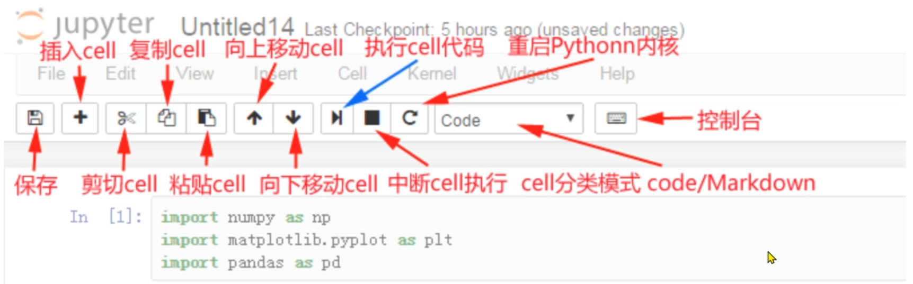

# Anaconda

1. 介绍

   是最流行的数据分析平台。

2. 作用

   创建沙箱（虚拟环境）。

   1. 很多开源库版本升级后 API 有变化，老版本的代码不能在新版本中运行。
   2. 将不同 Python 版本/相同开源库的不同版本隔离。
   3. 不同版本的代码在不同的虚拟环境中运行。

3. 包管理功能

   1. 包安装命令

      - `conda install 包名`
      - `pip install 包名`

      注意事项：使用 `pip` 时最好指定安装源（镜像源），推荐以下国内镜像地址：

      - 阿里云：`https://mirrors.aliyun.com/pypi/simple/`
      - 豆瓣：`https://pypi.douban.com/simple/`
      - 清华大学：`https://pypi.tuna.tsinghua.edu.cn/simple/`
      - 中国科学技术大学：`http://pypi.mirrors.ustc.edu.cn/simple/`

       ```cmd
       pip install 包名 -i https://mirrors.aliyun.com/pypi/simple/  # 通过阿里云镜像安装
       ```

   2. 查看是否安装模块

      `conda list 模块名` 

   3. 查看本机支持该模块的所有版本

      `conda search 模块名`

4. 管理虚拟环境

   - **创建虚拟环境**
     `conda create -n 虚拟环境名字 python=python版本`，没指定版本默认跟base沙箱的版本一致。

   - **进入（切换）虚拟环境**
     `conda activate 虚拟环境名字`

   - **退出虚拟环境**
     `conda deactivate [虚拟环境名字]`

   - **删除虚拟环境**
     `conda remove -n 虚拟环境名字 --all`

   - **查看虚拟环境**

     `conda list env`：查看`list`命令的来源。

     `conda env list`：查看虚拟环境。

5. Jupyter Notebook

   - 启动

     `jupyter notebook`

   - 界面

     

   - 快捷指令

     1. 命令模式：按`ESC`键进入。

        - `Y`：将 cell 切换到 Code（代码）模式。

        - `M`：将 cell 切换到 Markdown 模式。

        - `A`：在当前 cell 的**上面**添加 cell。

        - `B`：在当前 cell 的**下面**添加 cell。

        - `双击D`：删除当前 cell。

     2. 编辑模式：按`ENTER`键进入

        - 多光标操作：`Ctrl` + 点击鼠标（Mac：`CMD` + 点击鼠标）；**回退**：`Ctrl` + `Z`（Mac：`CMD` + `Z`）
        - 重做：`Ctrl` + `Y`（Mac：`CMD` + `Y`）
        - 补全代码：在变量、方法后跟 `Tab` 键
        - 注释/取消注释：为一行或多行代码添加/取消注释--`Ctrl` + `/`。

     3. 通用

        - `Shift+Enter`：执行本单元代码，并跳转到下一单元。
        - `Ctrl+Enter`：执行本单元代码，留在本单元。

        > cell 行号前的 `\*`表示代码正在运行。

# Seaborn

是一个python数据可视化库，基于Matplotlib并提供了更高级的功能。

绘图是`图姓名+plot`，比如：`histplot`。