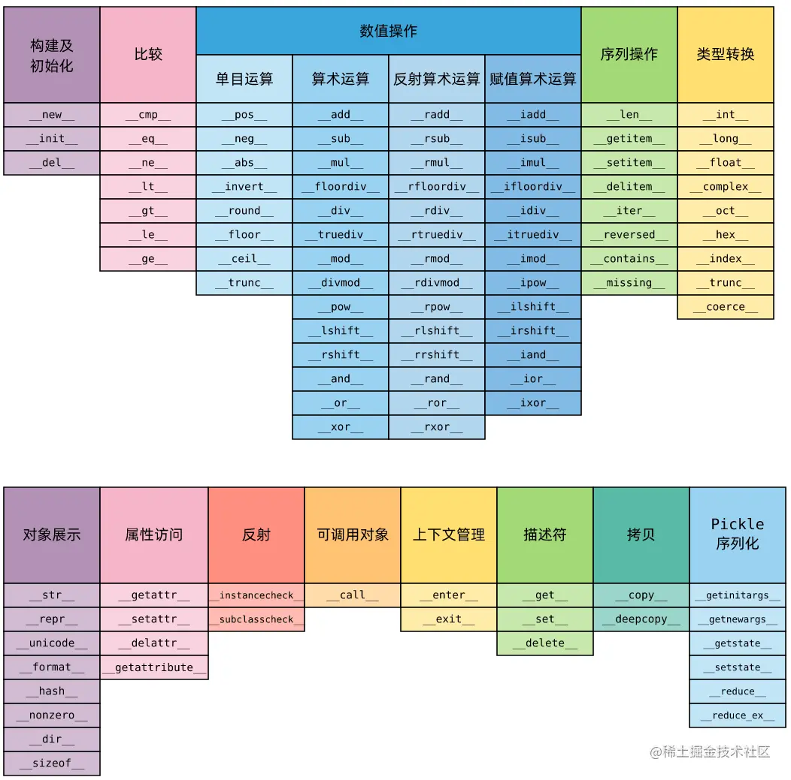

# 概述

Python 的魔法方法（Magic Methods），也称为特殊方法（Special Methods）或双下方法（Dunder Methods），是类中以下划线 `__` 开头和结尾的特殊方法。它们无需主动调用，而是在特定场景下由 Python 解释器自动调用，用于自定义类的行为，使其能与内置函数和操作符无缝交互。

所谓魔法方法，它的官方的名字实际上叫 `special method`，是Python的一种高级语法，允许在类中自定义函数，并绑定到类的特殊方法中。比如在类A中自定义 `__str__()` 函数，则在调用 `str(A())` 时，会自动调用 `__str__()` 函数，并返回相应的结果。



# 内置变量

## `__name__`

当前模块的名称由内置变量 `__name__` 决定。它的具体值取决于模块的运行方式：

### 作为主程序运行

当你直接运行一个 Python 文件时（例如在命令行执行 `python script.py`），该文件的 `__name__` 变量会被自动设置为字符串 `'__main__'`。

### 作为模块被导入

当一个 Python 文件被其他文件通过 `import` 语句导入时，它的 `__name__` 变量就是该文件的模块名（即文件名，不包含 `.py` 后缀）。如果文件在包内，则会包含包的路径。

### 代码示例

假设有一个名为 `my_module.py` 的文件：

```python
# 文件名: my_module.py

def show_name():
    print(f"当前模块的名称是: {__name__}")

if __name__ == '__main__':
    # 只有直接运行此文件时，这里的代码才会执行
    print("脚本正在作为主程序运行")
    show_name()
```

- 情况一：直接运行
  在命令行执行 `python my_module.py`，输出为：

  ```text
  脚本正在作为主程序运行
  当前模块的名称是: __main__
  ```

- 情况二：被导入
  在另一个 Python 文件中执行 `import my_module`，`my_module.py` 中的 `show_name()` 函数如果被调用，输出为：

  ```text
  当前模块的名称是: my_module
  ```

## `__all__`

模块级别的特殊变量，用于指定`from 模块名 import *`时导入了哪些功能。

使用时需用列表指定，功能需要使用字符串包裹，写在导入模块处。

```python
__all__ = ['功能1', '功能2']
```

## `__version__`

用来描述包的版本，写在`__init__.py`文件中。

## `__author__`

用来描述包的作者，写在`__init__.py`文件中。

# 构造与初始化

这类方法控制对象的生命周期，从创建到销毁。前面两个改变一个类建立对象时的行为。

## `__new__(cls, [...])`
- 格式
  
  ```python
  # 第一个参数指向类本身
  def __new__(cls, *args, **kwargs) -> Self:
      # 返回一个类的实例
  ```
  
- 说明

  这是对象实例化时调用的**第一个**方法。它负责创建并返回一个新实例，在 `__init__` 之前被调用，也就是建立一个 `object` 的过程。通常用于继承不可变类型（如 `int`、`str`、`tuple`）时定制创建过程。

- 示例
  ```python
  class MyClass:
      def __new__(cls, *args, **kwargs):
          print("1. 调用 __new__")
          instance = super().__new__(cls)
          return instance
  
      def __init__(self, value):
          print("2. 调用 __init__")
          self.value = value
  
  obj = MyClass(10)  # 参数既会传给 new，也会传给 init
  # 输出：
  # 1. 调用 __new__
  # 2. 调用 __init__
  """
  这只是一种解释，实际并没有这种写法
  obj = MyClass.__new__(MyClass, 10)
  obj.__init__(10)
  """
  ```

## `__init__(self, [...])`
- 格式
  
  ```python
  def __init__(self, 参数1, 参数2, ...):
      # 初始化代码
  ```
  
- 说明

  这是最常用的初始化方法。在实例被 `__new__` 创建**之后**、返回给调用者之前被调用。用于设置对象的初始状态。

- 示例
  
  ```python
  class Person:
      def __init__(self, name, age):
          self.name = name
          self.age = age
  
  p = Person("张三", 25)
  print(p.name)  # 输出: 张三
  ```

## `__del__(self)`
- 格式
  ```python
  def __del__(self):
      # 清理代码
  ```
  
- 说明

  析构方法，当对象被垃圾回收时调用。用于执行清理操作（如关闭文件、释放资源）。

- 示例
  ```python
  class FileHandler:
      def __init__(self, filename):
          self.file = open(filename, 'r')
  
      def __del__(self):
          self.file.close()
          print("文件已关闭")
  
  fh = FileHandler("test.txt")
  del fh  # 输出: 文件已关闭
  ```

```python
class App:
    def __del__(self):
        print("删除")
        
app = App()
a = app

del app
print("结束")

"""
结束
删除
"""
```

python中对象的释放是比较复杂的。`__del__` 和关键字`del`是没有关系的，我们看到`del app`没有触发 `__del__`。`__del__()` 和 `del` 关键字是两个不同的概念，虽然它们都与对象的销毁相关。

`del` 是Python的一个关键字，用于删除变量或对象的引用。当我们执行 `del obj` 语句时，Python会将对象 `obj` 的引用计数减1，如果引用计数为0，则对象被销毁。`del` 关键字并不会直接调用对象的 `__del__()` 方法，它只是将对象的引用计数减1，由Python自动决定是否调用 `__del__()` 方法。

`__del__()` 方法是一个特殊方法，用于在对象被销毁时执行一些清理任务。当对象的引用计数为0时，Python会自动调用该对象的 `__del__()` 方法进行清理。`__del__()` 方法在对象被销毁前最后一次被调用，我们可以在这个方法中执行一些需要进行清理的操作，如释放资源、关闭文件等。

需要注意的是，`__del__()` 方法不是必须的，大多数情况下，Python会自动处理对象的销毁和内存管理，我们不需要手动定义 `__del__()` 方法。如果我们确实需要进行一些特殊的清理任务，应该尽量避免使用 `__del__()` 方法，而是使用上下文管理器、`with` 语句等方式来管理资源和清理任务。

# 类的字符串表示

这类方法控制对象如何被转换为字符串。

## `__str__(self)`
- 格式
  ```python
  def __str__(self):
      return "可读性好的字符串"
  ```
  
- 说明

  定义 `str()` 函数的行为。返回对象的**用户友好**、可读性高的字符串表示。当使用 `print()` 打印对象时也会调用。

- 示例
  ```python
  class Person:
      def __init__(self, name, age):
          self.name = name
          self.age = age
  
      def __str__(self):
          return f"姓名: {self.name}, 年龄: {self.age}"
  
  p = Person("李四", 30)
  print(p)  # 输出: 姓名: 李四, 年龄: 30
  ```

## `__repr__(self)`
- 格式
  ```python
  def __repr__(self):
      return "准确无歧义的字符串"
  ```
  
- 说明

  定义 `repr()` 函数的行为。返回对象的**正式**、准确、无歧义的字符串表示。主要用于开发和调试。在交互式环境中直接输入对象名时也会调用。

  目标是**无歧义性**。为开发者提供一个官方的、尽可能详细的字符串表示，理想情况下，返回的字符串应该能直接用 `eval()` 重新创建出该对象。当你在交互式解释器中直接输入变量名回车，或者在调试器中查看对象时，Python 会尝试调用它。

  > - `__repr__()`是`__str__()`的“备胎”，如果找不到`__str__()`就会找`__repr__()`方法。
  > - `%r`默认调用的是`__repr__()`方法，`%s`调用`__str__()`方法

- 示例
  ```python
  class Person:
      def __init__(self, name, age):
          self.name = name
          self.age = age
  
      def __repr__(self):
          return f"Person('{self.name}', {self.age})"
      	# 或者
          # return f'Person(name={self.name}, age={self.age})'
  
  p = Person("王五", 28)
  print(repr(p))  # 输出: Person('王五', 28)
  ```

## `__bytes__(self)`
- 格式
  ```python
  def __bytes__(self):
      return b"字节串"
  ```
  
- 说明

  定义 `bytes()` 函数的行为。返回对象的字节串表示。

- 示例
  ```python
  class Data:
      def __init__(self, value):
          self.value = value
  
      def __bytes__(self):
          return bytes(self.value, 'utf-8')
  
  d = Data("Hello")
  print(bytes(d))  # 输出: b'Hello'
  ```

## `__format__(self, format_spec)`
- 格式
  ```python
  def __format__(self, format_spec):
      return "格式化后的字符串"
  ```
- 说明：定义 `format()` 函数的行为。支持在字符串格式化时自定义输出格式。
- 示例
  ```python
  class Person:
      def __init__(self, name, age):
          self.name = name
          self.age = age
  
      def __format__(self, format_spec):
          if format_spec == 'name':
              return self.name
          elif format_spec == 'age':
              return str(self.age)
          return f"{self.name} ({self.age})"
  
  p = Person("赵六", 35)
  print(format(p, 'name'))  # 输出: 赵六
  print(format(p, 'age'))   # 输出: 35
  ```

# 比较操作

这类方法支持对象之间的比较运算。

| 魔法方法              | 对应的操作符 | 说明     |
| :-------------------- | :----------- | :------- |
| `__lt__(self, other)` | `<`          | 小于     |
| `__le__(self, other)` | `<=`         | 小于等于 |
| `__eq__(self, other)` | `==`         | 等于     |
| `__ne__(self, other)` | `!=`         | 不等于   |
| `__gt__(self, other)` | `>`          | 大于     |
| `__ge__(self, other)` | `>=`         | 大于等于 |

- 格式（以 `__eq__` 为例）
  ```python
  def __eq__(self, other):
      return self.属性 == other.属性
  ```
- 示例
  ```python
  class Point:
      def __init__(self, x, y):
          self.x = x
          self.y = y
  
      def __eq__(self, other):
          return self.x == other.x and self.y == other.y
  
      def __lt__(self, other):
          return (self.x + self.y) < (other.x + other.y)
  
  p1 = Point(1, 2)
  p2 = Point(1, 2)
  p3 = Point(3, 4)
  
  print(p1 == p2)  # 输出: True
  print(p1 < p3)   # 输出: True
  ```

---

# 数值运算

这类方法支持对象进行算术运算。

| 魔法方法                         | 对应的操作符/函数 | 说明     |
| :------------------------------- | :---------------- | :------- |
| `__add__(self, other)`           | `+`               | 加法     |
| `__sub__(self, other)`           | `-`               | 减法     |
| `__mul__(self, other)`           | `*`               | 乘法     |
| `__truediv__(self, other)`       | `/`               | 真除法   |
| `__floordiv__(self, other)`      | `//`              | 整数除法 |
| `__mod__(self, other)`           | `%`               | 取模     |
| `__pow__(self, other[, modulo])` | `**` 或 `pow()`   | 幂运算   |
| `__neg__(self)`                  | `-`               | 一元负号 |
| `__pos__(self)`                  | `+`               | 一元正号 |
| `__abs__(self)`                  | `abs()`           | 绝对值   |
| `__bool__(self)`                 | `bool()`          | 布尔值   |

- 格式（以 `__add__` 为例）
  ```python
  def __add__(self, other):
      return 新对象 # 注意：返回的是新的对象
  ```
- 示例
  ```python
  class Vector:
      def __init__(self, x, y):
          self.x = x
          self.y = y
  
      def __add__(self, other):
          return Vector(self.x + other.x, self.y + other.y)
  
      def __abs__(self):
          return (self.x ** 2 + self.y ** 2) ** 0.5
  
      def __bool__(self):
          return self.x != 0 or self.y != 0
  
  v1 = Vector(1, 2)
  v2 = Vector(3, 4)
  v3 = v1 + v2
  print(v3.x, v3.y)   # 输出: 4 6
  print(abs(v1))      # 输出: 2.236...
  print(bool(Vector(0, 0)))  # 输出: False
  ```

# 容器类操作

这类方法让自定义类表现得像列表、字典等容器。

| 魔法方法                        | 对应的操作             | 说明                 |
| :------------------------------ | :--------------------- | :------------------- |
| `__len__(self)`                 | `len()`                | 返回容器中元素的个数 |
| `__getitem__(self, key)`        | `self[key]`            | 获取指定键的元素     |
| `__setitem__(self, key, value)` | `self[key] = value`    | 设置指定键的元素     |
| `__delitem__(self, key)`        | `del self[key]`        | 删除指定键的元素     |
| `__contains__(self, item)`      | `item in self`         | 判断元素是否在容器中 |
| `__iter__(self)`                | `iter()` 或 `for` 循环 | 返回一个迭代器       |

- 格式（以 `__getitem__` 为例）
  ```python
  def __getitem__(self, key):
      return self.数据[key]
  ```
  
- 示例一
  ```python
  class MyList:
      def __init__(self, data):
          self.data = data
  
      def __len__(self):
          return len(self.data)
  
      def __getitem__(self, index):
          return self.data[index]
  
      def __setitem__(self, index, value):
          self.data[index] = value
  
      def __contains__(self, item):
          return item in self.data
  
  ml = MyList([10, 20, 30, 40])
  print(len(ml))        # 输出: 4
  print(ml[1])          # 输出: 20
  ml[2] = 99
  print(ml[2])          # 输出: 99
  print(30 in ml)       # 输出: False
  ```
  
- 示例二

  ```python
  class Fib(object):
      def __getitem__(self, n):
          a, b = 1, 1
          for x in range(n):
              a, b = b, a + b
          return a
  ```

# 属性访问控制

这类方法控制对象属性的访问、设置和删除。

| 魔法方法                         | 触发条件               | 说明             |
| :------------------------------- | :--------------------- | :--------------- |
| `__getattr__(self, name)`        | 访问**不存在**的属性时 | 获取不存在的属性 |
| `__getattribute__(self, name)`   | **任何**属性被访问时   | 无条件地获取属性 |
| `__setattr__(self, name, value)` | 设置属性时             | 设置属性值       |
| `__delattr__(self, name)`        | 删除属性时             | 删除属性         |
| `__dir__(self)`                  | `dir()`                | 返回属性列表     |

- 格式（以 `__getattr__` 为例）
  ```python
  def __getattr__(self, name):
      return f"属性 {name} 不存在"
  ```
- 示例
  ```python
  class DynamicAttr:
      def __init__(self):
          self.existing = "已存在的属性"
  
      def __getattr__(self, name):
          return f"你访问了不存在的属性: {name}"
  
      def __setattr__(self, name, value):
          print(f"正在设置属性 {name} = {value}")
          super().__setattr__(name, value)
  
  d = DynamicAttr()
  print(d.existing)     # 输出: 已存在的属性
  print(d.unknown)      # 输出: 你访问了不存在的属性: unknown
  d.new_attr = 100      # 输出: 正在设置属性 new_attr = 100
  ```

# 可调用对象

## `__call__(self, [...])`
- 格式
  ```python
  def __call__(self, *args, **kwargs):
      # 像函数一样被调用时的行为
  ```
  
- 说明

  使实例可以像函数一样被调用。即 `obj()` 会触发 `obj.__call__()`。

- 示例
  ```python
  class Multiplier:
      def __init__(self, factor):
          self.factor = factor
  
      def __call__(self, x):
          return x * self.factor
  
  double = Multiplier(2)
  triple = Multiplier(3)
  
  print(double(5))   # 输出: 10
  print(triple(5))   # 输出: 15
  ```

# 上下文管理器

这类方法支持 `with` 语句。

| 魔法方法                                    | 说明                                   |
| :------------------------------------------ | :------------------------------------- |
| `__enter__(self)`                           | 进入 `with` 代码块时调用，返回资源对象 |
| `__exit__(self, exc_type, exc_val, exc_tb)` | 退出 `with` 代码块时调用，用于清理资源 |

- **格式**：
  ```python
  def __enter__(self):
      return self
  
  def __exit__(self, exc_type, exc_val, exc_tb):
      # 清理代码
  ```
- **示例**：
  ```python
  class ManagedFile:
      def __init__(self, filename, mode):
          self.filename = filename
          self.mode = mode
          self.file = None
  
      def __enter__(self):
          self.file = open(self.filename, self.mode)
          return self.file
  
      def __exit__(self, exc_type, exc_val, exc_tb):
          if self.file:
              self.file.close()
          print("文件已关闭")
  
  with ManagedFile("test.txt", "w") as f:
      f.write("Hello, World!")
  # 输出: 文件已关闭
  ```

# 迭代器协议

| 魔法方法         | 说明                                           |
| :--------------- | :--------------------------------------------- |
| `__iter__(self)` | 返回迭代器对象（通常返回 `self`）              |
| `__next__(self)` | 返回下一个值，没有更多值时抛出 `StopIteration` |

- 格式
  ```python
  def __iter__(self):
      return self
  
  def __next__(self):
      # 返回下一个值
  ```
- 示例
  ```python
  class CountDown:
      def __init__(self, start):
          self.current = start
  
      def __iter__(self):
          return self
  
      def __next__(self):
          if self.current < 0:
              raise StopIteration
          value = self.current
          self.current -= 1
          return value
  
  for num in CountDown(5):
      print(num, end=' ')  # 输出: 5 4 3 2 1 0
  ```

# 描述符协议

Descriptor Protocol

描述符是实现了 `__get__`、`__set__`、`__delete__` 中至少一个方法的类，用于控制另一个类中属性的访问行为。常用于实现 `@property`、`@classmethod`、`@staticmethod` 等。

## `__get__(self, instance, owner)`
- 格式
  ```python
  def __get__(self, instance, owner):
      # 返回属性的值
  ```
- 说明
  当通过实例或类访问描述符属性时调用。`instance` 是访问属性的实例（若通过类访问则为 `None`），`owner` 是拥有该属性的类。该方法应返回属性的值。
- 示例
  ```python
  class Celsius:
      def __get__(self, instance, owner):
          if instance is None:
              return self
          return instance._celsius
  
  class Temperature:
      celsius = Celsius()
  
      def __init__(self, value):
          self._celsius = value
  
  t = Temperature(25)
  print(t.celsius)   # 输出: 25
  print(Temperature.celsius)  # 输出: <__main__.Celsius object at ...>
  ```

## `__set__(self, instance, value)`
- 格式
  ```python
  def __set__(self, instance, value):
      # 设置属性的值
  ```
- 说明
  当通过实例给描述符属性赋值时调用。`instance` 是操作的实例，`value` 是要赋的新值。该方法通常负责存储或验证数据。
- 示例
  ```python
  class Celsius:
      def __get__(self, instance, owner):
          return instance._celsius
  
      def __set__(self, instance, value):
          if value < -273.15:
              raise ValueError("温度不能低于绝对零度")
          instance._celsius = value
  
  class Temperature:
      celsius = Celsius()
  
      def __init__(self, value):
          self.celsius = value
  
  t = Temperature(25)
  t.celsius = 30      # 正常
  # t.celsius = -300  # 会引发 ValueError
  ```

## `__delete__(self, instance)`
- 格式
  ```python
  def __delete__(self, instance):
      # 删除属性的逻辑
  ```
- 说明
  当通过实例删除描述符属性时（`del instance.attr`）调用。用于清理或阻止删除。
- 示例
  ```python
  class Protected:
      def __get__(self, instance, owner):
          return instance._value
  
      def __set__(self, instance, value):
          instance._value = value
  
      def __delete__(self, instance):
          raise AttributeError("禁止删除该属性")
  
  class MyClass:
      attr = Protected()
  
      def __init__(self, val):
          self.attr = val
  
  obj = MyClass(10)
  # del obj.attr  # 会抛出 AttributeError
  ```

## `__set_name__(self, owner, name)`
- 格式
  ```python
  def __set_name__(self, owner, name):
      # 记录属性名
  ```
  
- 说明
  
  在类定义时，当描述符被赋值给类属性时自动调用。`owner` 是所属类，`name` 是属性名。可用于让描述符知道自己被绑定的名称，从而在 `__get__` 等中直接使用该名称。
  
- 示例
  ```python
  class Field:
      def __set_name__(self, owner, name):
          self.name = name
  
      def __get__(self, instance, owner):
          return instance.__dict__.get(self.name)
  
      def __set__(self, instance, value):
          instance.__dict__[self.name] = value
  
  class Model:
      id = Field()
      name = Field()
  
  m = Model()
  m.id = 1
  m.name = "Alice"
  print(m.id, m.name)  # 输出: 1 Alice
  ```

# 协程相关

Coroutine-related

这些魔法方法用于支持异步编程（`async`/`await`）和异步迭代。

## `__await__(self)`
- 格式
  ```python
  def __await__(self):
      yield  # 或 return 一个迭代器
  ```
- 说明
  使对象成为可等待对象（awaitable），可以用于 `await` 表达式。该方法必须返回一个迭代器（通常使用 `yield` 实现），该迭代器驱动异步操作。Python 的协程本身已经实现了该方法，但自定义类也可以实现。
- 示例
  ```python
  import asyncio
  
  class Sleep:
      def __init__(self, seconds):
          self.seconds = seconds
  
      def __await__(self):
          yield from asyncio.sleep(self.seconds).__await__()
          return "已等待完成"
  
  async def main():
      result = await Sleep(1)
      print(result)
  
  asyncio.run(main())  # 输出（1秒后）: 已等待完成
  ```

## `__aiter__(self)`
- 格式
  ```python
  def __aiter__(self):
      return self  # 返回异步迭代器对象
  ```
- 说明
  返回一个异步迭代器对象，该对象必须实现 `__anext__`。用于 `async for` 循环。类比于 `__iter__`。
- 示例
  ```python
  class AsyncCounter:
      def __init__(self, limit):
          self.limit = limit
          self.current = 0
  
      def __aiter__(self):
          return self
  
      async def __anext__(self):
          if self.current >= self.limit:
              raise StopAsyncIteration
          self.current += 1
          await asyncio.sleep(0.1)  # 模拟异步操作
          return self.current
  
  async def main():
      async for num in AsyncCounter(5):
          print(num, end=' ')  # 输出: 1 2 3 4 5
  
  import asyncio
  asyncio.run(main())
  ```

## `__anext__(self)`
- 格式
  ```python
  async def __anext__(self):
      # 返回下一个值，或抛出 StopAsyncIteration
  ```
- 说明
  异步迭代器的 `__anext__` 方法，必须是一个协程（用 `async def` 定义）。每次迭代时调用，返回一个可等待对象，该对象产生下一个值；当没有更多值时，必须抛出 `StopAsyncIteration` 异常。
- 示例（同 `__aiter__` 示例中的 `__anext__`）

# 综合示例一

下面通过一个完整的 `Book` 类，展示多种魔法方法的综合运用：

```python
class Book:
    """书籍类 - 综合展示多种魔法方法"""

    def __init__(self, title, author, pages, price):
        """初始化方法"""
        self.title = title
        self.author = author
        self.pages = pages
        self.price = price
        self._reviews = []

    def __str__(self):
        """用户友好的字符串表示"""
        return f"《{self.title}》- {self.author}"

    def __repr__(self):
        """开发者使用的正式字符串表示"""
        return f"Book('{self.title}', '{self.author}', {self.pages}, {self.price})"

    def __eq__(self, other):
        """比较两本书是否相同（按书名和作者）"""
        if not isinstance(other, Book):
            return False
        return self.title == other.title and self.author == other.author

    def __lt__(self, other):
        """按页数排序"""
        return self.pages < other.pages

    def __add__(self, other):
        """两本书的页数相加"""
        if isinstance(other, Book):
            return self.pages + other.pages
        return NotImplemented

    def __len__(self):
        """返回评论数量"""
        return len(self._reviews)

    def __getitem__(self, index):
        """通过索引获取评论"""
        return self._reviews[index]

    def __setitem__(self, index, value):
        """通过索引设置评论"""
        self._reviews[index] = value

    def __contains__(self, item):
        """判断某条评论是否存在"""
        return item in self._reviews

    def __call__(self, review):
        """像函数一样调用，添加评论"""
        self._reviews.append(review)
        return f"已添加评论: {review}"

    def __bool__(self):
        """判断书籍是否值得阅读（页数大于100）"""
        return self.pages > 100

    def __iter__(self):
        """使书籍可迭代，返回评论的迭代器"""
        return iter(self._reviews)

    def __enter__(self):
        """上下文管理器入口 - 模拟打开书籍"""
        print(f"开始阅读《{self.title}》")
        return self

    def __exit__(self, exc_type, exc_val, exc_tb):
        """上下文管理器出口 - 模拟关闭书籍"""
        print(f"合上《{self.title}》")


# 测试代码
if __name__ == "__main__":
    # 创建书籍对象
    book1 = Book("Python编程", "张三", 350, 59.90)
    book2 = Book("数据结构", "李四", 280, 49.90)
    book3 = Book("Python编程", "张三", 350, 59.90)

    # __str__ 和 __repr__
    print(book1)                # 输出: 《Python编程》- 张三
    print(repr(book1))          # 输出: Book('Python编程', '张三', 350, 59.9)

    # __eq__
    print(book1 == book3)       # 输出: True
    print(book1 == book2)       # 输出: False

    # __lt__
    print(book1 < book2)        # 输出: False (350 < 280)

    # __add__
    print(book1 + book2)        # 输出: 630

    # __call__ 和 __len__
    book1("精彩的书籍！")
    book1("强烈推荐！")
    print(len(book1))           # 输出: 2

    # __getitem__ 和 __setitem__
    print(book1[0])             # 输出: 精彩的书籍！
    book1[1] = "五星好评！"
    print(book1[1])             # 输出: 五星好评！

    # __contains__
    print("五星好评！" in book1) # 输出: True

    # __bool__
    print(bool(book1))          # 输出: True
    print(bool(Book("短篇", "王五", 50, 9.90)))  # 输出: False

    # __iter__
    for review in book1:
        print(f"评论: {review}")
    # 输出:
    # 评论: 精彩的书籍！
    # 评论: 五星好评！

    # __enter__ 和 __exit__ (上下文管理器)
    with book1 as b:
        print(f"当前阅读: {b.title}")
    # 输出:
    # 开始阅读《Python编程》
    # 当前阅读: Python编程
    # 合上《Python编程》
```

# 综合示例二

下面创建一个 `AsyncDataLoader` 类，它同时实现了描述符协议（用于验证数据）和异步迭代协议（用于异步加载数据），并包含 `__await__` 支持等待加载完成。

```python
import asyncio

# ---------- 描述符：用于验证数值范围 ----------
class RangeValidator:
    """描述符，验证数值是否在指定范围内"""
    def __init__(self, min_val, max_val):
        self.min_val = min_val
        self.max_val = max_val
        self.name = None

    def __set_name__(self, owner, name):
        self.name = name

    def __get__(self, instance, owner):
        if instance is None:
            return self
        return instance.__dict__.get(self.name)

    def __set__(self, instance, value):
        if not (self.min_val <= value <= self.max_val):
            raise ValueError(f"{self.name} 必须在 {self.min_val} 到 {self.max_val} 之间")
        instance.__dict__[self.name] = value

    def __delete__(self, instance):
        raise AttributeError(f"不允许删除 {self.name} 属性")


# ---------- 异步数据加载器（实现 __await__ 和异步迭代） ----------
class AsyncDataLoader:
    """异步加载数据，支持 await 等待完成，也支持 async for 逐个获取数据项"""

    def __init__(self, data_source):
        self.data_source = data_source   # 假设是一个列表
        self.loaded = False
        self.index = 0

    def __await__(self):
        """使对象可等待，模拟异步加载全部数据"""
        return self._load_all().__await__()

    async def _load_all(self):
        """模拟异步加载所有数据（例如从网络读取）"""
        await asyncio.sleep(0.5)  # 模拟耗时操作
        self.loaded = True
        return f"已加载 {len(self.data_source)} 条数据"

    def __aiter__(self):
        """返回自身作为异步迭代器"""
        return self

    async def __anext__(self):
        """逐个返回数据项，支持 async for"""
        if not self.loaded:
            # 如果尚未加载，先自动加载全部（可选）
            await self._load_all()
        if self.index >= len(self.data_source):
            raise StopAsyncIteration
        item = self.data_source[self.index]
        self.index += 1
        await asyncio.sleep(0.1)  # 模拟每条数据的异步获取
        return item


# ---------- 使用示例 ----------
class DataProcessor:
    """使用描述符来限制处理器的并发数"""
    concurrency = RangeValidator(1, 10)   # 并发数必须在1~10之间

    def __init__(self, concurrency, loader):
        self.concurrency = concurrency
        self.loader = loader


async def main():
    # 创建数据加载器（数据源为列表）
    loader = AsyncDataLoader([f"数据-{i}" for i in range(1, 6)])

    # 1. 使用 await 等待加载完成
    status = await loader
    print(status)  # 输出: 已加载 5 条数据

    # 2. 使用 async for 逐条获取数据
    print("开始逐条获取数据：")
    async for item in loader:
        print(f"得到: {item}")

    # 3. 测试描述符
    processor = DataProcessor(5, loader)
    print(f"当前并发数: {processor.concurrency}")  # 输出: 5

    # 尝试设置非法值会报错
    try:
        processor.concurrency = 20
    except ValueError as e:
        print(f"捕获异常: {e}")   # 输出: concurrency 必须在 1 到 10 之间

    # 删除属性会被阻止
    try:
        del processor.concurrency
    except AttributeError as e:
        print(f"捕获异常: {e}")   # 输出: 不允许删除 concurrency 属性


if __name__ == "__main__":
    asyncio.run(main())
```

**运行结果（顺序可能略有延迟）**：

```
已加载 5 条数据
开始逐条获取数据：
得到: 数据-1
得到: 数据-2
得到: 数据-3
得到: 数据-4
得到: 数据-5
当前并发数: 5
捕获异常: concurrency 必须在 1 到 10 之间
捕获异常: 不允许删除 concurrency 属性
```
